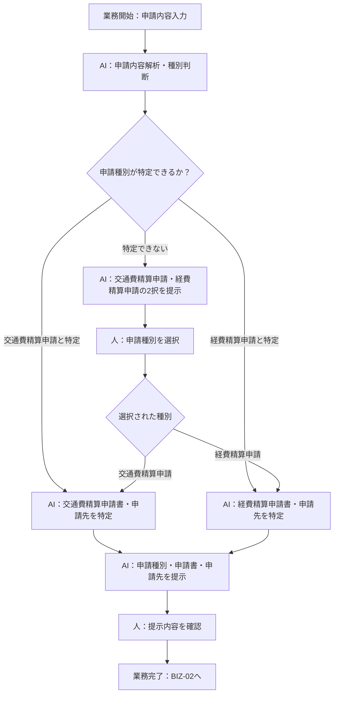
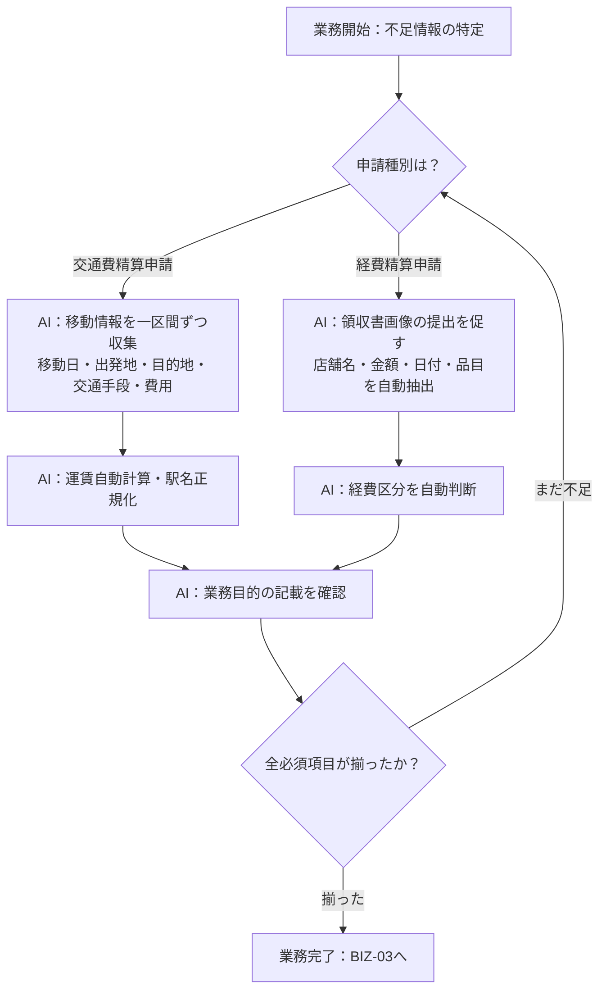
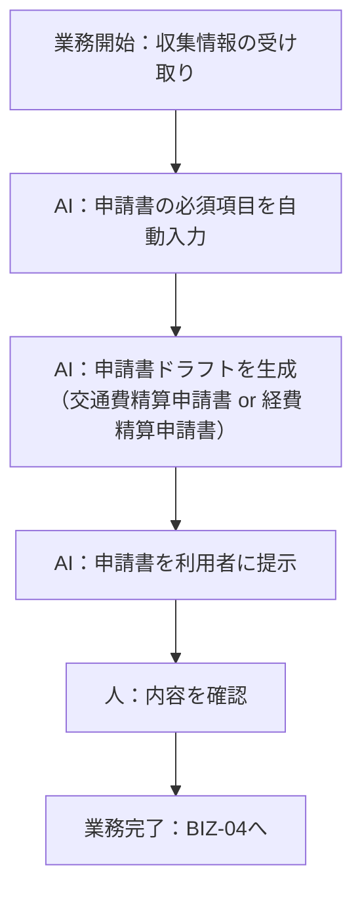
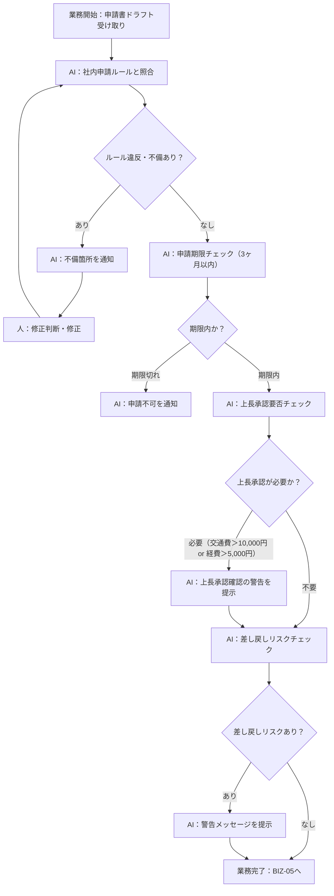
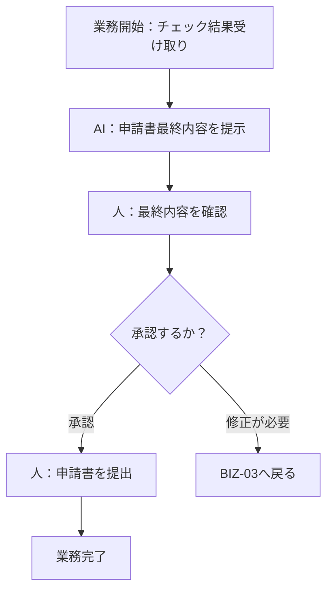

> **参照元（入力資料）:**
> - 業務要件一覧.md（業務要件ID・業務種別の特定）
> - 業務一覧.md（業務ID・業務名の特定）
> - 役割分担定義.md（実行主体・責務分担の決定）
> - 業務ルール定義_判断基準定義.md（判断・ルールとの紐付け）

---

## 業務プロセス定義

### 基本情報
- 業務ID：BIZ-01
- 業務名：申請種別判断
- 業務目的：ユーザーの申請内容から交通費精算申請・経費精算申請のいずれかを特定し、申請書・申請先を提示する
- 対象ユーザ：全社員（一般社員）
- 開始条件（トリガー）：ユーザーが申請内容（自由文）を入力する
- 終了条件：申請種別・申請書・申請先が利用者に提示される

### 業務フロー（To-Be）

---

## 業務ステップ定義：ST-01

### 1) 基本情報
- ステップID：ST-001-01
- ステップ名：申請内容入力
- 対応業務ID：BIZ-01
- 対応プロセスID：BIZ-01
- ステップ種別：入力
- 実行主体：
  - ☑ 人
  - ☐ AIエージェント
  - ☐ 人＋AI（協調）

### 2) ステップ概要
- 目的：申請種別判断に必要な初期情報を収集する
- このステップで達成すること：ユーザーが申請したい内容を自由文で入力する
- 業務上の意味：AIによる申請種別判断の起点となる情報を取得する

### 3) フロー上の位置
- 直前ステップ：なし（業務開始）
- 直後ステップ（通常）：ST-001-02
- 分岐先ステップ（条件付き）：なし

### 4) 入力情報

| データID | データ名 | 取得元 | 必須 | 欠落時対応 |
|---|---|---|---:|---|
| D-001 | 申請内容（自由文） | 社員入力 | ○ | 再入力要求 |

### 5) 実施内容

#### 5.1 処理概要
- 実施する業務処理：ユーザーが申請したい内容を自由文でシステムに入力する

#### 5.2 処理詳細（業務粒度）
1. システムが申請内容の入力を促す
2. ユーザーが申請したい内容を自由文で入力する
3. 入力内容をAI解析ステップへ渡す

### 6) 判断・ルール

| 種別 | ID | 利用方法 |
|---|---|---|
| 業務ルール | BRL-01 | 入力内容から申請種別を判断するための入力データとして使用 |

### 7) 出力結果

| データID | データ名 | 出力先 | 確定主体 |
|---|---|---|---|
| D-001 | 申請内容（自由文） | ST-001-02 | 人 |

### 8) 例外処理

| ケース | 発生条件 | 対応 | 遷移先 |
|---|---|---|---|
| 入力が空の場合 | 申請内容が未入力 | 再入力を促すメッセージを表示 | ST-001-01 |

### 9) 責務分担

| 項目 | 人 | AIエージェント |
|---|---|---|
| 入力 | ○ | × |
| 判断 | × | × |
| 実行 | × | × |

### 10) 完了条件
- 正常終了条件：申請内容（自由文）が入力され、次ステップへ渡せる状態
- 未完了・中断条件：申請内容が空のまま

---

## 業務ステップ定義：ST-02

### 1) 基本情報
- ステップID：ST-001-02
- ステップ名：申請種別解析・判断
- 対応業務ID：BIZ-01
- 対応プロセスID：BIZ-01
- ステップ種別：判断・実行
- 実行主体：
  - ☐ 人
  - ☑ AIエージェント
  - ☐ 人＋AI（協調）

### 2) ステップ概要
- 目的：入力された申請内容から交通費精算申請・経費精算申請のいずれかを特定する
- このステップで達成すること：申請種別が特定される、または判断不能時にユーザーへ選択肢を提示する
- 業務上の意味：正しい申請書・申請先を提示するための判断基盤を形成する

### 3) フロー上の位置
- 直前ステップ：ST-001-01
- 直後ステップ（通常）：ST-001-03（種別特定時）
- 分岐先ステップ（条件付き）：ST-001-02（選択肢提示→ユーザー選択後、再判断）

### 4) 入力情報

| データID | データ名 | 取得元 | 必須 | 欠落時対応 |
|---|---|---|---:|---|
| D-001 | 申請内容（自由文） | ST-001-01 | ○ | ST-001-01へ戻る |
| D-002 | 社内申請ルール | ナレッジベース | ○ | エスカレーション |

### 5) 実施内容

#### 5.1 処理概要
- 実施する業務処理：AIが申請内容を解析し、社内申請ルールを参照して交通費精算申請・経費精算申請のいずれかを判断する。判断できない場合は2択の選択肢をユーザーに提示する

#### 5.2 処理詳細（業務粒度）
1. AIが入力された申請内容（自由文）を解析する
2. 社内申請ルールを参照して交通費精算申請・経費精算申請のいずれかを特定する
3. 申請種別が特定できれば ST-001-03 へ進む
4. 申請種別が特定できない場合は「交通費精算申請」「経費精算申請」の2択をユーザーに提示する
5. ユーザーの選択に従って申請種別を確定し、ST-001-03 へ進む

### 6) 判断・ルール

| 種別 | ID | 利用方法 |
|---|---|---|
| 業務ルール | BRL-01 | 申請種別の判断根拠として使用 |
| 業務ルール | BRL-02 | 申請種別が判断できない場合の選択肢提示根拠 |
| 判断基準 | JD-01 | 申請種別が特定できるかを判定 |
| 判断基準 | JD-02 | 申請種別が特定できない場合のユーザー確認フロー判定 |

### 7) 出力結果

| データID | データ名 | 出力先 | 確定主体 |
|---|---|---|---|
| D-003 | 申請種別リスト | ST-001-03 | AI（または人の選択に基づきAIが確定） |

### 8) 例外処理

| ケース | 発生条件 | 対応 | 遷移先 |
|---|---|---|---|
| 社内ルールに例外ケースが該当 | ルール解釈に裁量判断が必要 | エスカレーション通知 | エスカレーション先（要件上未定義） |

### 9) 責務分担

| 項目 | 人 | AIエージェント |
|---|---|---|
| 入力 | × | ○ |
| 判断 | △（選択肢提示時のみ選択） | ○ |
| 実行 | × | ○ |

### 10) 完了条件
- 正常終了条件：申請種別（交通費精算申請または経費精算申請）が確定する
- 未完了・中断条件：ユーザーが選択肢を選択せず離脱した場合

---

## 業務ステップ定義：ST-03

### 1) 基本情報
- ステップID：ST-001-03
- ステップ名：申請書・申請先の提示
- 対応業務ID：BIZ-01
- 対応プロセスID：BIZ-01
- ステップ種別：案内
- 実行主体：
  - ☐ 人
  - ☑ AIエージェント
  - ☐ 人＋AI（協調）

### 2) ステップ概要
- 目的：特定した申請種別に対応する申請書と申請先を利用者に提示する
- このステップで達成すること：利用者が必要な申請書・申請先を把握できる
- 業務上の意味：利用者が次のアクション（申請書作成・情報収集）を判断できる状態にする

### 3) フロー上の位置
- 直前ステップ：ST-001-02
- 直後ステップ（通常）：BIZ-02（申請情報収集・対話）
- 分岐先ステップ（条件付き）：なし

### 4) 入力情報

| データID | データ名 | 取得元 | 必須 | 欠落時対応 |
|---|---|---|---:|---|
| D-003 | 申請種別リスト | ST-001-02 | ○ | ST-001-02へ戻る |
| D-002 | 社内申請ルール | ナレッジベース | ○ | エスカレーション |

### 5) 実施内容

#### 5.1 処理概要
- 実施する業務処理：特定された申請種別（交通費精算申請または経費精算申請）に対応する申請書と申請先をナレッジベースから取得し、利用者に提示する

#### 5.2 処理詳細（業務粒度）
1. 申請種別リストをもとに対応する申請書をナレッジベースから取得する
2. 申請種別に対応する申請先を取得する
3. 利用者に申請書・申請先情報を提示する

### 6) 判断・ルール

| 種別 | ID | 利用方法 |
|---|---|---|
| 業務ルール | BRL-03 | 申請種別に対応する申請書・申請先を提示する根拠として使用 |

### 7) 出力結果

| データID | データ名 | 出力先 | 確定主体 |
|---|---|---|---|
| D-004 | 申請書・申請先の提示結果 | 利用者（画面表示） | AI |

### 8) 例外処理

| ケース | 発生条件 | 対応 | 遷移先 |
|---|---|---|---|
| 申請書情報がナレッジベースに存在しない | 申請種別に対応する申請書情報が未登録 | エラー通知・エスカレーション | エスカレーション先（要件上未定義） |

### 9) 責務分担

| 項目 | 人 | AIエージェント |
|---|---|---|
| 入力 | × | ○ |
| 判断 | × | ○ |
| 実行 | × | ○ |

### 10) 完了条件
- 正常終了条件：申請書・申請先が利用者に提示される
- 未完了・中断条件：ナレッジベースに申請書情報が存在しない場合

---

## 業務プロセス定義（BIZ-02）

### 基本情報
- 業務ID：BIZ-02
- 業務名：申請情報収集（対話）
- 業務目的：申請書作成に必要な情報が不足している場合、申請種別ごとのルールに従い対話形式で追加情報を収集する
- 対象ユーザ：全社員（一般社員）
- 開始条件（トリガー）：申請書の必須項目が不足していると判断される
- 終了条件：申請書作成に必要な情報がすべて揃う

### 業務フロー（To-Be）

---

## 業務ステップ定義：ST-004

### 1) 基本情報
- ステップID：ST-002-01
- ステップ名：不足情報の特定・追加質問
- 対応業務ID：BIZ-02
- 対応プロセスID：BIZ-02
- ステップ種別：対話・確認
- 実行主体：
  - ☐ 人
  - ☐ AIエージェント
  - ☑ 人＋AI（協調）

### 2) ステップ概要
- 目的：申請種別に応じた業務ルールで不足情報を特定し、対話形式で収集する
- このステップで達成すること：申請書の全必須項目に対応するデータが揃う
- 業務上の意味：申請書自動作成の前提条件を整える

### 3) フロー上の位置
- 直前ステップ：ST-001-02（申請種別特定後）またはBIZ-01完了後
- 直後ステップ（通常）：ST-003-01（BIZ-03）
- 分岐先ステップ（条件付き）：ST-002-01（不足情報が残る場合、繰り返し）

### 4) 入力情報

| データID | データ名 | 取得元 | 必須 | 欠落時対応 |
|---|---|---|---:|---|
| D-003 | 申請種別リスト | BIZ-01 | ○ | BIZ-01へ戻る |
| D-005 | 申請書必須項目定義 | ナレッジベース | ○ | エスカレーション |
| D-006 | ユーザー回答（追加情報） | 社員入力 | ○ | 再入力要求 |

### 5) 実施内容

#### 5.1 処理概要
- 実施する業務処理：申請種別に応じた業務ルールで不足必須項目を特定し、質問を生成・提示する。ユーザーが回答し、情報が揃うまで繰り返す

#### 5.2 処理詳細（業務粒度）

**交通費精算申請の場合：**
1. AIが移動情報（移動日・出発地・目的地・交通手段・費用）を一区間ずつ収集する
2. 電車の場合は経路テーブルから運賃を自動計算する（BRL-12）
3. バス・タクシー・飛行機の場合は固定運賃を適用する（BRL-12）
4. 入力された駅名を正規化する（BRL-15）
5. 業務目的の記載を確認する（BRL-20）

**経費精算申請の場合：**
1. AIが領収書画像の提出を促す
2. 領収書画像から店舗名・金額・日付・品目を自動抽出する（BRL-16）
3. 品目から経費区分（事務用品費・宿泊費・資格精算費・その他経費）を自動判断する（BRL-17）
4. 業務目的の記載を確認する（BRL-20）

**共通処理：**
5. 収集情報を更新し、不足項目が残る場合は繰り返す

### 6) 判断・ルール

| 種別 | ID | 利用方法 |
|---|---|---|
| 業務ルール | BRL-04 | 不足必須項目の特定と質問生成の根拠 |
| 業務ルール | BRL-11 | 交通費精算：移動情報の一区間ずつ収集 |
| 業務ルール | BRL-12 | 交通費精算：運賃自動計算 |
| 業務ルール | BRL-15 | 交通費精算：駅名正規化 |
| 業務ルール | BRL-16 | 経費精算：領収書画像からの自動抽出 |
| 業務ルール | BRL-17 | 経費精算：経費区分の自動判断 |
| 業務ルール | BRL-20 | 交通費精算・経費精算：業務目的の記載確認 |
| 判断基準 | JD-03 | 必須項目が揃ったかを判定 |
| 判断基準 | JD-04 | 不足項目が残る場合の繰り返し判定 |

### 7) 出力結果

| データID | データ名 | 出力先 | 確定主体 |
|---|---|---|---|
| D-007 | 収集済み申請情報 | ST-003-01 | 人＋AI |

### 8) 例外処理

| ケース | 発生条件 | 対応 | 遷移先 |
|---|---|---|---|
| ユーザーが回答できない場合 | 必要情報が不明・不存在 | エスカレーション通知 | エスカレーション先（要件上未定義） |
| 領収書画像から情報抽出に失敗 | 画像が不鮮明・未対応形式 | 手動入力を促す | ST-002-01（手動入力） |

### 9) 責務分担

| 項目 | 人 | AIエージェント |
|---|---|---|
| 入力 | ○（回答・画像提出） | ○（不足項目特定・自動抽出） |
| 判断 | × | ○ |
| 実行 | × | ○ |

### 10) 完了条件
- 正常終了条件：申請書の全必須項目に対応する情報が揃う
- 未完了・中断条件：ユーザーが回答できず情報が揃わない場合

---

## 業務プロセス定義（BIZ-03）

### 基本情報
- 業務ID：BIZ-03
- 業務名：申請書自動作成
- 業務目的：収集した申請情報をもとに申請書を自動作成し、利用者に提示する
- 対象ユーザ：全社員（一般社員）
- 開始条件（トリガー）：申請書作成に必要な情報がすべて揃う
- 終了条件：申請書ドラフトが生成され利用者に提示される

### 業務フロー（To-Be）

---

## 業務ステップ定義：ST-005

### 1) 基本情報
- ステップID：ST-003-01
- ステップ名：申請書自動作成・提示
- 対応業務ID：BIZ-03
- 対応プロセスID：BIZ-03
- ステップ種別：参照・実行
- 実行主体：
  - ☐ 人
  - ☑ AIエージェント
  - ☐ 人＋AI（協調）

### 2) ステップ概要
- 目的：収集した申請情報から申請書（交通費精算申請書または経費精算申請書）を自動作成し、利用者に提示する
- このステップで達成すること：申請書ドラフトが生成される
- 業務上の意味：利用者の申請書作成工数を削減し、記入ミスを防ぐ

### 3) フロー上の位置
- 直前ステップ：ST-002-01（BIZ-02）
- 直後ステップ（通常）：ST-004-01（BIZ-04）
- 分岐先ステップ（条件付き）：なし

### 4) 入力情報

| データID | データ名 | 取得元 | 必須 | 欠落時対応 |
|---|---|---|---:|---|
| D-007 | 収集済み申請情報 | BIZ-02 | ○ | BIZ-02へ戻る |
| D-005 | 申請書必須項目定義 | ナレッジベース | ○ | エスカレーション |

### 5) 実施内容

#### 5.1 処理概要
- 実施する業務処理：収集済み申請情報を申請種別（交通費精算申請書または経費精算申請書）の各必須項目にマッピングし、申請書ドラフトを生成して提示する

#### 5.2 処理詳細（業務粒度）
1. 申請種別に対応する申請書テンプレートを取得する（交通費精算申請書または経費精算申請書）
2. 収集済み申請情報を申請書の必須項目に自動入力する
3. 申請書ドラフトを生成する
4. 生成した申請書ドラフトを利用者に提示する

### 6) 判断・ルール

| 種別 | ID | 利用方法 |
|---|---|---|
| 業務ルール | BRL-05 | 収集情報から申請書の必須項目への自動入力 |
| 業務ルール | BRL-06 | 申請書を利用者に提示して確認を得る |

### 7) 出力結果

| データID | データ名 | 出力先 | 確定主体 |
|---|---|---|---|
| D-008 | 申請書ドラフト | 利用者（画面表示）、ST-004-01 | AI |

### 8) 例外処理

| ケース | 発生条件 | 対応 | 遷移先 |
|---|---|---|---|
| 申請書テンプレートが存在しない | 申請種別に対応するテンプレート未登録 | エラー通知 | エスカレーション先（要件上未定義） |

### 9) 責務分担

| 項目 | 人 | AIエージェント |
|---|---|---|
| 入力 | × | ○ |
| 判断 | × | ○ |
| 実行 | × | ○ |

### 10) 完了条件
- 正常終了条件：申請書ドラフトが生成され、利用者に提示される
- 未完了・中断条件：申請書テンプレートが存在しない場合

---

## 業務プロセス定義（BIZ-04）

### 基本情報
- 業務ID：BIZ-04
- 業務名：申請内容チェック
- 業務目的：作成した申請書を社内申請ルールと照合し、ミス・不備・差し戻しリスクを検出して利用者に提示する
- 対象ユーザ：全社員（一般社員）
- 開始条件（トリガー）：申請書ドラフトが生成される
- 終了条件：チェック結果・警告が利用者に提示される

### 業務フロー（To-Be）

---

## 業務ステップ定義：ST-006

### 1) 基本情報
- ステップID：ST-004-01
- ステップ名：申請ルール照合・チェック
- 対応業務ID：BIZ-04
- 対応プロセスID：BIZ-04
- ステップ種別：判断・実行
- 実行主体：
  - ☐ 人
  - ☑ AIエージェント
  - ☐ 人＋AI（協調）

### 2) ステップ概要
- 目的：申請書ドラフトを社内申請ルールと照合し、ミス・不備・差し戻しリスクを検出する
- このステップで達成すること：申請書のルール適合性・申請期限・上長承認要否・差し戻しリスクが評価される
- 業務上の意味：申請ミスと差し戻しを事前に防ぐ

### 3) フロー上の位置
- 直前ステップ：ST-003-01（BIZ-03）
- 直後ステップ（通常）：ST-005-01（BIZ-05）
- 分岐先ステップ（条件付き）：ST-003-01（不備修正後に再チェック）

### 4) 入力情報

| データID | データ名 | 取得元 | 必須 | 欠落時対応 |
|---|---|---|---:|---|
| D-008 | 申請書ドラフト | BIZ-03 | ○ | BIZ-03へ戻る |
| D-002 | 社内申請ルール | ナレッジベース | ○ | エスカレーション |

### 5) 実施内容

#### 5.1 処理概要
- 実施する業務処理：申請書ドラフトを社内申請ルールと照合し、不備・申請期限・上長承認要否・差し戻しリスクを評価して結果を提示する

#### 5.2 処理詳細（業務粒度）
1. 申請書ドラフトの各項目を社内申請ルールと照合する
2. ルール違反・不備がある場合は箇所を特定して利用者に通知する
3. 申請期限チェック：経費発生日から3ヶ月以内かを確認する（BRL-13/BRL-18）
4. 上長承認要否チェック：交通費精算は10,000円超、経費精算は5,000円超の場合に上長承認を確認する（BRL-14/BRL-19）
5. 差し戻しリスク評価を実施する
6. 差し戻しリスクがある場合は警告メッセージを生成・提示する

### 6) 判断・ルール

| 種別 | ID | 利用方法 |
|---|---|---|
| 業務ルール | BRL-07 | 申請ルール照合の根拠 |
| 業務ルール | BRL-08 | 差し戻しリスク評価の根拠 |
| 業務ルール | BRL-13 | 交通費精算：3ヶ月以内の申請期限チェック |
| 業務ルール | BRL-14 | 交通費精算：10,000円超の上長承認チェック |
| 業務ルール | BRL-18 | 経費精算：3ヶ月以内の申請期限チェック |
| 業務ルール | BRL-19 | 経費精算：5,000円超の上長承認チェック |
| 判断基準 | JD-05 | 申請ルール適合性の判定（OK） |
| 判断基準 | JD-06 | 申請ルール不適合の判定（NG） |
| 判断基準 | JD-07 | 差し戻しリスク評価の判定 |
| 判断基準 | JD-09 | 交通費精算：3ヶ月以内確認 |
| 判断基準 | JD-10 | 交通費精算：3ヶ月超の申請不可 |
| 判断基準 | JD-11 | 交通費精算：上長承認不要 |
| 判断基準 | JD-12 | 交通費精算：上長承認要 |
| 判断基準 | JD-13 | 経費精算：3ヶ月以内確認 |
| 判断基準 | JD-14 | 経費精算：3ヶ月超の申請不可 |
| 判断基準 | JD-15 | 経費精算：上長承認不要 |
| 判断基準 | JD-16 | 経費精算：上長承認要 |

### 7) 出力結果

| データID | データ名 | 出力先 | 確定主体 |
|---|---|---|---|
| D-009 | 申請チェック結果 | 利用者（画面表示）、ST-005-01 | AI |
| D-010 | 警告メッセージ | 利用者（画面表示） | AI |

### 8) 例外処理

| ケース | 発生条件 | 対応 | 遷移先 |
|---|---|---|---|
| ルール解釈に裁量が必要 | 申請ルールの例外ケース該当 | エスカレーション通知 | エスカレーション先（要件上未定義） |
| 申請期限超過 | 経費発生日から3ヶ月超 | 申請不可を通知して終了 | 業務終了 |

### 9) 責務分担

| 項目 | 人 | AIエージェント |
|---|---|---|
| 入力 | × | ○ |
| 判断 | × | ○ |
| 実行 | × | ○ |

### 10) 完了条件
- 正常終了条件：チェック結果・警告が利用者に提示される
- 未完了・中断条件：ルール照合ができない場合

---

## 業務プロセス定義（BIZ-05）

### 基本情報
- 業務ID：BIZ-05
- 業務名：申請書確認・提出
- 業務目的：利用者が申請書の最終内容を確認・承認し、申請を提出する
- 対象ユーザ：全社員（一般社員）
- 開始条件（トリガー）：申請チェックが完了し申請書が確定状態になる
- 終了条件：利用者が申請書を提出する

### 業務フロー（To-Be）

---

## 業務ステップ定義：ST-007

### 1) 基本情報
- ステップID：ST-005-01
- ステップ名：申請書確認・提出
- 対応業務ID：BIZ-05
- 対応プロセスID：BIZ-05
- ステップ種別：対話・確認
- 実行主体：
  - ☐ 人
  - ☐ AIエージェント
  - ☑ 人＋AI（協調）

### 2) ステップ概要
- 目的：申請書の最終内容を利用者に確認させ、承認・提出を完了する
- このステップで達成すること：利用者が申請書を確認・承認し、提出操作を行う
- 業務上の意味：最終意思決定と提出操作を必ず人が行うことを担保する

### 3) フロー上の位置
- 直前ステップ：ST-004-01（BIZ-04）
- 直後ステップ（通常）：業務完了
- 分岐先ステップ（条件付き）：ST-003-01（修正が必要な場合）

### 4) 入力情報

| データID | データ名 | 取得元 | 必須 | 欠落時対応 |
|---|---|---|---:|---|
| D-008 | 申請書ドラフト | BIZ-03 | ○ | BIZ-03へ戻る |
| D-009 | 申請チェック結果 | BIZ-04 | ○ | BIZ-04へ戻る |

### 5) 実施内容

#### 5.1 処理概要
- 実施する業務処理：AIが申請書最終内容を提示し、利用者が確認・承認・提出を行う

#### 5.2 処理詳細（業務粒度）
1. AIが申請書の最終内容をチェック結果とともに提示する
2. 利用者が内容を確認する
3. 承認する場合、利用者が申請書の提出操作を行う
4. 修正が必要な場合、BIZ-03へ戻る

### 6) 判断・ルール

| 種別 | ID | 利用方法 |
|---|---|---|
| 業務ルール | BRL-06 | 利用者の確認承認を得る根拠 |
| 業務ルール | BRL-09 | AIによる自動提出を禁止する根拠 |

### 7) 出力結果

| データID | データ名 | 出力先 | 確定主体 |
|---|---|---|---|
| D-011 | 提出済み申請書 | 申請先システム・部門 | 人 |

### 8) 例外処理

| ケース | 発生条件 | 対応 | 遷移先 |
|---|---|---|---|
| 利用者が修正を希望 | 提示内容に修正が必要 | BIZ-03へ戻る | ST-003-01 |
| 利用者が提出を中断 | 利用者が提出操作を中断 | 申請書ドラフトを保存し後続操作を待つ（保存仕様は要件上未定義） | 中断 |

### 9) 責務分担

| 項目 | 人 | AIエージェント |
|---|---|---|
| 入力 | ○（確認・承認） | ○（最終提示） |
| 判断 | 最終 | × |
| 実行 | ○（提出操作） | × |

### 10) 完了条件
- 正常終了条件：利用者が申請書を承認し提出操作を完了する
- 未完了・中断条件：利用者が承認せず修正対応が続く場合

---

### 例外処理（業務全体共通）

| ケース | 発生条件 | 対応方針 | 担当 |
|---|---|---|---|
| 申請種別判断不能後もユーザーが選択しない | 2択提示後にユーザーが選択せず離脱 | 中断・セッション保留 | AIエージェント |
| 申請ルール例外ケース | ルール解釈に裁量判断が必要 | 承認権限者・総務部門へエスカレーション | AIエージェント |
| 申請書テンプレート未登録 | 申請種別に対応するテンプレートが存在しない | システム管理者へエラー通知 | AIエージェント |
| 重大なルール違反の検出 | チェックで是正不能な違反が判明 | 上長・承認権限者へエスカレーション | AIエージェント |
| 申請期限超過 | 経費発生日から3ヶ月超 | 申請不可を通知して業務終了 | AIエージェント |
