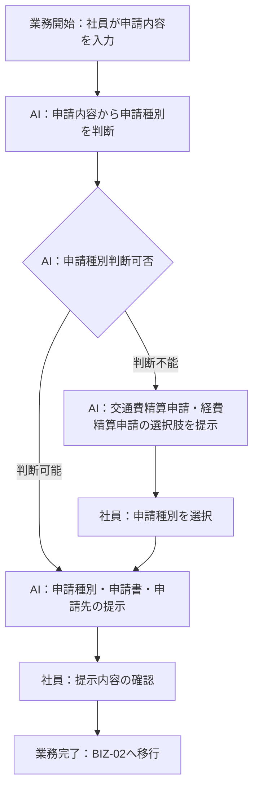
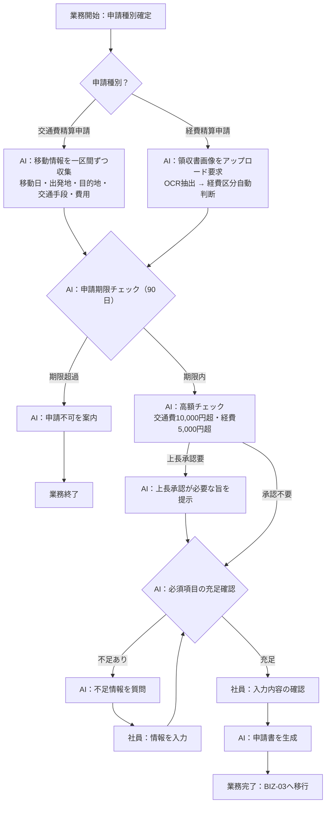
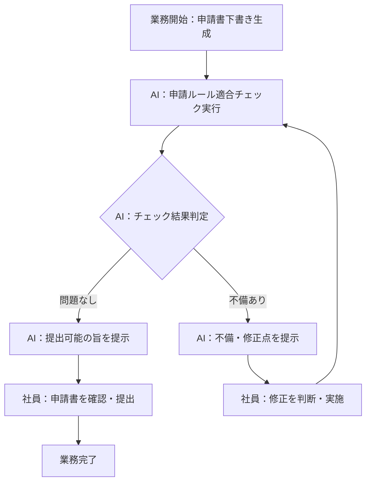

> **参照元（入力資料）:**
> - 業務要件一覧.md（業務要件ID・業務種別の特定）
> - 業務一覧.md（業務ID・業務名の特定）
> - 役割分担定義.md（実行主体・責務分担の決定）
> - 業務ルール定義_判断基準定義.md（判断・ルールとの紐付け）

## 業務プロセス定義

---

### 基本情報
- 業務ID：BIZ-01
- 業務名：申請種別案内
- 業務目的：社員が入力した申請内容をもとに、必要な申請種別・申請書・申請先を判断して提示する
- 対象ユーザ：一般社員
- 開始条件（トリガー）：社員が申請内容テキストを入力する
- 終了条件：申請種別・申請書・申請先が社員に提示され確認される

### 業務フロー（To-Be）

## 業務ステップ定義：ST-01

### 1) 基本情報
- ステップID：ST-001-01
- ステップ名：申請内容の入力受付
- 対応業務ID：BIZ-01
- 対応プロセスID：BIZ-01
- ステップ種別：入力
- 実行主体：
  - ☑ 人
  - ☐ AIエージェント
  - ☐ 人＋AI（協調）

### 2) ステップ概要
- 目的：社員の申請意図をシステムに伝える
- このステップで達成すること：申請内容テキストを取得する
- 業務上の意味：後続の申請種別判断の起点となる

### 3) フロー上の位置
- 直前ステップ：なし（業務開始）
- 直後ステップ（通常）：ST-001-02
- 分岐先ステップ（条件付き）：なし

### 4) 入力情報

| データID | データ名 | 取得元 | 必須 | 欠落時対応 |
|---|---|---|---:|---|
| D-001 | 申請内容テキスト | 社員入力 | ○ | 再入力要求 |

### 5) 実施内容

#### 5.1 処理概要
- 実施する業務処理：社員が申請したい内容を自由テキストで入力する

#### 5.2 処理詳細（業務粒度）
1. システムが申請内容の入力を促すメッセージを表示する
2. 社員が申請内容テキストを入力する
3. 入力内容をシステムが受け取る

### 6) 判断・ルール

| 種別 | ID | 利用方法 |
|---|---|---|
| 業務ルール | BRL-01 | 入力受付後に申請ルール参照処理を起動する条件として使用 |

### 7) 出力結果

| データID | データ名 | 出力先 | 確定主体 |
|---|---|---|---|
| D-001 | 申請内容テキスト | ST-001-02 | 人 |

### 8) 例外処理

| ケース | 発生条件 | 対応 | 遷移先 |
|---|---|---|---|
| 入力なし | 社員が何も入力しない | 入力を促すメッセージを再表示する | ST-001-01（再実行） |

### 9) 責務分担

| 項目 | 人 | AIエージェント |
|---|---|---|
| 入力 | ○ | × |
| 判断 | × | × |
| 実行 | ○ | × |

### 10) 完了条件
- 正常終了条件：申請内容テキストが取得できた
- 未完了・中断条件：入力が空の場合

---

## 業務ステップ定義：ST-02

### 1) 基本情報
- ステップID：ST-001-02
- ステップ名：申請種別の判断
- 対応業務ID：BIZ-01
- 対応プロセスID：BIZ-01
- ステップ種別：判断・実行
- 実行主体：
  - ☐ 人
  - ☑ AIエージェント
  - ☐ 人＋AI（協調）

### 2) ステップ概要
- 目的：申請内容に対して適切な申請種別を特定する
- このステップで達成すること：必要な申請種別（複数含む）を確定する
- 業務上の意味：社員が正しい申請を行うための核心ステップ

### 3) フロー上の位置
- 直前ステップ：ST-001-01
- 直後ステップ（通常）：ST-001-03
- 分岐先ステップ（条件付き）：エスカレーション案内（申請種別特定不可の場合）

### 4) 入力情報

| データID | データ名 | 取得元 | 必須 | 欠落時対応 |
|---|---|---|---:|---|
| D-001 | 申請内容テキスト | ST-001-01 | ○ | ST-001-01へ戻る |
| D-002 | 社内申請ルール | ナレッジベース | ○ | エスカレーション |

### 5) 実施内容

#### 5.1 処理概要
- 実施する業務処理：社内申請ルールを参照して申請内容に対応する申請種別を判断する

#### 5.2 処理詳細（業務粒度）
1. 社内申請ルールドキュメントを参照する
2. 申請内容テキストと申請ルールを照合して該当申請種別を特定する
3. 複数該当する場合はすべての申請種別を特定する
4. 申請種別が特定できない場合は判断不可と判定する

### 6) 判断・ルール

| 種別 | ID | 利用方法 |
|---|---|---|
| 業務ルール | BRL-01 | 社内申請ルール参照の実行根拠 |
| 業務ルール | BRL-03 | 複数種別が該当する場合の全種別提示の根拠 |
| 判断基準 | JD-01 | 申請種別が特定できた場合の次アクション判定 |
| 判断基準 | JD-02 | 申請種別が特定できない場合の次アクション判定 |
| 判断基準 | JD-03 | 複数申請種別が該当する場合の判定 |

### 7) 出力結果

| データID | データ名 | 出力先 | 確定主体 |
|---|---|---|---|
| D-003 | 申請種別リスト | ST-001-03 | AI |
| D-004 | 判断結果（OK/NG） | ST-001-03 | AI |

### 8) 例外処理

| ケース | 発生条件 | 対応 | 遷移先 |
|---|---|---|---|
| 申請種別の判断不能 | 申請内容から交通費精算申請・経費精算申請のいずれかを判断できない | 「交通費精算申請」「経費精算申請」の選択肢を提示してユーザーに選択を求める | 選択された申請種別のフローへ移行 |
| ナレッジベース参照失敗 | 社内申請ルールの参照に失敗 | エラーを社員に通知し再試行または担当部門への問い合わせを案内する | 業務終了（エスカレーション） |

### 9) 責務分担

| 項目 | 人 | AIエージェント |
|---|---|---|
| 入力 | × | ○ |
| 判断 | × | ○ |
| 実行 | × | ○ |

### 10) 完了条件
- 正常終了条件：申請種別が1件以上特定された
- 未完了・中断条件：申請種別が特定できない、またはナレッジベース参照に失敗した

---

## 業務ステップ定義：ST-03

### 1) 基本情報
- ステップID：ST-001-03
- ステップ名：申請種別・申請書・申請先の提示
- 対応業務ID：BIZ-01
- 対応プロセスID：BIZ-01
- ステップ種別：案内
- 実行主体：
  - ☐ 人
  - ☑ AIエージェント
  - ☐ 人＋AI（協調）

### 2) ステップ概要
- 目的：判断した申請種別・申請書・申請先を社員に提示する
- このステップで達成すること：社員が次に行うべき申請の全体像を把握する
- 業務上の意味：申請ルールを知らない社員でも正しい申請を開始できるようにする

### 3) フロー上の位置
- 直前ステップ：ST-001-02
- 直後ステップ（通常）：BIZ-02（申請書自動作成）
- 分岐先ステップ（条件付き）：なし

### 4) 入力情報

| データID | データ名 | 取得元 | 必須 | 欠落時対応 |
|---|---|---|---:|---|
| D-003 | 申請種別リスト | ST-001-02 | ○ | ST-001-02へ戻る |
| D-005 | 申請書テンプレート情報 | ナレッジベース | ○ | エスカレーション |
| D-006 | 申請先情報 | ナレッジベース | ○ | エスカレーション |

### 5) 実施内容

#### 5.1 処理概要
- 実施する業務処理：申請種別ごとに使用する申請書と申請先を提示する

#### 5.2 処理詳細（業務粒度）
1. 特定した申請種別に対応する申請書テンプレートを取得する
2. 申請種別に対応する申請先（部門・担当者・システム）を取得する
3. 申請種別・申請書・申請先をわかりやすく社員に提示する

### 6) 判断・ルール

| 種別 | ID | 利用方法 |
|---|---|---|
| 業務ルール | BRL-02 | 申請書と申請先の提示の根拠 |

### 7) 出力結果

| データID | データ名 | 出力先 | 確定主体 |
|---|---|---|---|
| D-007 | 申請種別・申請書・申請先の提示結果 | 社員（表示） | AI |

### 8) 例外処理

| ケース | 発生条件 | 対応 | 遷移先 |
|---|---|---|---|
| 申請書テンプレート未整備 | 申請種別に対応するテンプレートがない | 申請先の担当部門への直接問い合わせを案内する | 業務終了 |

### 9) 責務分担

| 項目 | 人 | AIエージェント |
|---|---|---|
| 入力 | × | ○ |
| 判断 | × | ○ |
| 実行 | △（確認） | ○ |

### 10) 完了条件
- 正常終了条件：申請種別・申請書・申請先が社員に提示された
- 未完了・中断条件：申請書テンプレートまたは申請先情報が取得できない

---

### 基本情報
- 業務ID：BIZ-02
- 業務名：申請書自動作成
- 業務目的：不足情報を対話で確認しながら申請種別に対応した申請書を自動生成する
- 対象ユーザ：一般社員
- 開始条件（トリガー）：申請種別が確定し社員が申請書作成を開始する
- 終了条件：申請書が生成され社員が内容を確認する

### 業務フロー（To-Be）

## 業務ステップ定義：ST-04

### 1) 基本情報
- ステップID：ST-002-01
- ステップ名：不足情報の対話収集
- 対応業務ID：BIZ-02
- 対応プロセスID：BIZ-02
- ステップ種別：対話・確認
- 実行主体：
  - ☐ 人
  - ☐ AIエージェント
  - ☑ 人＋AI（協調）

### 2) ステップ概要
- 目的：申請書作成に必要な情報を対話で収集する
- このステップで達成すること：申請書の全必須項目が揃う
- 業務上の意味：申請ルールを知らない社員でも漏れなく情報を提供できるようにする

### 3) フロー上の位置
- 直前ステップ：ST-001-03
- 直後ステップ（通常）：ST-002-02
- 分岐先ステップ（条件付き）：ST-002-01（不足項目残存時は繰り返し）

### 4) 入力情報

| データID | データ名 | 取得元 | 必須 | 欠落時対応 |
|---|---|---|---:|---|
| D-003 | 申請種別リスト | ST-001-02 | ○ | BIZ-01へ戻る |
| D-008 | 申請書必須項目リスト | ナレッジベース（テンプレート） | ○ | エスカレーション |
| D-009 | 社員回答情報 | 社員入力 | ○ | 再入力要求 |

### 5) 実施内容

#### 5.1 処理概要
- 実施する業務処理：申請書の未充足必須項目を特定し、一問一答で情報を収集する

#### 5.2 処理詳細（業務粒度）
1. 申請書テンプレートの必須項目リストを参照する
2. 未収集の必須項目を特定する
3. 未収集項目について一問一答で社員に質問する
4. 社員の回答を収集して記録する
5. 全必須項目が収集されるまで繰り返す

### 6) 判断・ルール

| 種別 | ID | 利用方法 |
|---|---|---|
| 業務ルール | BRL-04 | 全必須項目収集前は申請書生成を行わない判断根拠 |
| 業務ルール | BRL-05 | 不足情報がある場合に対話を継続する根拠 |
| 判断基準 | JD-04 | 全必須項目が収集できた場合の申請書生成への遷移判定 |
| 判断基準 | JD-05 | 不足項目がある場合の対話継続判定 |

### 7) 出力結果

| データID | データ名 | 出力先 | 確定主体 |
|---|---|---|---|
| D-010 | 収集済み申請情報（全必須項目） | ST-002-02 | 人＋AI |

### 8) 例外処理

| ケース | 発生条件 | 対応 | 遷移先 |
|---|---|---|---|
| 社員が回答を拒否・不明と回答 | 必須項目に対して回答できない | 担当部門への確認を案内し中断する | 業務終了（一時中断） |

### 9) 責務分担

| 項目 | 人 | AIエージェント |
|---|---|---|
| 入力 | ○（回答） | ○（質問生成） |
| 判断 | × | ○（充足確認） |
| 実行 | ○（回答入力） | ○（質問・記録） |

### 10) 完了条件
- 正常終了条件：全必須項目が収集された
- 未完了・中断条件：社員が回答を提供できない必須項目が存在する

---

## 業務ステップ定義：ST-05

### 1) 基本情報
- ステップID：ST-002-02
- ステップ名：申請書の生成
- 対応業務ID：BIZ-02
- 対応プロセスID：BIZ-02
- ステップ種別：参照・実行
- 実行主体：
  - ☐ 人
  - ☑ AIエージェント
  - ☐ 人＋AI（協調）

### 2) ステップ概要
- 目的：収集した情報をもとに申請書を自動生成する
- このステップで達成すること：記入済み申請書（下書き）が生成される
- 業務上の意味：申請書の記入ミスや漏れを防ぎ、差し戻しを減らす

### 3) フロー上の位置
- 直前ステップ：ST-002-01
- 直後ステップ（通常）：BIZ-03（申請内容チェック）
- 分岐先ステップ（条件付き）：なし

### 4) 入力情報

| データID | データ名 | 取得元 | 必須 | 欠落時対応 |
|---|---|---|---:|---|
| D-010 | 収集済み申請情報（全必須項目） | ST-002-01 | ○ | ST-002-01へ戻る |
| D-005 | 申請書テンプレート | ナレッジベース | ○ | エスカレーション |

### 5) 実施内容

#### 5.1 処理概要
- 実施する業務処理：申請種別に対応したテンプレートに収集情報を入力して申請書を生成する

#### 5.2 処理詳細（業務粒度）
1. 申請種別に対応するテンプレートを取得する
2. 収集情報をテンプレートの対応フィールドに入力する
3. 申請書（下書き）を生成する
4. 生成した申請書を社員に提示して確認を求める

### 6) 判断・ルール

| 種別 | ID | 利用方法 |
|---|---|---|
| 業務ルール | BRL-06 | 申請種別に対応したテンプレートを使用する根拠 |

### 7) 出力結果

| データID | データ名 | 出力先 | 確定主体 |
|---|---|---|---|
| D-011 | 申請書（下書き） | BIZ-03、社員（表示） | AI |

### 8) 例外処理

| ケース | 発生条件 | 対応 | 遷移先 |
|---|---|---|---|
| テンプレート取得失敗 | 申請種別に対応するテンプレートが存在しない | 担当部門への直接問い合わせを案内する | 業務終了 |

### 9) 責務分担

| 項目 | 人 | AIエージェント |
|---|---|---|
| 入力 | × | ○ |
| 判断 | × | ○ |
| 実行 | 最終（確認） | ○（生成） |

### 10) 完了条件
- 正常終了条件：申請書（下書き）が生成され社員に提示された
- 未完了・中断条件：テンプレートが取得できない

---

### 基本情報
- 業務ID：BIZ-03
- 業務名：申請内容チェック
- 業務目的：生成した申請書の内容を社内申請ルールに照らしてチェックし、不備・修正点を提示する
- 対象ユーザ：一般社員
- 開始条件（トリガー）：申請書（下書き）が生成される
- 終了条件：チェック結果が社員に提示され、申請書が提出可能な状態になる

### 業務フロー（To-Be）

## 業務ステップ定義：ST-06

### 1) 基本情報
- ステップID：ST-003-01
- ステップ名：申請内容チェックの実行
- 対応業務ID：BIZ-03
- 対応プロセスID：BIZ-03
- ステップ種別：判断・実行
- 実行主体：
  - ☐ 人
  - ☑ AIエージェント
  - ☐ 人＋AI（協調）

### 2) ステップ概要
- 目的：申請書の内容が社内申請ルールに適合しているかを確認する
- このステップで達成すること：申請書の不備・ミスが事前に発見される
- 業務上の意味：差し戻しを減らし申請の成功率を上げる

### 3) フロー上の位置
- 直前ステップ：ST-002-02
- 直後ステップ（通常）：ST-003-02
- 分岐先ステップ（条件付き）：なし

### 4) 入力情報

| データID | データ名 | 取得元 | 必須 | 欠落時対応 |
|---|---|---|---:|---|
| D-011 | 申請書（下書き） | ST-002-02 | ○ | ST-002-02へ戻る |
| D-002 | 社内申請ルール | ナレッジベース | ○ | エスカレーション |

### 5) 実施内容

#### 5.1 処理概要
- 実施する業務処理：申請書の必須項目充足・ルール適合・金額上限の3軸でチェックを行う

#### 5.2 処理詳細（業務粒度）
1. 申請書の必須項目がすべて入力されているか確認する
2. 申請内容が社内申請ルールの条件を満たしているか確認する
3. 申請金額が承認権限・上限規定の範囲内か確認する（交通費：10,000円超、経費：5,000円超は上長承認が必要）
4. チェック結果（OK/NG・不備内容）を生成する

### 6) 判断・ルール

| 種別 | ID | 利用方法 |
|---|---|---|
| 業務ルール | BRL-07 | 申請書生成後にチェックを実行する根拠 |
| 判断基準 | JD-06 | ルール適合の場合の次アクション判定 |
| 判断基準 | JD-07 | ルール不適合の場合の次アクション判定 |
| 判断基準 | JD-08 | 申請金額が上限内の場合の判定 |
| 判断基準 | JD-09 | 申請金額が上限超過の場合の判定 |

### 7) 出力結果

| データID | データ名 | 出力先 | 確定主体 |
|---|---|---|---|
| D-012 | チェック結果（OK/NG・不備一覧） | ST-003-02 | AI |

### 8) 例外処理

| ケース | 発生条件 | 対応 | 遷移先 |
|---|---|---|---|
| ルール参照失敗 | 社内申請ルールの参照に失敗 | エラーを社員に通知し担当部門への問い合わせを案内する | 業務終了 |

### 9) 責務分担

| 項目 | 人 | AIエージェント |
|---|---|---|
| 入力 | × | ○ |
| 判断 | × | ○ |
| 実行 | × | ○ |

### 10) 完了条件
- 正常終了条件：チェック結果（OK/NG）が生成された
- 未完了・中断条件：社内申請ルールの参照に失敗した

---

## 業務ステップ定義：ST-07

### 1) 基本情報
- ステップID：ST-003-02
- ステップ名：チェック結果の提示と修正案内
- 対応業務ID：BIZ-03
- 対応プロセスID：BIZ-03
- ステップ種別：案内
- 実行主体：
  - ☐ 人
  - ☑ AIエージェント
  - ☐ 人＋AI（協調）

### 2) ステップ概要
- 目的：チェック結果を社員に提示し、不備がある場合は修正方法を案内する
- このステップで達成すること：社員がチェック結果を理解し次のアクションを判断できる
- 業務上の意味：申請ミスの自己修正を促し差し戻しを防ぐ

### 3) フロー上の位置
- 直前ステップ：ST-003-01
- 直後ステップ（通常）：社員の修正後にST-003-01へ戻る、または業務完了
- 分岐先ステップ（条件付き）：チェックOKの場合は業務完了へ

### 4) 入力情報

| データID | データ名 | 取得元 | 必須 | 欠落時対応 |
|---|---|---|---:|---|
| D-012 | チェック結果（OK/NG・不備一覧） | ST-003-01 | ○ | ST-003-01へ戻る |

### 5) 実施内容

#### 5.1 処理概要
- 実施する業務処理：チェック結果をわかりやすく提示し、NG項目があれば具体的な修正方法を提示する

#### 5.2 処理詳細（業務粒度）
1. チェック結果（OK/NG）を社員に提示する
2. NGの場合は不備内容と具体的な修正方法を提示する
3. OKの場合は提出可能の旨を提示する

### 6) 判断・ルール

| 種別 | ID | 利用方法 |
|---|---|---|
| 業務ルール | BRL-08 | 不備発見時に修正点を提示する根拠 |

### 7) 出力結果

| データID | データ名 | 出力先 | 確定主体 |
|---|---|---|---|
| D-013 | チェック結果提示（修正指摘含む） | 社員（表示） | AI |

### 8) 例外処理

| ケース | 発生条件 | 対応 | 遷移先 |
|---|---|---|---|
| 修正不能な不備 | 申請内容自体が申請不可能なケース | 申請できない旨を提示し担当部門への相談を案内する | 業務終了 |

### 9) 責務分担

| 項目 | 人 | AIエージェント |
|---|---|---|
| 入力 | × | ○ |
| 判断 | 最終（修正判断） | ○（不備特定） |
| 実行 | ○（修正対応） | ○（案内提示） |

### 10) 完了条件
- 正常終了条件：チェック結果が社員に提示された
- 未完了・中断条件：なし

### 例外処理

| ケース | 発生条件 | 対応方針 | 担当 |
|---|---|---|---|
| 社内申請ルール参照不可 | ナレッジベースへのアクセス失敗 | エラーを通知し担当部門への直接問い合わせを案内する | AI→人 |
| 申請種別が社内ルールに未定義 | 申請内容が既存ルールに該当しない | 判断不可の旨を通知し担当部門へのエスカレーションを促す | AI→人 |
| 必要情報の提供不能 | 社員が必須項目を提供できない | 中断して担当部門への問い合わせを案内する | 人 |
