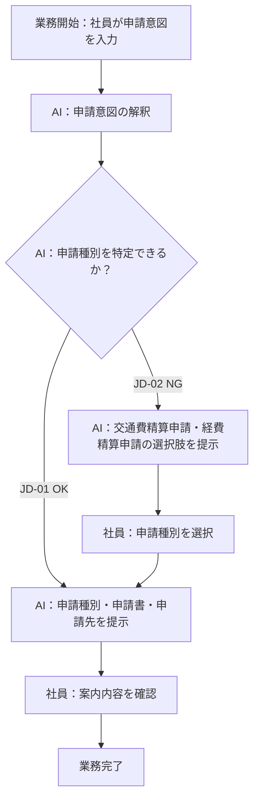
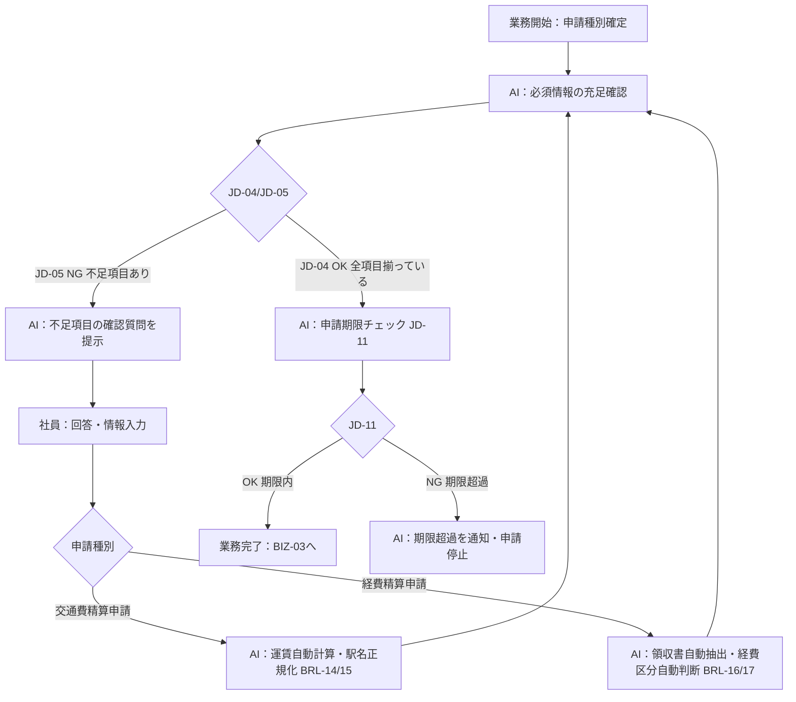
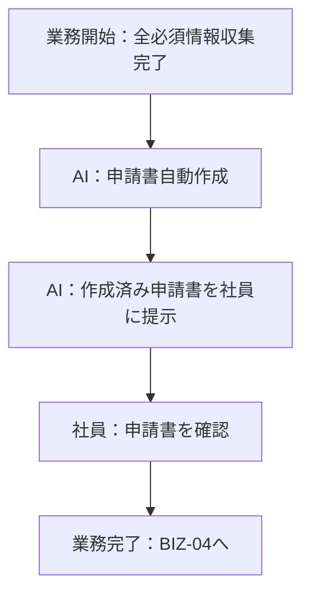
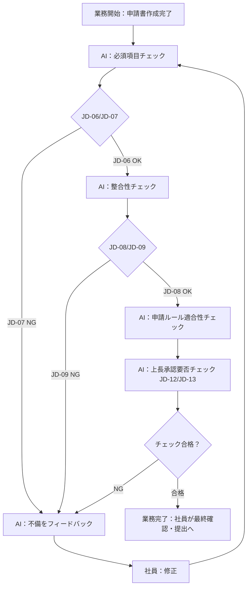

> **参照元（入力資料）:**
> - 業務要件一覧.md（業務要件ID・業務種別の特定）
> - 業務一覧.md（業務ID・業務名の特定）
> - 役割分担定義.md（実行主体・責務分担の決定）
> - 業務ルール定義_判断基準定義.md（判断・ルールとの紐付け）

## 業務プロセス定義

---

### 基本情報
- 業務ID：BIZ-01
- 業務名：申請種別判断・案内
- 業務目的：社員の申請意図から交通費精算申請・経費精算申請のいずれかを判断し提示する
- 対象ユーザ：社内の一般社員（申請ルールや申請方法に詳しくない場合がある）
- 開始条件（トリガー）：社員が申請意図（自然文）を入力する
- 終了条件：申請種別・申請書・申請先が社員に提示される

### 業務フロー（To-Be）

## 業務ステップ定義：ST-BIZ01

### 1) 基本情報
- ステップID：ST-BIZ01-01
- ステップ名：申請意図の入力受付
- 対応業務ID：BIZ-01
- 対応プロセスID：BIZ-01
- ステップ種別：入力
- 実行主体：
  - ☑ 人
  - ☐ AIエージェント
  - ☐ 人＋AI（協調）

### 2) ステップ概要
- 目的：社員の申請意図を受け取る
- このステップで達成すること：申請意図テキストの取得
- 業務上の意味：AIが申請種別判断を行うための起点となる情報取得

### 3) フロー上の位置
- 直前ステップ：なし（業務開始）
- 直後ステップ（通常）：ST-BIZ01-02
- 分岐先ステップ（条件付き）：なし

### 4) 入力情報

| データID | データ名 | 取得元 | 必須 | 欠落時対応 |
|---|---|---|---:|---|
| D-001 | 申請意図テキスト | 社員入力 | ○ | 再入力要求 |

### 5) 実施内容

#### 5.1 処理概要
- 実施する業務処理：社員から申請意図（自然文）を受け取る

#### 5.2 処理詳細（業務粒度）
1. 社員が申請意図を自然文で入力する
2. 入力が空でないことを確認する
3. 次ステップ（申請種別判断）へ渡す

### 6) 判断・ルール

| 種別 | ID | 利用方法 |
|---|---|---|
| 業務ルール | BRL-01 | 申請意図が不明確な場合に選択肢提示へ遷移する判定 |

### 7) 出力結果

| データID | データ名 | 出力先 | 確定主体 |
|---|---|---|---|
| D-001 | 申請意図テキスト | ST-BIZ01-02 | 人 |

### 8) 例外処理

| ケース | 発生条件 | 対応 | 遷移先 |
|---|---|---|---|
| 入力が空 | 社員が何も入力せずに送信 | 入力を促すメッセージを表示 | ST-BIZ01-01（再入力） |

### 9) 責務分担

| 項目 | 人 | AIエージェント |
|---|---|---|
| 入力 | ○ | × |
| 判断 | × | × |
| 実行 | × | × |

### 10) 完了条件
- 正常終了条件：申請意図テキストが取得された
- 未完了・中断条件：入力が空のまま送信された

---

### 1) 基本情報
- ステップID：ST-BIZ01-02
- ステップ名：申請種別判断・提示
- 対応業務ID：BIZ-01
- 対応プロセスID：BIZ-01
- ステップ種別：判断・実行
- 実行主体：
  - ☐ 人
  - ☑ AIエージェント
  - ☐ 人＋AI（協調）

### 2) ステップ概要
- 目的：申請意図から交通費精算申請・経費精算申請のいずれかを判断して提示する
- このステップで達成すること：申請種別の特定と案内
- 業務上の意味：社員が正しい申請先・申請書を把握できる

### 3) フロー上の位置
- 直前ステップ：ST-BIZ01-01
- 直後ステップ（通常）：BIZ-02（申請情報収集）
- 分岐先ステップ（条件付き）：ST-BIZ01-01（選択肢提示後の再判断）

### 4) 入力情報

| データID | データ名 | 取得元 | 必須 | 欠落時対応 |
|---|---|---|---:|---|
| D-001 | 申請意図テキスト | ST-BIZ01-01 | ○ | ST-BIZ01-01へ戻る |
| D-002 | 社内申請ルールナレッジ | ナレッジベース | ○ | エスカレーション |

### 5) 実施内容

#### 5.1 処理概要
- 実施する業務処理：申請意図と申請ルールを照合し、交通費精算申請・経費精算申請のいずれかを判断して社員に提示する

#### 5.2 処理詳細（業務粒度）
1. 申請意図テキストを解釈し、申請目的・状況を把握する
2. 社内申請ルールナレッジを参照して交通費精算申請・経費精算申請のいずれかを判断する（JD-01/JD-02）
3. 判断できない場合は「交通費精算申請」「経費精算申請」の2択選択肢を提示してユーザーに選択を求める（BRL-01）
4. 申請種別・使用すべき申請書・申請先を社員に提示する

### 6) 判断・ルール

| 種別 | ID | 利用方法 |
|---|---|---|
| 判断基準 | JD-01 | 申請種別が特定できる場合の正常フロー判定 |
| 判断基準 | JD-02 | 申請種別が特定できない場合の選択肢提示遷移 |
| 業務ルール | BRL-01 | 申請意図が一意でない場合の選択肢提示 |

### 7) 出力結果

| データID | データ名 | 出力先 | 確定主体 |
|---|---|---|---|
| D-003 | 申請種別・申請書・申請先の案内結果 | 社員（画面表示） | AI |

### 8) 例外処理

| ケース | 発生条件 | 対応 | 遷移先 |
|---|---|---|---|
| 申請種別が一意に判断できない | 申請意図が曖昧・不足 | 「交通費精算申請」「経費精算申請」の2択選択肢を提示してユーザーに選択を求める | ST-BIZ01-01（選択後の再判断） |
| ナレッジ参照失敗 | ナレッジベースにアクセス不可 | エスカレーション案内を提示 | 要件上未定義 |

### 9) 責務分担

| 項目 | 人 | AIエージェント |
|---|---|---|
| 入力 | × | ○ |
| 判断 | △（最終確認） | ○ |
| 実行 | × | ○ |

### 10) 完了条件
- 正常終了条件：申請種別・申請書・申請先が社員に提示された
- 未完了・中断条件：社員が選択肢からの選択を拒否した

### 例外処理

| ケース | 発生条件 | 対応方針 | 担当 |
|---|---|---|---|
| 申請ルール外のケース | 申請意図がナレッジ外 | 人へのエスカレーション案内を提示 | AIエージェント（案内）→人（判断） |

---

### 基本情報
- 業務ID：BIZ-02
- 業務名：申請情報収集（対話）
- 業務目的：申請書作成に必要な情報を対話形式で収集する
- 対象ユーザ：社内の一般社員（申請ルールや申請方法に詳しくない場合がある）
- 開始条件（トリガー）：申請種別が決定した後、必須情報の不足が検出された場合
- 終了条件：申請書作成に必要なすべての必須情報が収集された

### 業務フロー（To-Be）

## 業務ステップ定義：ST-BIZ02

### 1) 基本情報
- ステップID：ST-BIZ02-01
- ステップ名：必須情報の充足確認と不足情報収集
- 対応業務ID：BIZ-02
- 対応プロセスID：BIZ-02
- ステップ種別：対話・確認
- 実行主体：
  - ☐ 人
  - ☐ AIエージェント
  - ☑ 人＋AI（協調）

### 2) ステップ概要
- 目的：申請種別に応じた必須情報をすべて収集する
- このステップで達成すること：申請書作成に必要な全情報の確保
- 業務上の意味：不足情報のまま申請書を作成させないことで申請ミスを防ぐ

### 3) フロー上の位置
- 直前ステップ：ST-BIZ01-02
- 直後ステップ（通常）：ST-BIZ03-01
- 分岐先ステップ（条件付き）：なし（不足がある限りループ）

### 4) 入力情報

| データID | データ名 | 取得元 | 必須 | 欠落時対応 |
|---|---|---|---:|---|
| D-003 | 申請種別 | ST-BIZ01-02 | ○ | ST-BIZ01-02へ戻る |
| D-004 | 社員回答（不足情報） | 社員入力 | ○ | 再質問 |
| D-009 | 領収書画像データ | 社員入力（経費精算申請時） | △ | 領収書画像の提出を求める |
| D-010 | 移動区間情報 | 社員入力・自動計算（交通費精算申請時） | △ | 移動情報の入力を求める |

### 5) 実施内容

#### 5.1 処理概要
- 実施する業務処理：申請種別に応じた必須項目リストと収集済み情報を照合し、不足項目を特定・質問する。交通費精算申請は移動情報収集と運賃自動計算、経費精算申請は領収書自動抽出と経費区分自動判断を行う

#### 5.2 処理詳細（業務粒度）
1. 申請種別に対応する必須項目リストを参照する（BRL-06/BRL-07）
2. 収集済み情報と必須項目を照合し、不足項目を特定する（JD-05）
3. 不足項目ごとに確認質問を生成・提示する
4. 社員の回答を受け取り、収集済み情報に追加する
5. 交通費精算申請の場合：移動情報を一区間ずつ収集し、運賃を自動計算する（BRL-14）。駅名を正規化する（BRL-15）
6. 経費精算申請の場合：領収書画像から店舗名・金額・日付・品目を自動抽出する（BRL-16）。品目から経費区分を自動判断する（BRL-17）
7. 全必須項目が揃うまでステップ3〜6を繰り返す（JD-04）
8. 全必須項目充足後、申請期限チェックを実施する（JD-11）

### 6) 判断・ルール

| 種別 | ID | 利用方法 |
|---|---|---|
| 判断基準 | JD-04 | 全必須項目充足の確認（OK → 次ステップへ） |
| 判断基準 | JD-05 | 不足項目の検出（NG → 追加質問） |
| 判断基準 | JD-11 | 申請期限チェック（90日以内か確認） |
| 業務ルール | BRL-02 | 必須情報未充足時の申請書作成禁止 |
| 業務ルール | BRL-06 | 交通費精算申請の必須項目リスト |
| 業務ルール | BRL-07 | 経費精算申請の必須項目リスト |
| 業務ルール | BRL-14 | 交通費の運賃自動計算 |
| 業務ルール | BRL-15 | 駅名正規化 |
| 業務ルール | BRL-16 | 領収書画像からの情報自動抽出 |
| 業務ルール | BRL-17 | 品目からの経費区分自動判断 |

### 7) 出力結果

| データID | データ名 | 出力先 | 確定主体 |
|---|---|---|---|
| D-005 | 収集済み申請情報（全必須項目） | ST-BIZ03-01 | 人＋AI |

### 8) 例外処理

| ケース | 発生条件 | 対応 | 遷移先 |
|---|---|---|---|
| 社員が回答を拒否・キャンセル | 社員が情報提供を中止 | 申請手続きを中断し案内を終了 | 業務終了 |
| 収集情報に矛盾が発生 | 回答内容が既収集情報と矛盾 | 矛盾箇所を提示して再確認を促す | ST-BIZ02-01（再質問） |
| 申請期限超過 | 経費発生日から90日を超えている | 期限超過を申請者に通知し申請を停止する | 業務終了（期限超過） |

### 9) 責務分担

| 項目 | 人 | AIエージェント |
|---|---|---|
| 入力 | ○ | × |
| 判断 | × | ○ |
| 実行 | × | ○ |

### 10) 完了条件
- 正常終了条件：申請種別に応じた全必須情報が収集され、申請期限内であることが確認された
- 未完了・中断条件：社員が情報提供を中止した、または申請期限超過が確認された

### 例外処理

| ケース | 発生条件 | 対応方針 | 担当 |
|---|---|---|---|
| 回答が何度も矛盾する | 3回以上矛盾回答 | エスカレーション案内を提示 | AIエージェント（案内）→人（判断） |

---

### 基本情報
- 業務ID：BIZ-03
- 業務名：申請書自動作成
- 業務目的：収集した申請情報をもとに交通費精算申請書または経費精算申請書を自動作成する
- 対象ユーザ：社内の一般社員（申請ルールや申請方法に詳しくない場合がある）
- 開始条件（トリガー）：申請種別に応じた全必須情報が収集された
- 終了条件：申請書が作成され、社員に提示される

### 業務フロー（To-Be）

## 業務ステップ定義：ST-BIZ03

### 1) 基本情報
- ステップID：ST-BIZ03-01
- ステップ名：申請書自動作成・提示
- 対応業務ID：BIZ-03
- 対応プロセスID：BIZ-03
- ステップ種別：参照・実行
- 実行主体：
  - ☐ 人
  - ☑ AIエージェント
  - ☐ 人＋AI（協調）

### 2) ステップ概要
- 目的：収集情報から交通費精算申請書または経費精算申請書を自動作成して社員に提示する
- このステップで達成すること：申請書の生成と提示
- 業務上の意味：社員が手動で申請書を記入する負担を削減する

### 3) フロー上の位置
- 直前ステップ：ST-BIZ02-01
- 直後ステップ（通常）：ST-BIZ04-01
- 分岐先ステップ（条件付き）：なし

### 4) 入力情報

| データID | データ名 | 取得元 | 必須 | 欠落時対応 |
|---|---|---|---:|---|
| D-005 | 収集済み申請情報 | ST-BIZ02-01 | ○ | ST-BIZ02-01へ戻る |
| D-003 | 申請種別 | ST-BIZ01-02 | ○ | ST-BIZ01-02へ戻る |

### 5) 実施内容

#### 5.1 処理概要
- 実施する業務処理：収集済み申請情報を交通費精算申請書または経費精算申請書のフォーマットに当てはめ、申請書を生成して社員に提示する

#### 5.2 処理詳細（業務粒度）
1. 申請種別に対応する申請書フォーマット（交通費精算申請書または経費精算申請書）を選択する
2. 収集済み申請情報を各項目にマッピングする
3. 申請書を生成する
4. 生成した申請書を社員に提示する

### 6) 判断・ルール

| 種別 | ID | 利用方法 |
|---|---|---|
| 業務ルール | BRL-02 | 必須情報が揃っていることを前提に申請書作成を開始する |

### 7) 出力結果

| データID | データ名 | 出力先 | 確定主体 |
|---|---|---|---|
| D-006 | 作成済み申請書 | 社員（画面表示）、ST-BIZ04-01 | AI |

### 8) 例外処理

| ケース | 発生条件 | 対応 | 遷移先 |
|---|---|---|---|
| 申請書フォーマット取得失敗 | フォーマットデータにアクセス不可 | エラーを社員に通知する | 業務終了（エラー） |

### 9) 責務分担

| 項目 | 人 | AIエージェント |
|---|---|---|
| 入力 | × | ○ |
| 判断 | × | ○ |
| 実行 | × | ○ |

### 10) 完了条件
- 正常終了条件：申請書が生成され社員に提示された
- 未完了・中断条件：フォーマット取得・生成に失敗した

### 例外処理

| ケース | 発生条件 | 対応方針 | 担当 |
|---|---|---|---|
| 申請書フォーマット未対応 | 申請種別に対応するフォーマットが存在しない | エラー通知・管理者へのエスカレーション案内 | AIエージェント（案内）→人（対応） |

---

### 基本情報
- 業務ID：BIZ-04
- 業務名：申請内容チェック
- 業務目的：作成した申請書の内容をチェックし、申請ミスや差し戻しを防ぐ
- 対象ユーザ：社内の一般社員（申請ルールや申請方法に詳しくない場合がある）
- 開始条件（トリガー）：申請書が自動作成された
- 終了条件：チェック合格、または不備が社員にフィードバックされる

### 業務フロー（To-Be）

## 業務ステップ定義：ST-BIZ04

### 1) 基本情報
- ステップID：ST-BIZ04-01
- ステップ名：申請書チェック・フィードバック
- 対応業務ID：BIZ-04
- 対応プロセスID：BIZ-04
- ステップ種別：判断・実行
- 実行主体：
  - ☐ 人
  - ☐ AIエージェント
  - ☑ 人＋AI（協調）

### 2) ステップ概要
- 目的：申請書の必須項目・整合性・ルール適合性・上長承認要否を確認し不備をフィードバックする
- このステップで達成すること：申請ミス・差し戻しリスクの低減
- 業務上の意味：承認者への差し戻しを事前に防ぎ、申請効率を向上させる

### 3) フロー上の位置
- 直前ステップ：ST-BIZ03-01
- 直後ステップ（通常）：社員による最終確認・提出
- 分岐先ステップ（条件付き）：ST-BIZ03-01（修正後の再チェック）

### 4) 入力情報

| データID | データ名 | 取得元 | 必須 | 欠落時対応 |
|---|---|---|---:|---|
| D-006 | 作成済み申請書 | ST-BIZ03-01 | ○ | ST-BIZ03-01へ戻る |
| D-002 | 社内申請ルールナレッジ | ナレッジベース | ○ | エスカレーション |

### 5) 実施内容

#### 5.1 処理概要
- 実施する業務処理：申請書の必須項目充足・整合性・申請ルール適合性・上長承認要否を順次チェックしてフィードバックする

#### 5.2 処理詳細（業務粒度）
1. 必須項目がすべて記入されているか確認する（JD-06/JD-07）
2. 申請書内の情報（日付・金額・区間等）に矛盾がないか確認する（JD-08/JD-09）
3. 申請内容が社内申請ルールに適合しているか確認する
4. 上長承認要否を確認する（JD-12: 交通費10,000円超、JD-13: 経費5,000円超）
5. チェック結果（合格/不備）を社員にフィードバックする
6. 不備がある場合は修正を促し、修正後に再チェックする（BRL-03）

### 6) 判断・ルール

| 種別 | ID | 利用方法 |
|---|---|---|
| 判断基準 | JD-06 | 必須項目チェック合格判定 |
| 判断基準 | JD-07 | 必須項目不備の検出とフィードバック |
| 判断基準 | JD-08 | 整合性チェック合格判定 |
| 判断基準 | JD-09 | 整合性不備の検出とフィードバック |
| 判断基準 | JD-12 | 交通費精算申請の上長承認要否判断（10,000円超） |
| 判断基準 | JD-13 | 経費精算申請の上長承認要否判断（5,000円超） |
| 業務ルール | BRL-03 | 申請書作成後のチェック実施義務 |
| 業務ルール | BRL-11 | 交通費10,000円超の場合の上長承認案内 |
| 業務ルール | BRL-18 | 経費5,000円超の場合の上長承認案内 |

### 7) 出力結果

| データID | データ名 | 出力先 | 確定主体 |
|---|---|---|---|
| D-007 | チェック結果・修正指摘 | 社員（画面表示） | AI |
| D-008 | チェック合格済み申請書 | 社員（最終確認・提出） | 人＋AI |

### 8) 例外処理

| ケース | 発生条件 | 対応 | 遷移先 |
|---|---|---|---|
| 修正しても不備が解消しない | 複数回修正後も同じ不備が残る | エスカレーション案内を提示 | 要件上未定義 |

### 9) 責務分担

| 項目 | 人 | AIエージェント |
|---|---|---|
| 入力 | × | ○ |
| 判断 | △（最終判断） | ○（一次チェック） |
| 実行 | ○（修正・提出） | △（修正案提示） |

### 10) 完了条件
- 正常終了条件：チェックが合格し、社員が最終確認できる状態になった
- 未完了・中断条件：社員が修正・対応を中止した

### 例外処理

| ケース | 発生条件 | 対応方針 | 担当 |
|---|---|---|---|
| ルール適合性が判断できない | 申請ルールナレッジに定めのないケース | エスカレーション案内を提示 | AIエージェント（案内）→人（判断） |
