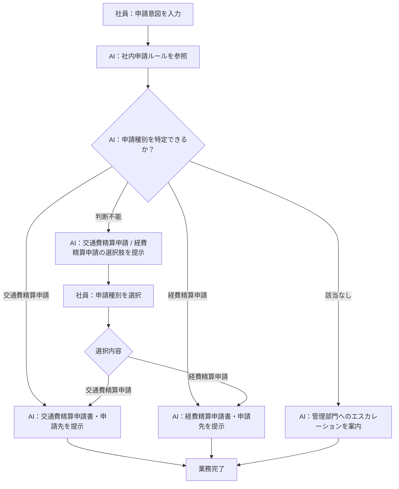
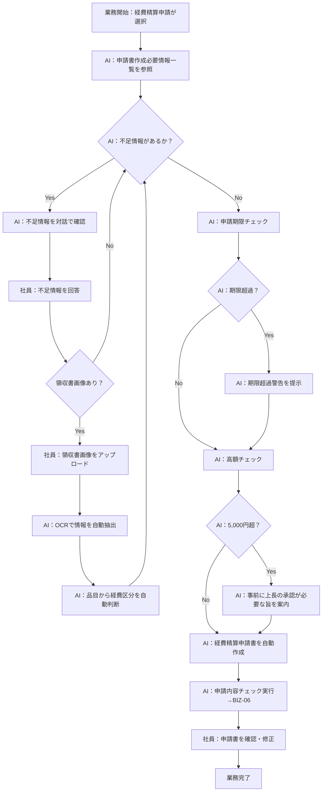
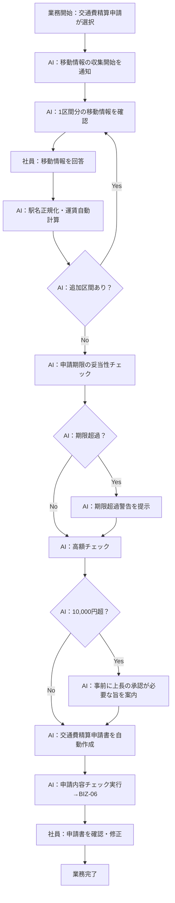
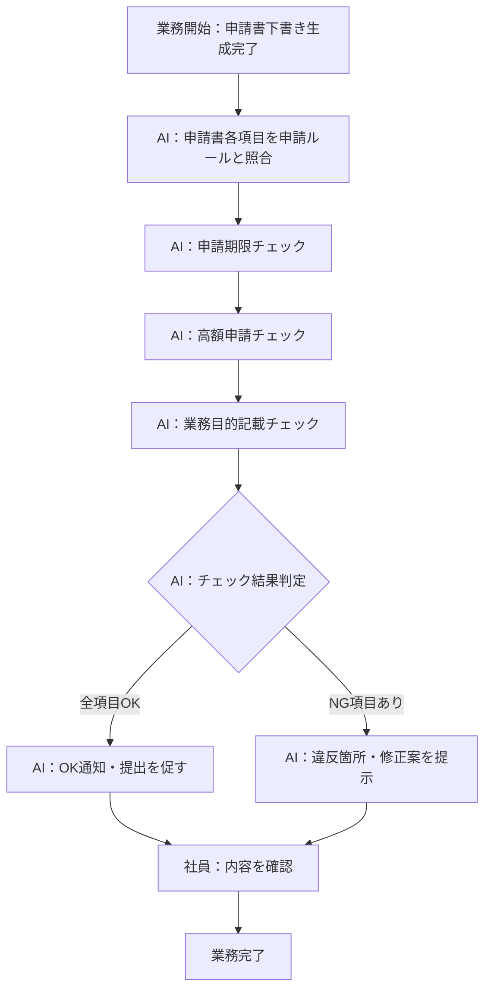
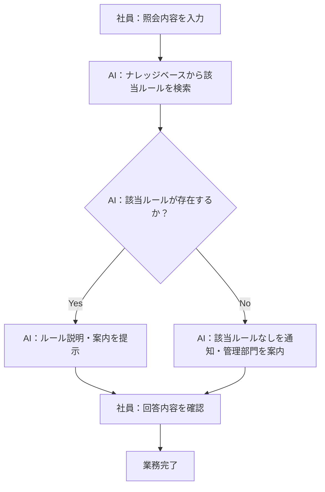

> **参照元（入力資料）:**
> - 業務要件一覧.md（業務要件ID・業務種別の特定）
> - 業務一覧.md（業務ID・業務名の特定）
> - 役割分担定義.md（実行主体・責務分担の決定）
> - 業務ルール定義_判断基準定義.md（判断・ルールとの紐付け）

## 業務プロセス定義

---

### 基本情報
- 業務ID：BIZ-01
- 業務名：申請種別案内
- 業務目的：社員の申請意図から必要な申請種別（交通費精算申請・経費精算申請）・申請書・申請先を判断して提示する
- 対象ユーザ：一般社員
- 開始条件（トリガー）：社員が申請意図（「タクシー代を精算したい」「文房具を購入した」等）を入力する
- 終了条件：申請種別・申請書・申請先が社員に提示される

### 業務フロー（To-Be）

## 業務ステップ定義：ST-01

### 1) 基本情報
- ステップID：ST-01-01
- ステップ名：申請意図受付
- 対応業務ID：BIZ-01
- ステップ種別：入力
- 実行主体：
  - ☑ 人

### 2) ステップ概要
- 目的：社員の申請意図を受け取る
- このステップで達成すること：申請意図テキストの取得
- 業務上の意味：後続の申請種別判断処理の起点となる

### 3) フロー上の位置
- 直前ステップ：なし（開始）
- 直後ステップ（通常）：ST-01-02

### 4) 入力情報

| データID | データ名 | 取得元 | 必須 | 欠落時対応 |
|---|---|---|---:|---|
| D-001 | 申請意図テキスト | 社員入力 | ○ | 入力を促すメッセージを表示する |

### 5) 実施内容

#### 5.1 処理概要
- 社員が申請意図を自由テキストで入力する

#### 5.2 処理詳細（業務粒度）
1. AIエージェントが申請意図の入力を促す
2. 社員が申請意図（「タクシー代を精算したい」「文房具を購入した」等）を自然言語で入力する

### 6) 判断・ルール

| 種別 | ID | 利用方法 |
|---|---|---|
| 業務ルール | BRL-01 | 申請ルールを参照して判断する前提として適用 |

### 7) 出力結果

| データID | データ名 | 出力先 | 確定主体 |
|---|---|---|---|
| D-001 | 申請意図テキスト | 後続処理（ST-01-02） | 人 |

### 8) 例外処理

| ケース | 発生条件 | 対応 | 遷移先 |
|---|---|---|---|
| 入力が空欄 | 社員が何も入力せずに送信 | 申請意図の入力を促す | ST-01-01（再入力） |

### 9) 責務分担

| 項目 | 人 | AIエージェント |
|---|---|---|
| 入力 | ○ | × |
| 判断 | × | × |
| 実行 | × | × |

### 10) 完了条件
- 正常終了条件：申請意図テキストが入力された
- 未完了・中断条件：社員が入力を中断する

---

### 1) 基本情報
- ステップID：ST-01-02
- ステップ名：申請種別判断・案内
- 対応業務ID：BIZ-01
- ステップ種別：判断・実行
- 実行主体：
  - ☑ AIエージェント

### 2) ステップ概要
- 目的：社内申請ルールを参照して申請種別（交通費精算申請・経費精算申請）を判断し、申請書・申請先を提示する
- このステップで達成すること：申請種別・申請書・申請先の提示
- 業務上の意味：社員が正しい申請先・申請書を把握する

### 3) フロー上の位置
- 直前ステップ：ST-01-01
- 直後ステップ（通常）：申請書自動作成（BIZ-02 または BIZ-04）
- 分岐先ステップ（条件付き）：ST-01-03（判断不能の場合）

### 4) 入力情報

| データID | データ名 | 取得元 | 必須 | 欠落時対応 |
|---|---|---|---:|---|
| D-001 | 申請意図テキスト | ST-01-01 | ○ | ST-01-01に戻る |
| D-002 | 社内申請ルール | ナレッジベース | ○ | 管理部門へエスカレーション案内 |

### 5) 実施内容

#### 5.1 処理概要
- 社内申請ルール（D-002）を参照して申請意図から申請種別を判断する

#### 5.2 処理詳細（業務粒度）
1. 社内申請ルール（D-002）を取得する
2. 申請意図（D-001）から対応する申請種別（交通費精算申請・経費精算申請）を判断する（JD-01〜03）
3. 判断結果に基づき申請種別・申請書・申請先（経理部）を提示する
4. 申請種別が判断できない場合は ST-01-03 に遷移し、選択肢を提示する（BRL-04）

### 6) 判断・ルール

| 種別 | ID | 利用方法 |
|---|---|---|
| 判断基準 | JD-01〜03 | 申請意図から申請種別を特定する |
| 業務ルール | BRL-01 | 社内申請ルールのみを根拠に判断する |
| 業務ルール | BRL-04 | 特定できない場合は選択肢を提示する |
| 業務ルール | BRL-14 | 申請ルールに定義されていない内容は推測・補完しない |

### 7) 出力結果

| データID | データ名 | 出力先 | 確定主体 |
|---|---|---|---|
| D-003 | 申請種別判断結果 | 後続処理（申請書自動作成） | AI |
| D-004 | 申請案内結果 | 社員（画面表示） | AI |

### 8) 例外処理

| ケース | 発生条件 | 対応 | 遷移先 |
|---|---|---|---|
| 申請ルール参照失敗 | ナレッジベースへのアクセス失敗 | エラー通知・管理部門エスカレーション案内 | 業務中断 |
| 申請種別特定不可 | 申請意図が申請ルールに該当しない（JD-03） | 追加情報を確認するか管理部門を案内 | ST-01-03 または 業務中断 |

### 9) 責務分担

| 項目 | 人 | AIエージェント |
|---|---|---|
| 入力 | × | ○ |
| 判断 | × | ○ |
| 実行 | × | ○ |

### 10) 完了条件
- 正常終了条件：申請種別・申請書・申請先が社員に提示された
- 未完了・中断条件：ナレッジベースが参照できない場合

---

### 1) 基本情報
- ステップID：ST-01-03
- ステップ名：申請種別選択（条件付き）
- 対応業務ID：BIZ-01
- ステップ種別：対話・確認
- 実行主体：
  - ☑ 人＋AI（協調）

### 2) ステップ概要
- 目的：申請種別（交通費精算申請・経費精算申請）が判断できない場合に選択肢を提示してユーザーに選択させる
- このステップで達成すること：申請種別の確定
- 業務上の意味：正確な申請種別を社員が選択することで後続フローへ誘導する

### 3) フロー上の位置
- 直前ステップ：ST-01-02（JD-02がTrueの場合のみ実行）
- 直後ステップ（通常）：ST-01-02（再判断）

### 4) 入力情報

| データID | データ名 | 取得元 | 必須 | 欠落時対応 |
|---|---|---|---:|---|
| D-001 | 申請意図テキスト | ST-01-01 | ○ | ST-01-01に戻る |
| D-002 | 社内申請ルール | ナレッジベース | ○ | 管理部門へエスカレーション案内 |

### 5) 実施内容

#### 5.1 処理概要
- AIが「交通費精算申請」「経費精算申請」の選択肢を提示し、社員が選択する

#### 5.2 処理詳細（業務粒度）
1. AIが「交通費精算申請」「経費精算申請」の2つの選択肢を社員に提示する
2. 社員が申請種別を選択する
3. AIが選択された申請種別に対応する申請フロー（BIZ-02 または BIZ-04）へ誘導する

### 6) 判断・ルール

| 種別 | ID | 利用方法 |
|---|---|---|
| 業務ルール | BRL-04 | 申請種別が判断できない場合に選択肢を提示する |

### 7) 出力結果

| データID | データ名 | 出力先 | 確定主体 |
|---|---|---|---|
| D-003 | 申請種別判断結果（選択後） | ST-01-02（再判断） | 人 |

### 8) 例外処理

| ケース | 発生条件 | 対応 | 遷移先 |
|---|---|---|---|
| 選択不可 | 社員が選択肢のいずれも選択できない | 管理部門へのエスカレーションを案内する | 業務中断 |

### 9) 責務分担

| 項目 | 人 | AIエージェント |
|---|---|---|
| 入力 | ○ | × |
| 判断 | ○ | × |
| 実行 | × | ○ |

### 10) 完了条件
- 正常終了条件：申請種別が選択されST-01-02に渡された
- 未完了・中断条件：社員が申請種別を選択できない

---

### 例外処理（BIZ-01全体）

| ケース | 発生条件 | 対応方針 | 担当 |
|---|---|---|---|
| 申請ルール参照失敗 | ナレッジベースへのアクセス失敗 | エラー通知・管理部門エスカレーション案内 | AIエージェント |
| 申請種別が特定不可 | 申請意図が申請ルールに該当しない | 選択肢確認または管理部門エスカレーション | AIエージェント |

---

## 業務プロセス定義

---

### 基本情報
- 業務ID：BIZ-02
- 業務名：経費精算申請書自動作成
- 業務目的：対話で不足情報を収集しながら経費精算申請書を自動作成する
- 対象ユーザ：一般社員
- 開始条件（トリガー）：BIZ-01（申請種別案内）で経費精算申請が選択される
- 終了条件：経費精算申請書（下書き）が作成され社員に提示される

### 業務フロー（To-Be）

## 業務ステップ定義：ST-02

### 1) 基本情報
- ステップID：ST-02-01
- ステップ名：不足情報確認・申請書作成
- 対応業務ID：BIZ-02
- ステップ種別：対話・確認 → 参照・実行
- 実行主体：
  - ☑ 人＋AI（協調）

### 5) 実施内容

#### 5.2 処理詳細（業務粒度）
1. AIが経費精算申請書の作成必要情報一覧（D-005）を参照する
2. 不足情報（JD-05）を特定し、社員に対話で確認する（BRL-02）
3. 領収書画像がある場合、社員がアップロードし、AIがOCRで情報を自動抽出する（BRL-08）
4. 品目から経費区分（事務用品費・宿泊費・資格精算費・その他経費）を自動判断する（BRL-09, JD-07, JD-17）
5. 申請期限の妥当性をチェックする（JD-09, BRL-11）
6. 高額チェックを実施する（JD-11, BRL-12）
7. 全情報が揃ったら（JD-08）経費精算申請書を自動作成する（BRL-07）
8. 申請内容チェック（BIZ-06）を自動実行する（BRL-16）

### 6) 判断・ルール

| 種別 | ID | 利用方法 |
|---|---|---|
| 判断基準 | JD-05 | 不足情報の有無を判断する |
| 判断基準 | JD-07 | 品目から経費区分を判断する |
| 判断基準 | JD-08 | 全情報収集完了を判断する |
| 判断基準 | JD-09 | 申請期限の妥当性を判断する（3ヶ月以内） |
| 判断基準 | JD-11 | 高額申請の事前承認要否を判断する（経費精算：5,000円超） |
| 判断基準 | JD-17 | 経費区分（事務用品費・宿泊費・資格精算費・その他経費）を判断する |
| 業務ルール | BRL-02 | 不足情報を対話で確認する |
| 業務ルール | BRL-07 | 全情報収集後に申請書を生成する |
| 業務ルール | BRL-08 | 領収書画像がある場合はOCRで情報を抽出する |
| 業務ルール | BRL-09 | 品目から経費区分を自動判断する |
| 業務ルール | BRL-11 | 申請期限超過を検出した場合は警告する |
| 業務ルール | BRL-12 | 高額申請の場合は事前に上長の承認が必要な旨を案内する |
| 業務ルール | BRL-13 | 業務目的の記載を必須とする |
| 業務ルール | BRL-16 | 申請書作成後にBIZ-06を自動実行する |

### 4) 入力情報

| データID | データ名 | 取得元 | 必須 | 欠落時対応 |
|---|---|---|---:|---|
| D-003 | 申請種別判断結果 | BIZ-01 | ○ | BIZ-01に戻る |
| D-005 | 申請書作成必要情報一覧（経費精算） | ナレッジベース | ○ | 管理部門へエスカレーション案内 |
| D-006 | 社員回答（不足情報） | 社員入力 | 条件付き | 再確認を促す |
| D-008 | 申請書テンプレート（経費精算） | ナレッジベース | ○ | 管理部門へエスカレーション案内 |
| D-014 | 領収書画像 | 社員入力 | 条件付き | 手動入力を促す |

### 7) 出力結果

| データID | データ名 | 出力先 | 確定主体 |
|---|---|---|---|
| D-009 | 申請書（下書き） | 社員（画面表示）、BIZ-06 | AI |

### 8) 例外処理

| ケース | 発生条件 | 対応 | 遷移先 |
|---|---|---|---|
| 必須情報収集不能 | 社員が必須情報の回答を拒否 | 申請書作成中断を通知 | 業務中断 |
| テンプレート取得失敗 | テンプレートがナレッジベースに未登録 | エラー通知・管理部門エスカレーション | 業務中断 |
| OCR抽出失敗 | 領収書画像が不鮮明または非対応形式 | 再アップロードまたは手動入力を促す | ST-02-01（継続） |

### 9) 責務分担

| 項目 | 人 | AIエージェント |
|---|---|---|
| 入力 | ○ | × |
| 判断 | × | ○ |
| 実行 | △ | ○ |

### 10) 完了条件
- 正常終了条件：経費精算申請書（下書き）が作成され社員に提示された
- 未完了・中断条件：必須情報が収集できない場合、テンプレート取得失敗

---

## 業務プロセス定義

---

### 基本情報
- 業務ID：BIZ-04
- 業務名：交通費精算申請書自動作成
- 業務目的：対話で移動情報を一区間ずつ収集しながら交通費精算申請書を自動作成する
- 対象ユーザ：一般社員
- 開始条件（トリガー）：BIZ-01（申請種別案内）で交通費精算申請が選択される
- 終了条件：交通費精算申請書（下書き）が作成され社員に提示される

### 業務フロー（To-Be）

## 業務ステップ定義：ST-04

### 1) 基本情報
- ステップID：ST-04-01
- ステップ名：移動情報収集・申請書作成
- 対応業務ID：BIZ-04
- ステップ種別：対話・確認 → 参照・実行
- 実行主体：
  - ☑ 人＋AI（協調）

### 4) 入力情報

| データID | データ名 | 取得元 | 必須 | 欠落時対応 |
|---|---|---|---:|---|
| D-003 | 申請種別判断結果 | BIZ-01 | ○ | 開始条件に戻る |
| D-005 | 申請書作成必要情報一覧（交通費精算） | ナレッジベース | ○ | 管理部門へエスカレーション案内 |
| D-006 | 社員回答（移動情報） | 社員入力 | ○ | 再確認を促す |
| D-008 | 申請書テンプレート（交通費精算） | ナレッジベース | ○ | 管理部門へエスカレーション案内 |

### 5) 実施内容

#### 5.2 処理詳細（業務粒度）
1. AIが移動情報の収集開始を通知する
2. AIが1区間分の移動情報（移動日・出発地・目的地・交通手段・費用・業務目的）を確認する（BRL-10）
   - 対応交通手段：電車・バス・タクシー・飛行機（JD-15）
3. 社員が回答する
4. 電車の場合は駅名を正規化する（BRL-18）
5. 運賃データから交通費を自動計算する（BRL-17, JD-16）
   - 電車：経路テーブル検索による自動計算
   - バス/タクシー/飛行機：固定運賃
6. 追加区間があれば繰り返す
7. 全区間収集後、申請期限の妥当性をチェックする（JD-09, BRL-11）
8. 高額チェックを実施する（JD-10, BRL-12）
9. 全情報が揃ったら交通費精算申請書を自動作成する（BRL-07）
10. 申請内容チェック（BIZ-06）を自動実行する（BRL-16）

### 6) 判断・ルール

| 種別 | ID | 利用方法 |
|---|---|---|
| 判断基準 | JD-08 | 全情報収集完了を判断する |
| 判断基準 | JD-09 | 申請期限の妥当性を判断する（3ヶ月以内） |
| 判断基準 | JD-10 | 高額申請の事前承認要否を判断する（交通費精算：10,000円超） |
| 判断基準 | JD-15 | 交通手段（電車・バス・タクシー・飛行機）を判断する |
| 判断基準 | JD-16 | 運賃の自動計算可否を判断する |
| 業務ルール | BRL-07 | 全情報収集後に申請書を生成する |
| 業務ルール | BRL-10 | 移動情報を一区間ずつ収集する |
| 業務ルール | BRL-11 | 申請期限超過を検出した場合は警告する |
| 業務ルール | BRL-12 | 高額申請の場合は事前に上長の承認が必要な旨を案内する |
| 業務ルール | BRL-13 | 業務目的の記載を必須とする |
| 業務ルール | BRL-16 | 申請書作成後にBIZ-06を自動実行する |
| 業務ルール | BRL-17 | 運賃データから交通費を自動計算する |
| 業務ルール | BRL-18 | 駅名を正規化する |

---

## 業務プロセス定義

---

### 基本情報
- 業務ID：BIZ-06
- 業務名：申請内容チェック
- 業務目的：作成した申請書を社内申請ルールと照合し、申請期限・高額申請・業務目的等の問題点と修正案を提示する
- 対象ユーザ：一般社員
- 開始条件（トリガー）：BIZ-02またはBIZ-04のいずれかで申請書（下書き）が作成される（自動実行）
- 終了条件：チェック結果と修正案（またはOK通知）が社員に提示される

### 業務フロー（To-Be）

## 業務ステップ定義：ST-06

### 1) 基本情報
- ステップID：ST-06-01
- ステップ名：申請内容チェック・結果提示
- 対応業務ID：BIZ-06
- ステップ種別：参照・実行
- 実行主体：
  - ☑ AIエージェント

### 4) 入力情報

| データID | データ名 | 取得元 | 必須 | 欠落時対応 |
|---|---|---|---:|---|
| D-009 | 申請書（下書き） | BIZ-02またはBIZ-04 | ○ | 申請書作成に戻る |
| D-002 | 社内申請ルール | ナレッジベース | ○ | 管理部門へエスカレーション案内 |

### 5) 実施内容

#### 5.2 処理詳細（業務粒度）
1. AIが申請書（D-009）の各項目を社内申請ルール（D-002）と照合する（JD-13, BRL-03）
2. 申請期限の妥当性をチェックする（JD-09, BRL-11）：経費発生日から3ヶ月以内
3. 高額申請の事前承認要否をチェックする（JD-10/JD-11, BRL-12）：交通費10,000円超・経費5,000円超
4. 業務目的の記載有無をチェックする（JD-12, BRL-13）
5. チェック結果（OK/NG）を判定し、NG の場合は違反箇所と修正案を社員に提示する

### 6) 判断・ルール

| 種別 | ID | 利用方法 |
|---|---|---|
| 判断基準 | JD-09 | 申請期限の妥当性を判断する（3ヶ月以内） |
| 判断基準 | JD-10 | 交通費精算の高額申請の事前承認要否を判断する（10,000円超） |
| 判断基準 | JD-11 | 経費精算の高額申請の事前承認要否を判断する（5,000円超） |
| 判断基準 | JD-12 | 業務目的の記載有無を判断する |
| 判断基準 | JD-13 | 申請内容の総合妥当性を判断する |
| 業務ルール | BRL-03 | 申請内容の妥当性チェックを実施する |
| 業務ルール | BRL-11 | 申請期限超過を警告する |
| 業務ルール | BRL-12 | 高額申請の事前承認が必要な旨を案内する |
| 業務ルール | BRL-13 | 業務目的の記載を確認する |
| 業務ルール | BRL-14 | 申請ルールに定義されていない内容は推測・補完しない |

### 7) 出力結果

| データID | データ名 | 出力先 | 確定主体 |
|---|---|---|---|
| D-010 | チェック結果・修正案 | 社員（画面表示） | AI |

### 8) 例外処理

| ケース | 発生条件 | 対応 | 遷移先 |
|---|---|---|---|
| 申請ルール参照失敗 | ナレッジベースへのアクセス失敗 | エラー通知・管理部門エスカレーション案内 | 業務中断 |

### 9) 責務分担

| 項目 | 人 | AIエージェント |
|---|---|---|
| 入力 | × | ○ |
| 判断 | × | ○ |
| 実行 | × | ○ |

### 10) 完了条件
- 正常終了条件：チェック結果と修正案（またはOK通知）が社員に提示された
- 未完了・中断条件：申請ルール参照失敗

---

## 業務プロセス定義

---

### 基本情報
- 業務ID：BIZ-07
- 業務名：申請ルール照会
- 業務目的：申請ルール・申請方法についての問い合わせに対し、社内申請ルールを参照して回答する
- 対象ユーザ：一般社員
- 開始条件（トリガー）：社員が申請ルール・申請方法について問い合わせる
- 終了条件：ルール説明・案内が社員に提示される

### 業務フロー（To-Be）

## 業務ステップ定義：ST-07

### 1) 基本情報
- ステップID：ST-07-01
- ステップ名：申請ルール照会・回答提示
- 対応業務ID：BIZ-07
- ステップ種別：参照・実行
- 実行主体：
  - ☑ AIエージェント

### 4) 入力情報

| データID | データ名 | 取得元 | 必須 | 欠落時対応 |
|---|---|---|---:|---|
| D-011 | 照会内容テキスト | 社員入力 | ○ | 入力を促す |
| D-002 | 社内申請ルール | ナレッジベース | ○ | 管理部門へエスカレーション案内 |

### 5) 実施内容

#### 5.2 処理詳細（業務粒度）
1. 社員が照会内容（申請ルール・申請方法に関する質問）を入力する
2. AIがナレッジベースから該当する申請ルールを検索する（BRL-01）
3. 該当ルールがある場合、ルール説明・案内を提示する
4. 該当ルールがない場合、その旨を通知し管理部門への問い合わせを案内する

### 6) 判断・ルール

| 種別 | ID | 利用方法 |
|---|---|---|
| 業務ルール | BRL-01 | 申請ルールを参照して回答する |
| 業務ルール | BRL-14 | 申請ルールに定義されていない内容は推測・補完しない |

### 7) 出力結果

| データID | データ名 | 出力先 | 確定主体 |
|---|---|---|---|
| D-012 | ルール説明・案内 | 社員（画面表示） | AI |

### 8) 例外処理

| ケース | 発生条件 | 対応 | 遷移先 |
|---|---|---|---|
| ナレッジベース参照失敗 | ナレッジベースへのアクセス失敗 | エラー通知・管理部門エスカレーション案内 | 業務中断 |
| 該当ルールなし | 照会内容に対応する申請ルールが存在しない | 管理部門への問い合わせを案内 | 業務完了 |

### 9) 責務分担

| 項目 | 人 | AIエージェント |
|---|---|---|
| 入力 | ○ | × |
| 判断 | × | ○ |
| 実行 | × | ○ |

### 10) 完了条件
- 正常終了条件：ルール説明・案内が社員に提示された
- 未完了・中断条件：ナレッジベース参照失敗

---

### 例外処理（全業務共通）

| ケース | 発生条件 | 対応方針 | 担当 |
|---|---|---|---|
| 申請ルール参照失敗 | ナレッジベースへのアクセス失敗 | エラー通知・管理部門エスカレーション案内 | AIエージェント |
| 必須情報収集不能 | 社員が必須情報の回答を拒否 | 申請書作成中断を通知 | AIエージェント |
| 申請書テンプレート取得失敗 | テンプレートがナレッジベースに未登録 | エラー通知・管理部門エスカレーション案内 | AIエージェント |
