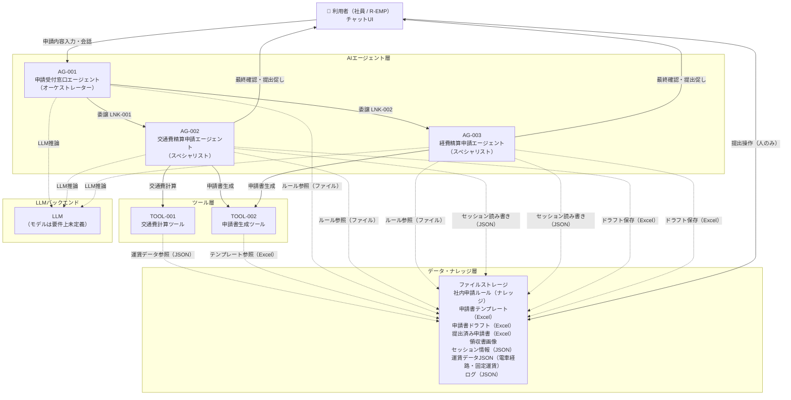
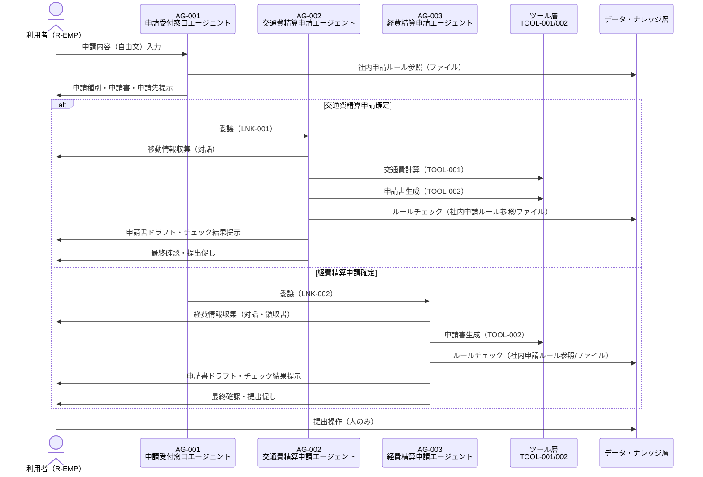

> **参照元（業務要件定義資料）:**
> - 業務一覧.md（システム化対象業務の特定）
> - 業務プロセス定義.md（システム構成要素の役割・責務）
> - ユースケース定義.md（システム利用者・利用シーン）
> - 役割分担定義.md（システムと人の分担）

# システム構成図

## 1. システム全体構成図（Mermaid）

**凡例:**
- `-->` 実線矢印：処理の委譲・呼び出し・会話
- `-.->` 破線矢印：データの参照・取得

---

## 2. マルチエージェント連携図（Mermaid）

---

## 3. 注記

- フロントエンド（チャットUI）は要件上未定義（システム化対象外）
- インフラ構成（クラウド/オンプレ）は要件上未定義
- LLMモデル・バックエンドサービスは要件上未定義
- 外部システム連携は要件上未定義（申請先部門・申請先システムが未定義）
- データ永続化はファイル永続化を使用する（RDBは使用しない）
- ナレッジベースはファイルを使用する（RAGは使用しない）
- セッション情報はファイルストレージ（JSON）で管理する（メモリ・揮発性ストレージは使用しない）
- 申請書テンプレート・ドラフト・提出済み申請書はExcel（.xlsx）形式で管理する
- 運賃データは電車経路（JSON）と固定運賃（JSON）の2ファイルで管理する
