# システム構成図

> **参照元（業務要件定義資料）:**
> - 業務一覧.md（システム化対象業務の特定）
> - 業務プロセス定義.md（システム構成要素の役割・責務）
> - ユースケース定義.md（システム利用者・利用シーン）
> - 役割分担定義.md（システムと人の分担）

---

## 1. システム全体構成図

```mermaid
flowchart TB
    subgraph USER["👤 ユーザー（R-EMP：一般社員）"]
        U1["会話インタフェース（CLI/API）"]
    end

    subgraph EAAS["経費精算申請AIエージェントシステム（EAAS）"]
        subgraph ORCHESTRATOR["オーケストレーター層"]
            AG001["AG-001\n申請受付窓口エージェント\n・申請者名収集\n・申請種別判断\n・申請ルール照会\n・専門エージェントへの委譲"]
        end

        subgraph SPECIALIST["スペシャリスト層（Agent-as-Tool）"]
            AG002["AG-002\n交通費精算申請エージェント\n・移動情報収集\n・運賃自動計算\n・申請書生成\n・申請内容チェック"]
            AG003["AG-003\n経費精算申請エージェント\n・情報収集・領収書OCR\n・経費区分判断\n・申請書生成\n・申請内容チェック"]
        end

        subgraph TOOLS["ツール層"]
            TOOL001["TOOL-001\n交通費計算ツール"]
            TOOL002["TOOL-002\n申請書生成ツール\n（経費精算・交通費精算）"]
        end

        subgraph SESSION["セッション管理"]
            STATE["ファイルストア\n（セッション状態・ファイル永続化）\nsession_{id}.json"]
        end
    end

    subgraph AWS_BEDROCK["Amazon Bedrock（EXT-001）"]
        LLM["Claude Sonnet 4.5\nLLM推論エンジン（IF-001/002）"]
    end

    subgraph FILESTORE["ファイルストア（EXT-003）"]
        TMPL_K["申請書テンプレート\n（経費精算）（DATA-002）"]
        TMPL_T["申請書テンプレート\n（交通費精算）（DATA-003）"]
        FARE_R["運賃データ\n（電車経路テーブル）（DATA-004）"]
        FARE_F["運賃データ\n（固定運賃）（DATA-005）"]
        AUDIT_STD["標準監査ログ\naudit_log_std.jsonl（DATA-010）"]
        AUDIT_HI["強化監査ログ\naudit_log_hi.jsonl（DATA-011）"]
        KB_FILE["ナレッジ\n社内申請ルール（DATA-001）\n申請書作成必要情報（DATA-012）"]
    end

    subgraph OUTPUT["出力（社員端末）"]
        OUT_K["経費精算申請書（下書き）\n（Excel/.xlsx）（OUT-002）"]
        OUT_T["交通費精算申請書（下書き）\n（Excel/.xlsx）（OUT-003）"]
    end

    %% ユーザー ↔ オーケストレーター
    U1 -->|"申請意図入力・照会テキスト"| AG001
    AG001 -->|"申請案内・ルール説明・チェック結果"| U1

    %% オーケストレーター → スペシャリスト（委譲）
    AG001 -->|"LNK-001 委譲（交通費精算申請）"| AG002
    AG001 -->|"LNK-002 委譲（経費精算申請）"| AG003

    %% スペシャリスト ↔ ユーザー（対話）
    AG002 <-->|"移動情報収集対話・承認取得（APR-001）"| U1
    AG003 <-->|"経費情報収集対話・領収書アップロード・承認取得（APR-001）"| U1

    %% エージェント → ツール
    AG002 -->|"TOOL-001 呼び出し"| TOOL001
    AG002 -->|"TOOL-002 呼び出し（交通費精算）"| TOOL002
    AG003 -->|"TOOL-002 呼び出し（経費精算）"| TOOL002

    %% ツール → 出力ファイル
    TOOL002 -->|"申請書生成（経費精算）"| OUT_K
    TOOL002 -->|"申請書生成（交通費精算）"| OUT_T

    %% エージェント → LLM（推論）
    AG001 -.->|"IF-001 LLM推論"| LLM
    AG002 -.->|"IF-001/002 LLM推論・OCR"| LLM
    AG003 -.->|"IF-001/002 LLM推論・OCR"| LLM

    %% エージェント/ツール → ファイルストア（参照）
    TOOL001 -.->|"IF-005 運賃データ参照"| FARE_R
    TOOL001 -.->|"IF-005 運賃データ参照"| FARE_F
    TOOL002 -.->|"IF-004 テンプレート参照"| TMPL_K
    TOOL002 -.->|"IF-004 テンプレート参照"| TMPL_T

    %% エージェント → ナレッジ参照（ファイル）
    AG001 -.->|"IF-009 ナレッジファイル参照"| KB_FILE
    AG002 -.->|"IF-009 ナレッジファイル参照"| KB_FILE
    AG003 -.->|"IF-009 ナレッジファイル参照"| KB_FILE

    %% エージェント → 監査ログ書き込み
    AG001 -.->|"IF-006 LOG-STD書き込み"| AUDIT_STD
    AG002 -.->|"IF-006 LOG-STD書き込み"| AUDIT_STD
    AG003 -.->|"IF-006 LOG-STD書き込み"| AUDIT_STD
    AG002 -.->|"IF-007 LOG-HI書き込み"| AUDIT_HI
    AG003 -.->|"IF-007 LOG-HI書き込み"| AUDIT_HI

    %% セッション状態
    AG001 <-.->|"IF-010 セッションファイル読み書き"| STATE
    AG002 <-.->|"IF-010 セッションファイル読み書き"| STATE
    AG003 <-.->|"IF-010 セッションファイル読み書き"| STATE
```

---

## 2. 凡例・補足

| 記号 | 意味 |
|---|---|
| 実線矢印（→） | 処理の委譲・呼び出し・出力 |
| 破線矢印（-.->） | データの参照・取得・記録 |
| 双方向矢印（<-->） | 対話（リクエスト/レスポンス） |

---

## 3. システム境界・スコープ

| 区分 | 範囲 |
|---|---|
| 本システム（EAAS） | AG-001, AG-002, AG-003, TOOL-001/002, セッション管理（ファイルストア） |
| 外部サービス（AWS） | Amazon Bedrock（LLM） |
| 外部ストア | ファイルストア（テンプレート・運賃データ・監査ログ・ナレッジ・セッション状態） |
| ユーザー端末 | 出力ファイル（経費精算・交通費精算申請書下書き） |
| スコープ外 | 経理部への申請書提出・上長承認フロー・ワークフローシステム連携 |
