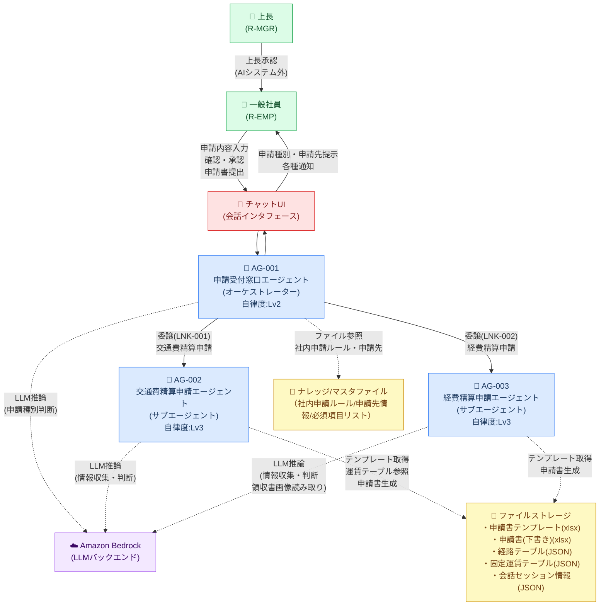

# システム構成図

> **参照元（業務要件定義資料）:**
> - 業務一覧.md（システム化対象業務の特定）
> - 業務プロセス定義.md（システム構成要素の役割・責務）
> - ユースケース定義.md（システム利用者・利用シーン）
> - 役割分担定義.md（システムと人の分担）

---

## 1. システム構成図（Mermaid）

---

## 2. 構成要素サマリ

| 区分 | 構成要素 | 役割 |
|---|---|---|
| ユーザー | 一般社員（R-EMP） | 申請内容入力・確認・申請書提出 |
| ユーザー | 上長（R-MGR） | 高額申請時の承認（AIシステム外） |
| チャットUI | 会話インタフェース | 社員とエージェントのテキスト対話窓口 |
| エージェント | AG-001 申請受付窓口（オーケストレーター） | 申請種別判断・AG-002/AG-003への委譲 |
| エージェント | AG-002 交通費精算申請（サブエージェント） | 移動情報収集・交通費計算・申請書生成 |
| エージェント | AG-003 経費精算申請（サブエージェント） | 経費情報収集・LLM画像読み取り・申請書生成 |
| LLMバックエンド | Amazon Bedrock | 全エージェントの推論バックエンド（領収書画像読み取り含む） |
| ナレッジ/マスタファイル | 社内申請ルール/申請先情報/必須項目リスト（ファイル） | 社内申請ルール・申請先・必須項目のファイル参照 |
| ファイルストレージ | 申請書テンプレート・運賃テーブル・セッション情報 | テンプレート・申請書・マスタデータ・セッション情報の格納 |

---

## 3. 変更履歴

| 日付 | 版 | 変更内容 | 担当 |
|---|---|---|---|
| 2026-05-02 | v1.0 | 初版作成 | - |
