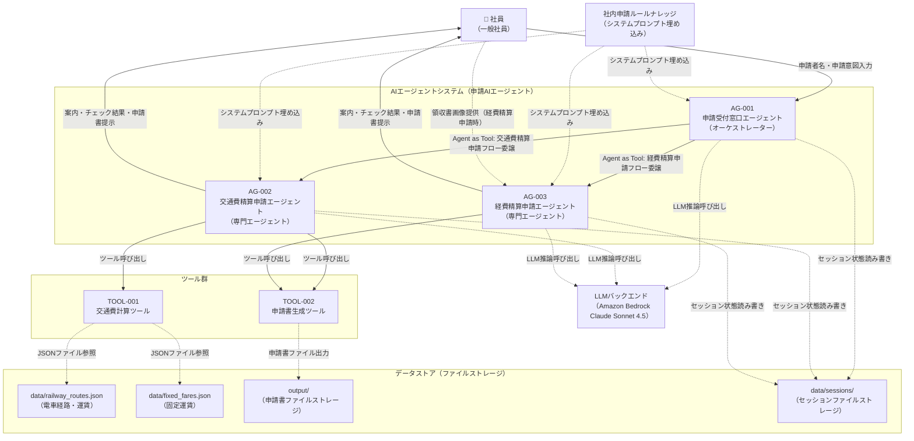

# システム基本情報

> **参照元（システム要件定義資料）:**
> - エージェント一覧.md（エージェント一覧・役割の特定）
> - 機能ツール一覧.md（ツール一覧・目的の特定）
> - システム構成図.md、システム構成図の構成要素一覧.md（システム構成図・アーキテクチャ概要）
> - 機能要件一覧.md（主な機能の特定）
> - データ一覧.md（データストアの特定）
> - 外部システム機能一覧.md（外部サービスの特定）

> 文書ID：`SYS-INFO-001`
> 文書名：システム基本情報
> 版数：`v1.0`
> 作成日：2026-05-06


---

## 1. システム概要

### 1.1 システム名称

**システム名**: 申請AIエージェントシステム

**英語名**: Expense Claim AI Agent System

**略称**: 申請AIエージェント

### 1.2 システムの目的・役割

**目的**:
- 社員が行う交通費精算申請・経費精算申請の対話型自動化により、申請業務の負荷を軽減する
- 申請情報の収集・申請書作成・内容チェックを自動化し、申請漏れ・記載ミスを防止する
- 社内申請ルールをシステムプロンプトに埋め込み、申請種別判断・チェックを一貫して実施する

**役割**:
- 社員の申請意図を受け付け、申請種別（交通費精算申請／経費精算申請）を判断して案内する
- 対話形式で申請に必要な情報を収集し、申請書（Excel）を自動生成して社員に提示する
- 申請書の必須項目・整合性・申請ルール適合性・上長承認要否をチェックしてフィードバックする


---

## 2. システム構成図

### 2.1 アーキテクチャ概要

本システムは、階層型マルチエージェント（Agent as Tools）パターンを採用しています。

**階層構造**:
1. プレゼンテーション層：社員とエージェントの対話インタフェース（AG-001が担当）
2. アプリケーション層：エージェント処理・ツール実行（AG-001〜AG-003、TOOL-001〜TOOL-002）
3. データ層：JSONファイル（運賃マスタ）・Excelファイル（申請書）・セッションファイルの管理


### 2.2 システム構成図（Mermaid）



### 2.3 コンポーネント間の依存関係

| 送信元 | 送信先 | 関係種別 | 説明 |
|--------|--------|----------|------|
| AG-001 | AG-002 | Agent as Tool（委譲） | 交通費精算申請フローをツールとして呼び出す |
| AG-001 | AG-003 | Agent as Tool（委譲） | 経費精算申請フローをツールとして呼び出す |
| AG-002 | TOOL-001 | ツール呼び出し | 運賃計算を依頼する |
| AG-002 | TOOL-002 | ツール呼び出し | 申請書生成を依頼する |
| AG-003 | TOOL-002 | ツール呼び出し | 申請書生成を依頼する |
| TOOL-001 | data/railway_routes.json | ファイル参照 | 電車運賃を検索する |
| TOOL-001 | data/fixed_fares.json | ファイル参照 | 固定運賃を取得する |
| TOOL-002 | output/ | ファイル出力 | 申請書Excelを保存する |
| AG-001〜AG-003 | Amazon Bedrock | API呼び出し | LLM推論を実行する |
| AG-001〜AG-003 | data/sessions/ | ファイル読み書き | セッション状態を永続化する |

---

## 3. 技術スタック

### 3.1 開発環境

| 項目 | 内容 |
|-----|------|
| OS | ローカルPC（Windows/Mac/Linux） |
| シェル | CLI（コマンドライン） |
| 言語 | Python 3.x |
| IDE | 要件上未定義 |
| 実行方式 | ローカルPC上でCLIを使用してエージェントと対話する |

### 3.2 LLM

| 項目 | 内容 |
|-----|------|
| LLMサービス | Amazon Bedrock（Claude Sonnet 4.5） |
| モデルID | jp.anthropic.claude-sonnet-4-5-20250929-v1:0 |
| 認証 | AWS認証情報（AWS_ACCESS_KEY_ID / AWS_SECRET_ACCESS_KEY） |
| リージョン | ap-northeast-1（デフォルト） |


### 3.3 フレームワーク・ライブラリ

| 項目 | 内容 | 用途 |
|-----|------|------|
| strands-agents | v1.25.0 | マルチエージェント・オーケストレーションフレームワーク |
| strands-agents-tools | v1.25.0 | エージェントツール定義支援 |
| strands-agents-builder | v1.25.0 | エージェントビルダー |
| pydantic | v2+ | 入力・状態モデルのデータバリデーション |
| openpyxl | 最新安定版 | 申請書Excelファイル生成 |
| boto3 / botocore | 最新安定版 | BedrockアクセスAWS SDK |
| Pillow | 最新安定版 | 領収書画像処理（image_reader の間接依存） |
| python-dotenv | 最新安定版 | 環境変数管理 |
| python-dateutil | 最新安定版 | 日付解析 |
| pytest | 最新安定版 | テストランナー |
| hypothesis | 最新安定版 | プロパティベーステスト |
| pytest-cov | 最新安定版 | カバレッジレポート |

### 3.4 外部サービス

| サービス | 用途 |
|---------|------|
| Amazon Bedrock | LLM推論（Claude Sonnet 4.5経由） |

---

## 4. ディレクトリ構造

```
expense-claim-agent/            # プロジェクトルート
├── main.py                     # エントリーポイント
├── requirements.txt            # 依存パッケージ
├── .env.template               # 環境変数テンプレート
├── .env                        # 環境変数（gitignore対象）
├── config/
│   └── model_config.py         # LLMモデル設定の集約
├── agents/
│   ├── orchestrator_agent.py   # AG-001: 申請受付窓口エージェント（オーケストレーター）
│   ├── transport_agent.py      # AG-002: 交通費精算申請エージェント（専門エージェント）
│   └── expense_agent.py        # AG-003: 経費精算申請エージェント（専門エージェント）
├── tools/
│   ├── transport_tools.py      # TOOL-001: 交通費計算ツール
│   └── output_generator.py     # TOOL-002: 申請書生成ツール
├── handlers/
│   └── error_handler.py        # 共通エラーハンドラー・ログ出力
├── models/
│   └── data_models.py          # Pydanticデータモデル定義
├── session/
│   └── session_manager.py      # セッション管理（ファイルベース）
├── data/
│   ├── railway_routes.json     # 電車経路・運賃マスタ（DATA-009）
│   ├── fixed_fares.json        # 固定運賃マスタ（DATA-010）
│   └── sessions/               # セッションファイル格納先（DATA-006）
├── output/                     # 生成済み申請書出力先（実行時自動作成）
├── logs/
│   └── error.log               # エラーログ出力先
└── tests/
    ├── unit/                   # ユニットテスト（マーカー: unit）
    ├── integration/            # 統合テスト（マーカー: integration）
    └── conftest.py             # テスト共通設定
```


---

## 5. エージェント一覧

| エージェントID | エージェント名 | 役割 | 基本設計書 |
|--------------|--------------|------|-----------|
| AG-001 | 申請受付窓口エージェント | オーケストレーター。申請者名・申請意図を受け付け、申請種別を判断してAG-002またはAG-003に委譲する | artifacts/04_basic-design/outputs/エージェント基本設計.md |
| AG-002 | 交通費精算申請エージェント | 専門エージェント。交通費精算申請の情報収集・運賃計算・申請書作成・チェックを担当する | artifacts/04_basic-design/outputs/エージェント基本設計.md |
| AG-003 | 経費精算申請エージェント | 専門エージェント。経費精算申請の情報収集・領収書自動抽出・申請書作成・チェックを担当する | artifacts/04_basic-design/outputs/エージェント基本設計.md |

**詳細**: 各エージェントの詳細仕様は基本設計書を参照してください。

---

## 6. ツール一覧

| ツールID | ツール名 | 目的 | 基本設計書 |
|---------|---------|------|-----------|
| TOOL-001 | 交通費計算ツール | 出発地・目的地・交通手段を入力として運賃を自動計算する（電車：JSONファイル検索、バス/タクシー/飛行機：固定運賃） | artifacts/04_basic-design/outputs/ツール基本設計.md |
| TOOL-002 | 申請書生成ツール | 収集済み申請情報を業務固有フォーマット（Excel）の申請書に変換してファイルを生成する | artifacts/04_basic-design/outputs/ツール基本設計.md |

**詳細**: 各ツールの詳細仕様は基本設計書を参照してください。

---

## 7. 共通コンポーネント一覧

| コンポーネントID | コンポーネント名 | 目的 | 基本設計書 |
|----------------|----------------|------|-----------|
| HD-001 | エラーハンドラー | 全コンポーネント共通のエラー処理・ログ出力を担当する | artifacts/04_basic-design/outputs/ハンドラー基本設計.md |
| SM-001 | セッションマネージャ | 申請フローの進捗状態をファイルベースで管理する（セッション永続化・resume対応） | artifacts/04_basic-design/outputs/セッションマネージャ基本設計.md |
| DM-001 | データモデル | 全コンポーネント共通のPydanticデータモデル定義（マスタデータ・ツール入力・エージェント状態・出力生成モデル） | artifacts/04_basic-design/outputs/データモデル基本設計.md |

**詳細**: 各コンポーネントの詳細仕様は基本設計書を参照してください。

---

## 8. データストア

### 8.1 データファイル

| ファイル名 | 内容 | 形式 | パス |
|----------|------|------|------|
| railway_routes.json | 電車経路・運賃マスタ（DATA-009） | JSON | data/railway_routes.json |
| fixed_fares.json | 固定運賃マスタ（DATA-010）（バス230円・タクシー10,000円・飛行機50,000円） | JSON | data/fixed_fares.json |

### 8.2 出力ファイル

| ディレクトリ | 内容 | 形式 | パス |
|------------|------|------|------|
| output/ | 生成済み申請書（DATA-004, DATA-005） | Excel（.xlsx） | output/ |

### 8.3 ストレージ

| ディレクトリ | 内容 | 形式 | パス |
|------------|------|------|------|
| data/sessions/ | 申請フローセッション状態（DATA-006） | JSON | data/sessions/ |
| logs/ | エラーログ（DATA-007） | テキスト | logs/error.log |

---

## 9. ターゲットユーザー

**主要ユーザー**: 一般社員

**ユーザー特性**:
- 交通費精算申請・経費精算申請を行う社員
- AIエージェントとの対話（自然文入力）で申請を進める
- 申請書の最終確認・提出は人が実施する

---

## 10. 主な機能

### 10.1 申請受付・判断機能

1. 申請者名取得・申請意図受付（FR-001）：申請者名はアプリケーション起動時（対話ループ開始前）にCLI入力またはパラメータから取得し、エージェントの初期化パラメータとして渡す。申請日はシステム日付（実行時のYYYY-MM-DD形式）を自動取得する
2. 申請種別判断・提示（FR-002）：交通費精算申請または経費精算申請を自律判断して案内する

### 10.2 申請情報収集機能

1. 必須情報充足確認・不足情報対話収集（FR-003, FR-004）
2. 運賃自動計算・駅名正規化（FR-005）：電車はJSONファイル検索、バス/タクシー/飛行機は固定運賃
3. 領収書自動抽出・経費区分自動判断（FR-006）：LLMの画像認識機能を利用（ツール不使用）
4. 申請期限チェック（FR-007）：経費発生日から90日以内かを確認する

### 10.3 申請書作成・チェック機能

1. 申請書自動作成（FR-008）：収集済み申請情報をExcel申請書に変換して提示する
2. 申請書必須項目チェック・整合性チェック・ルール適合性チェック・上長承認要否チェック（FR-009〜FR-012）
3. チェック合格済み申請書提示（FR-013）

### 10.4 共通機能

1. 会話状態管理（CAP-AG-001）：セッション単位でファイルベースに申請フローの進捗状態を管理する
2. 根拠提示（CAP-AG-002）：判断・チェック結果に参照ルールID・内容を付記する
3. エラー・例外処理（CAP-OPS-001）：エラーメッセージ表示・エスカレーション案内を提示する

---

## 11. 技術的特徴

### 11.1 階層型マルチエージェント（Agent as Tools）

- AG-001（オーケストレーター）がAG-002・AG-003をツールとして呼び出す構成
- 専門エージェントはファクトリ関数（`_get_{agent_name}_agent(session_id)`）でインスタンスを生成する
- `invocation_state`により、プロンプトに含めない機密情報（ユーザーID・セッションID・申請日等）をエージェント間で引き渡す

### 11.2 システムプロンプト埋め込みによるナレッジ管理

- 社内申請ルールナレッジはRAGを使用せず、各エージェントのシステムプロンプトに直接埋め込む
- 申請ルール変更時は再デプロイで対応する

### 11.3 ファイルベースセッション管理

- セッション状態をJSONファイル（data/sessions/）に永続化する
- 揮発性ストレージ・メモリは使用しないため、resume（再開）に対応する

---

## 12. 制約事項

### 12.1 技術的制約

- RDB不使用。運賃マスタ・セッションデータはJSONファイルで管理する
- 申請書フォーマットはExcel形式（openpyxlを使用）
- LLMバックエンドはAmazon Bedrock（Claude Sonnet 4.5）のみ。LLM障害時は全エージェント機能が停止する
- ストリーミング無効（`callback_handler=None`）。エンドユーザー向けアプリのため

### 12.2 業務的制約

- 申請書の最終提出（ACT-EXEC-02）は人が手動で実施する
- 申請期限は経費発生日から90日以内
- 上長承認が必要なケース：交通費合計10,000円超、または経費5,000円超
- 申請先は要件上未定義

### 12.3 運用的制約

- 申請ルール変更時はシステムプロンプトを更新して再デプロイが必要
- ログ設定（レベル・出力先・フォーマット）は `main.py`（エントリーポイント）で一元管理する
- ログレベルは`LOG_LEVEL`環境変数で設定する（デフォルト: WARNING）
- ユーザー向けメッセージと技術ログ（エラーログ・監査ログ）は分離する
- ガードレールID・バージョンは環境変数（`GUARDRAIL_ID` / `GUARDRAIL_VERSION`）で管理する

---

## 13. 今後の拡張予定

### 13.1 機能拡張

- 要件上未定義

### 13.2 技術的拡張

- 要件上未定義

---

## 14. 関連ドキュメント

| ドキュメント名 | パス |
|-------------|------|
| 基本設計書（エージェント） | artifacts/04_basic-design/outputs/エージェント基本設計.md |
| 基本設計書（ツール） | artifacts/04_basic-design/outputs/ツール基本設計.md |
| 基本設計書（ハンドラー） | artifacts/04_basic-design/outputs/ハンドラー基本設計.md |
| 基本設計書（セッションマネージャ） | artifacts/04_basic-design/outputs/セッションマネージャ基本設計.md |
| 基本設計書（データモデル） | artifacts/04_basic-design/outputs/データモデル基本設計.md |
| マルチエージェント連携設計 | artifacts/03_system-design/outputs/マルチエージェント連携設計.md |
| セッション管理方針 | artifacts/03_system-design/outputs/セッション管理方針.md |
| 例外処理方針 | artifacts/03_system-design/outputs/例外処理方針.md |
| 実行制御方針 | artifacts/03_system-design/outputs/実行制御方針.md |
| 共通設定方針 | artifacts/03_system-design/outputs/共通設定方針.md |
| バリデーション方針 | artifacts/03_system-design/outputs/バリデーション方針.md |

---

## 15. 変更履歴

| 日付 | 版 | 変更内容 | 担当 |
|-----|---|---------|------|
| 2026-05-06 | v1.0 | 初版作成 | - |
| 2026-05-06 | v1.1 | アーキテクチャ修正（実行環境・ログ方針・申請者情報取得タイミング） | - |

---
