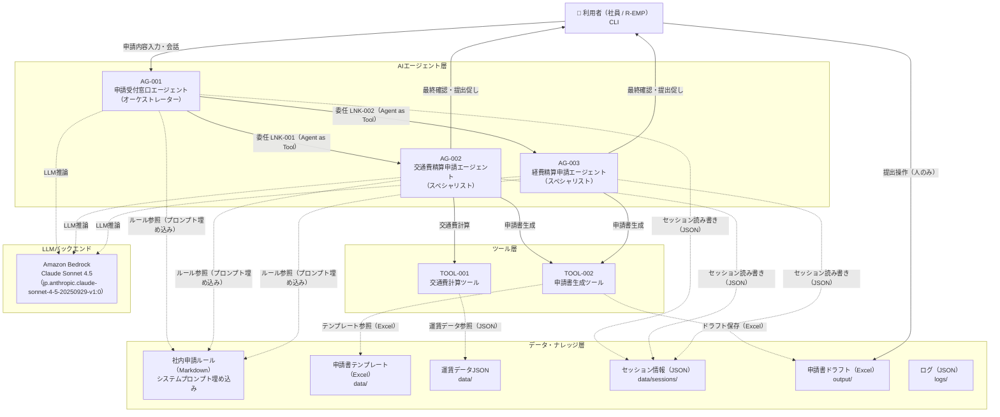

# システム基本情報

> **参照元（システム要件定義資料）:**
> - エージェント一覧.md（エージェント一覧・役割の特定）
> - 機能ツール一覧.md（ツール一覧・目的の特定）
> - システム構成図.md、システム構成図の構成要素一覧.md（システム構成図・アーキテクチャ概要）
> - 機能要件一覧.md（主な機能の特定）
> - データ一覧.md、テーブル一覧.md（データストアの特定）
> - 外部システム機能一覧.md（外部サービスの特定）

> 文書ID：`SYS-INFO-001`
> 文書名：システム基本情報
> 版数：`v1.0`
> 作成日：2026-04-28


---

## 1. システム概要

### 1.1 システム名称

**システム名**: 社内申請AIエージェントシステム

**英語名**: Internal Application AI Agent System

**略称**: 申請AIエージェント

### 1.2 システムの目的・役割

**目的**:
- 社員（利用者）が交通費精算申請・経費精算申請を対話形式で行えるようにし、申請作業の負荷を軽減する
- 申請ルールの照合・チェックをAIが自動で行い、申請ミスや差し戻しリスクを低減する
- 申請書（Excel形式）の自動生成により、書類作成工数を削減する

**役割**:
- 申請内容（自由文）を受け付け、申請種別（交通費精算申請・経費精算申請）を判定して対応する専門エージェントに委任する
- 対話形式で申請に必要な情報を収集し、社内申請ルールに照らして不備・リスクを通知する
- 収集した申請情報から申請書ドラフト（Excel/.xlsx）を自動生成し、利用者の最終確認後に提示する
- 申請書の自動提出は行わず、最終的な提出操作は必ず利用者が実施する（Human-in-the-Loop）


---

## 2. システム構成図

### 2.1 アーキテクチャ概要

本システムは、階層型マルチエージェント構成（Agent as Tools パターン）を採用しています。

**階層構造**:
1. プレゼンテーション層：利用者（CLI）とのインタフェース
2. AIエージェント層：オーケストレーター（AG-001）＋スペシャリスト（AG-002/AG-003）
3. ツール層：交通費計算（TOOL-001）・申請書生成（TOOL-002）
4. データ・ナレッジ層：ファイルストレージ（申請書テンプレート・セッション・運賃データ・ナレッジ・ログ）
5. LLMバックエンド層：Amazon Bedrock（Claude Sonnet 4.5）


### 2.2 システム構成図（Mermaid）



### 2.3 コンポーネント間の依存関係

| 送信元 | 送信先 | 連携方式 | データ種別 |
|---|---|---|---|
| CLI（利用者） | AG-001 | 標準入出力 | テキスト |
| AG-001 | AG-002 | Agent as Tools（関数呼び出し） | 申請種別確定情報・invocation_state |
| AG-001 | AG-003 | Agent as Tools（関数呼び出し） | 申請種別確定情報・invocation_state |
| AG-002 | TOOL-001 | 関数呼び出し（@tool） | 移動情報→交通費計算結果 |
| AG-002, AG-003 | TOOL-002 | 関数呼び出し（@tool） | 収集済み申請情報→申請書ドラフト |
| AG-001〜003 | Amazon Bedrock | AWS SDK（boto3） | プロンプト/応答 |
| AG-001〜003 | ファイルストレージ | ファイルI/O | セッション情報（JSON）・ナレッジ（Markdown） |
| TOOL-001 | ファイルストレージ | ファイルI/O | 運賃データ（JSON） |
| TOOL-002 | ファイルストレージ | ファイルI/O | 申請書テンプレート（Excel）・ドラフト（Excel） |

---

## 3. 技術スタック

### 3.1 開発環境

| 項目 | 内容 |
|-----|------|
| OS | ローカルPC（Windows/Mac/Linux） |
| シェル | CLI（コマンドライン） |
| 言語 | Python 3.x |
| IDE | 要件上未定義 |

**実行環境**: ローカルPC上でCLIを使用してエージェントと対話する。チャットUI等のフロントエンドは現時点では未使用。

### 3.2 LLM

| 項目 | 内容 |
|-----|------|
| LLMサービス | Amazon Bedrock |
| モデルID | jp.anthropic.claude-sonnet-4-5-20250929-v1:0 |
| 認証 | AWS認証情報（AWS_ACCESS_KEY_ID / AWS_SECRET_ACCESS_KEY） |
| リージョン | ap-northeast-1（デフォルト） |


### 3.3 フレームワーク・ライブラリ

| 項目 | 内容 | 用途 |
|-----|------|------|
| strands-agents | Version 1.25.0 | マルチエージェント・オーケストレーションフレームワーク |
| strands-agents-tools | Version 1.25.0 | エージェントツール群（image_reader 等） |
| strands-agents-builder | Version 1.25.0 | エージェントビルダー |
| pydantic | v2+ | 入力・状態モデルのデータバリデーション |
| openpyxl | 最新安定版 | 経費申請書のExcelファイル生成 |
| boto3 / botocore | 最新安定版 | Amazon BedrockアクセスAWS SDK |
| Pillow | 最新安定版 | 領収書読み取り用画像処理（strands_tools内部使用） |
| python-dotenv | 最新安定版 | 環境変数管理 |
| python-dateutil | 最新安定版 | 日付解析 |
| pytest | 最新安定版 | テストランナー |
| hypothesis | 最新安定版 | プロパティベーステスト |
| pytest-cov | 最新安定版 | カバレッジレポート |

### 3.4 外部サービス

| サービス | 用途 |
|---------|------|
| Amazon Bedrock | LLM推論（Claude Sonnet 4.5） |

---

## 4. ディレクトリ構造

```
project_root/
├── main.py                         # エントリーポイント
├── requirements.txt                # 依存ライブラリ
├── .env                            # 環境変数（.env.templateからコピー）
├── .env.template                   # 環境変数テンプレート
├── config/
│   └── model_config.py             # LLMモデル設定（モデルID・ガードレール等）
├── agents/
│   ├── orchestrator_agent.py       # AG-001 申請受付窓口エージェント
│   ├── travel_agent.py             # AG-002 交通費精算申請エージェント
│   └── expense_agent.py            # AG-003 経費精算申請エージェント
├── tools/
│   ├── travel_tools.py             # TOOL-001 交通費計算ツール
│   └── output_generator.py         # TOOL-002 申請書生成ツール
├── handlers/
│   └── error_handler.py            # エラーハンドラー（HD-001）
├── models/
│   └── data_models.py              # Pydanticデータモデル（DM-001）
├── prompts/
│   ├── orchestrator_prompt.py      # AG-001システムプロンプト（申請ルール埋め込み）
│   ├── travel_prompt.py            # AG-002システムプロンプト（申請ルール埋め込み）
│   └── expense_prompt.py           # AG-003システムプロンプト（申請ルール埋め込み）
├── hooks/
│   ├── loop_control_hook.py        # LoopControlHook（ReActループ上限制御）
│   └── human_approval_hook.py      # HumanApprovalHook（申請書生成前の人間承認）
├── data/
│   ├── train_fares.json            # DATA-011 電車経路・運賃データ
│   ├── fixed_fares.json            # DATA-012 固定運賃データ（バス・タクシー・飛行機）
│   ├── 交通費申請書_template.xlsx  # DATA-002 交通費精算申請書テンプレート
│   └── 経費精算申請書_template.xlsx # DATA-003 経費精算申請書テンプレート
├── output/                         # 申請書ドラフト出力先（実行時自動作成）
├── data/
│   └── sessions/                   # セッション情報（JSON）永続化先
└── logs/
    └── error.log                   # エラーログ出力先
```


---

## 5. エージェント一覧

| エージェントID | エージェント名 | 役割 | 基本設計書 |
|--------------|--------------|------|-----------|
| AG-001 | 申請受付窓口エージェント | オーケストレーター：申請種別判定・専門エージェント委任・セッション全体管理 | artifacts/04_basic-design/outputs/エージェント基本設計.md |
| AG-002 | 交通費精算申請エージェント | スペシャリスト：交通費精算申請フロー全体（情報収集・計算・申請書生成・チェック） | artifacts/04_basic-design/outputs/エージェント基本設計.md |
| AG-003 | 経費精算申請エージェント | スペシャリスト：経費精算申請フロー全体（領収書OCR・情報収集・申請書生成・チェック） | artifacts/04_basic-design/outputs/エージェント基本設計.md |

**詳細**: 各エージェントの詳細仕様は基本設計書を参照してください。

---

## 6. ツール一覧

| ツールID | ツール名 | 目的 | 基本設計書 |
|---------|---------|------|-----------|
| TOOL-001 | 交通費計算ツール | 移動情報から運賃データ（電車経路JSON・固定運賃JSON）を参照し交通費を算出する | artifacts/04_basic-design/outputs/ツール基本設計.md |
| TOOL-002 | 申請書生成ツール | 収集済み申請情報と申請書テンプレート（Excel）を用いて申請書ドラフトを生成する | artifacts/04_basic-design/outputs/ツール基本設計.md |

**詳細**: 各ツールの詳細仕様は基本設計書を参照してください。

---

## 7. 共通コンポーネント一覧

| コンポーネントID | コンポーネント名 | 目的 | 基本設計書 |
|----------------|----------------|------|-----------|
| HD-001 | ErrorHandler | エラー処理・ログ出力の統一管理。全コンポーネントが利用 | artifacts/04_basic-design/outputs/ハンドラー基本設計.md |
| DM-001 | データモデル（Pydantic） | 入力・状態・出力の型保証とバリデーション | artifacts/04_basic-design/outputs/データモデル基本設計.md |
| SM-001 | セッションマネージャー | Strands Agents SDK のセッション管理機能への委譲 | artifacts/04_basic-design/outputs/セッションマネージャ基本設計.md |

**詳細**: 各コンポーネントの詳細仕様は基本設計書を参照してください。

---

## 8. データストア

### 8.1 データファイル

| ファイル名 | 内容 | 形式 | パス |
|----------|------|------|------|
| train_fares.json | DATA-011：電車経路・運賃データ（出発駅・到着駅・運賃） | JSON | data/train_fares.json |
| fixed_fares.json | DATA-012：固定運賃データ（バス:230円/タクシー:10,000円/飛行機:50,000円） | JSON | data/fixed_fares.json |
| 交通費申請書_template.xlsx | DATA-002：交通費精算申請書テンプレート | Excel（.xlsx） | data/交通費申請書_template.xlsx |
| 経費精算申請書_template.xlsx | DATA-003：経費精算申請書テンプレート | Excel（.xlsx） | data/経費精算申請書_template.xlsx |

### 8.2 出力ファイル

| ディレクトリ | 内容 | 形式 | パス |
|------------|------|------|------|
| output/ | DATA-005：申請書ドラフトファイル（交通費精算申請書・経費精算申請書） | Excel（.xlsx） | output/ |

### 8.3 ストレージ

| ディレクトリ | 内容 | 形式 | パス |
|------------|------|------|------|
| data/sessions/ | DATA-004：会話セッション情報（Strands Agents SDK のファイルセッション） | JSON | data/sessions/ |
| logs/ | DATA-007/008/009：会話ログ・判断ログ・承認ログ | JSON | logs/ |

---

## 9. ターゲットユーザー

**主要ユーザー**: 社員（R-EMP）

**ユーザー特性**:
- 交通費精算申請・経費精算申請を行う一般社員
- AIエージェントとの対話形式でCLIを操作する

---

## 10. 主な機能

### 10.1 申請種別判定・委任

1. 申請内容（自由文）から申請種別（交通費精算申請・経費精算申請）を自動判定（FR-001）
2. 申請書名・申請先をナレッジから提示（FR-002）
3. 判定不能時は2択の選択肢を提示してユーザー選択（FR-001）

### 10.2 交通費精算申請フロー（AG-002）

1. 移動情報の対話収集（移動日・出発地・目的地・交通手段・費用）（FR-004）
2. 交通費自動計算（電車：経路テーブル検索、バス・タクシー・飛行機：固定運賃）（FR-005）
3. 駅名正規化（余分な接尾語の除去）（FR-006）
4. 申請書ドラフト自動生成（利用者確認OK後にExcel生成）（FR-010）
5. 申請ルール照合・期限チェック・上長承認要否チェック・差し戻しリスク評価（FR-011〜FR-014）
6. 申請書最終提示（FR-015）

### 10.3 経費精算申請フロー（AG-003）

1. 領収書画像からの情報自動抽出（店舗名・金額・日付・品目）（FR-007）
2. 経費区分自動判断（4区分：事務用品費・宿泊費・資格精算費・その他経費）（FR-008）
3. 申請書ドラフト自動生成（利用者確認OK後にExcel生成）（FR-010）
4. 申請ルール照合・期限チェック・上長承認要否チェック・差し戻しリスク評価（FR-011〜FR-014）
5. 申請書最終提示（FR-015）

### 10.4 共通機能

1. 入力文字数制限（500文字超は拒否）（FR-016）
2. 対話回数上限制御（30回超でセッション終了）（FR-017）
3. Human-in-the-Loop承認ゲート（申請書生成前の利用者確認）（CAP-GOV-001）

---

## 11. 技術的特徴

### 11.1 階層型マルチエージェント（Agent as Tools）

- AG-001（オーケストレーター）がAG-002/AG-003（スペシャリスト）をツールとして呼び出す
- `@tool(context=True)` デコレーターを使用し、`invocation_state` でセッション情報を受け渡す
- セッション情報はオーケストレーターから専門エージェントへ `invocation_state` 経由で伝播

### 11.2 ナレッジのシステムプロンプト埋め込み

- 申請ルール（BRL-01〜BRL-20）をシステムプロンプトに直接埋め込む（RAG不使用）
- 各エージェントのシステムプロンプトに社内申請ルール全体を含める

---

## 12. 制約事項

### 12.1 技術的制約

- AIによる申請書の自動提出禁止（BRL-09）：提出操作は利用者のみ実施可能
- データ永続化にRDBは使用しない：データはPCの所定のフォルダにファイルで格納する（JSON/Excel）
- ナレッジベースにRAGは使用しない：申請ルールはシステムプロンプト埋め込み
- LLMの中間思考プロセスはユーザーに非表示（根拠提示方針に従い推論ログは表示禁止）
- フロントエンド（チャットUI）は現状未使用（ローカルPC上のCLIで対話）

### 12.2 業務的制約

- 申請種別は交通費精算申請・経費精算申請の2種のみ対応
- 申請期限は経費発生日から3ヶ月以内（BRL-13/BRL-18）
- 上長承認要否：交通費10,000円超・経費5,000円超（BRL-14/BRL-19）
- 利用者確認（OK）を取得してからのみ申請書生成ツールを呼び出し可能（BRL-06/GRD-016）
- 差し戻しリスク閾値の詳細は要件上未定義

### 12.3 運用的制約

- インフラ構成（クラウド/オンプレ）は要件上未定義
- 外部システム連携（申請先システム・ワークフロー）は要件上未定義
- 応答時間目標値は要件上未定義
- ログ保存期間は要件上未定義

---

## 13. 今後の拡張予定

### 13.1 機能拡張

- 申請種別の追加（新たな専門エージェントをオーケストレーターに委任先として追加）
- 外部ワークフローシステムとの連携（申請書の提出自動化）
- フロントエンド（チャットUI）の実装

### 13.2 技術的拡張

- インフラ構成の定義（クラウド/オンプレ）
- 応答時間最適化
- ログ保存期間・データ保持期間の定義

---

## 14. 関連ドキュメント

| ドキュメント名 | パス |
|-------------|------|
| 基本設計書（エージェント） | artifacts/04_basic-design/outputs/エージェント基本設計.md |
| 基本設計書（ツール） | artifacts/04_basic-design/outputs/ツール基本設計.md |
| 基本設計書（データモデル） | artifacts/04_basic-design/outputs/データモデル基本設計.md |
| 基本設計書（ハンドラー） | artifacts/04_basic-design/outputs/ハンドラー基本設計.md |
| 基本設計書（セッションマネージャ） | artifacts/04_basic-design/outputs/セッションマネージャ基本設計.md |
| マルチエージェント連携設計 | artifacts/03_system-design/outputs/マルチエージェント連携設計.md |
| エージェント一覧 | artifacts/02_system-requirements/outputs/エージェント一覧.md |
| 機能ツール一覧 | artifacts/02_system-requirements/outputs/機能ツール一覧.md |

---

## 15. 変更履歴

| 日付 | 版 | 変更内容 | 担当 |
|-----|---|---------|------|
| 2026-04-28 | v1.0 | 初版作成 | - |
| 2026-04-28 | v1.1 | 実行環境をローカルPC上のCLIに明記。OS/シェルを更新。データ管理をPCフォルダへのファイル格納に明記 | - |
| 2026-04-28 | v1.2 | セッション保存先を data/sessions/ に変更 | - |

---
