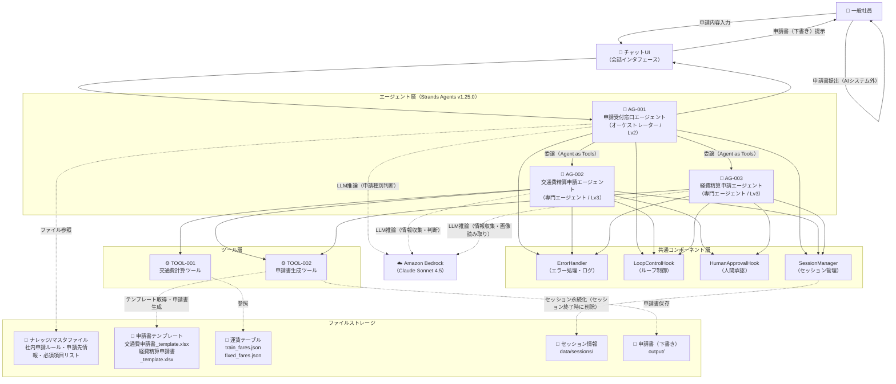

# システム基本情報

> **参照元（システム要件定義資料）:**
> - エージェント一覧.md（エージェント一覧・役割の特定）
> - 機能ツール一覧.md（ツール一覧・目的の特定）
> - システム構成図.md、システム構成図の構成要素一覧.md（システム構成図・アーキテクチャ概要）
> - 機能要件一覧.md（主な機能の特定）
> - データ一覧.md、テーブル一覧.md（データストアの特定）
> - 外部システム機能一覧.md（外部サービスの特定）

> 文書ID：`SYS-INFO-001`
> 文書名：システム基本情報
> 版数：`v1.0`
> 作成日：2026-05-02


---

## 1. システム概要

### 1.1 システム名称

**システム名**: 社内申請AIアシスタントシステム

**英語名**: Internal Application AI Assistant System

**略称**: IAAS

### 1.2 システムの目的・役割

**目的**:
- 社員が交通費精算申請・経費精算申請に必要な申請書を対話形式で効率的に作成できるよう支援する
- 社内申請ルールに基づいた申請種別の自動判定・申請先の案内により、申請手続きの誤りを低減する
- 領収書画像からの情報自動抽出・交通費の自動計算により、申請書作成にかかる工数を削減する

**役割**:
- 申請内容テキストの受付・申請種別判定・申請先案内（AG-001）
- 交通費精算申請に必要な移動情報の対話収集・交通費自動計算・申請書（下書き）生成（AG-002）
- 経費精算申請に必要な経費情報の対話収集・領収書OCR・申請書（下書き）生成（AG-003）
- 申請書（下書き）の提示・社員による最終確認・社員自身による提出（Human-in-the-Loop）


---

## 2. システム構成図

### 2.1 アーキテクチャ概要

本システムは、Agent as Tools パターンによる階層型マルチエージェントアーキテクチャを採用しています。

**階層構造**:
1. オーケストレーター層：AG-001（申請受付窓口エージェント）が申請種別を判断し、専門エージェントへ委譲する
2. 専門エージェント層：AG-002（交通費精算申請）・AG-003（経費精算申請）がそれぞれの業務ドメインを処理する
3. ツール層：TOOL-001（交通費計算）・TOOL-002（申請書生成）が業務固有ロジックを実行する


### 2.2 システム構成図（Mermaid）



### 2.3 コンポーネント間の依存関係

| コンポーネント | 依存先 | 依存方向 |
|---|---|---|
| AG-001 | Amazon Bedrock, AG-002(as tool), AG-003(as tool), KB, SM, ErrorHandler, LoopControlHook | 利用 |
| AG-002 | Amazon Bedrock, TOOL-001, TOOL-002, SM, ErrorHandler, HumanApprovalHook, LoopControlHook | 利用 |
| AG-003 | Amazon Bedrock, TOOL-002, SM, ErrorHandler, HumanApprovalHook, LoopControlHook | 利用 |
| TOOL-001 | train_fares.json, fixed_fares.json, ErrorHandler | 利用 |
| TOOL-002 | 申請書テンプレート(.xlsx), openpyxl, ErrorHandler | 利用 |
| ErrorHandler | logging（logs/agent.log, logs/error.log） | 利用 |
| SessionManager | data/sessions/（JSONファイル、セッション終了時に削除） | 利用 |

---

## 3. 技術スタック

### 3.1 開発環境

| 項目 | 内容 |
|-----|------|
| OS | Windows / Mac（ローカルPC） |
| シェル | CLI（コマンドラインインタフェース） |
| 言語 | Python 3.x |
| IDE | CLI（エントリーポイント `main.py` を CLI で起動） |

### 3.2 LLM

| 項目 | 内容 |
|-----|------|
| LLMサービス | Amazon Bedrock |
| 認証 | AWS IAM（boto3 / botocore） |
| リージョン | ap-northeast-1（デフォルト） |


### 3.3 フレームワーク・ライブラリ

| 項目 | 内容 | 用途 |
|-----|------|------|
| strands-agents | v1.25.0 | マルチエージェント・オーケストレーションフレームワーク |
| strands-agents-tools | v1.25.0 | Strands Agents 付属ツール群（image_reader等） |
| strands-agents-builder | v1.25.0 | エージェントビルダー |
| pydantic | v2+ | 入力・状態モデルのデータバリデーション |
| openpyxl | 最新安定版 | Excelファイル（申請書）生成 |
| boto3 | 最新安定版 | AWS SDK（Bedrockアクセス） |
| botocore | 最新安定版 | AWS SDK コア（Bedrockアクセス） |
| Pillow | 最新安定版 | 画像処理（image_reader の間接依存） |
| python-dotenv | 最新安定版 | 環境変数管理（.env ファイル読み込み） |
| python-dateutil | 最新安定版 | 日付解析 |
| pytest | 最新安定版 | テストランナー（マーカー: unit, integration, slow, llm） |
| hypothesis | 最新安定版 | プロパティベーステスト |
| pytest-cov | 最新安定版 | カバレッジレポート |

### 3.4 外部サービス

| サービス | 用途 |
|---------|------|
| Amazon Bedrock（Claude Sonnet 4.5） | エージェントの LLM バックエンド・領収書画像読み取り |

---

## 4. ディレクトリ構造

```
iaas/                               # プロジェクトルート
├── main.py                         # エントリーポイント
├── config/
│   └── model_config.py             # モデル設定（モデルID・リトライ設定等）
├── agents/
│   ├── orchestrator_agent.py       # AG-001 申請受付窓口エージェント
│   ├── transport_agent.py          # AG-002 交通費精算申請エージェント
│   └── expense_agent.py            # AG-003 経費精算申請エージェント
├── tools/
│   ├── transport_tools.py          # TOOL-001 交通費計算ツール
│   └── output_generator.py         # TOOL-002 申請書生成ツール
├── handlers/
│   ├── error_handler.py            # ErrorHandler（エラー処理・ログ出力）
│   ├── loop_control_hook.py        # LoopControlHook（ReActループ制御）
│   └── human_approval_hook.py      # HumanApprovalHook（申請書生成前の人間承認）
├── session/
│   └── session_manager.py          # SessionManager（セッション管理）
├── models/
│   └── data_models.py              # Pydantic データモデル（入力・状態・出力）
├── data/
│   ├── train_fares.json            # 電車経路運賃テーブル（EXT-004）
│   ├── fixed_fares.json            # 固定運賃テーブル（EXT-004）
│   └── sessions/                   # セッション状態JSONファイル保存先（セッション終了時に削除）
├── knowledge/
│   ├── application_rules.md        # 社内申請ルール（DATA-001）
│   └── submission_destinations.md  # 申請先情報（DATA-004）
├── templates/
│   ├── 交通費申請書_template.xlsx   # 交通費精算申請書テンプレート（DATA-002）
│   └── 経費精算申請書_template.xlsx # 経費精算申請書テンプレート（DATA-003）
├── output/                         # 申請書（下書き）出力先（実行時自動作成）
├── logs/
│   ├── agent.log                   # 標準操作ログ
│   └── error.log                   # エラーログ
├── tests/
│   ├── unit/                       # ユニットテスト（-m unit）
│   ├── integration/                # 統合テスト（-m integration）
│   └── evals/                      # LLM評価テスト（-m llm）
├── .env.template                   # 環境変数テンプレート
├── .env                            # 環境変数（.gitignore対象）
└── requirements.txt                # 依存パッケージ一覧
```


---

## 5. エージェント一覧

| エージェントID | エージェント名 | 役割 | 基本設計書 |
|--------------|--------------|------|-----------|
| AG-001 | 申請受付窓口エージェント | 申請種別判定・専門エージェントへの委譲（オーケストレーター/Lv2）。申請者名はアプリケーション起動時に外部から受け取る | artifacts/04_basic-design/outputs/エージェント基本設計_AG-001.md |
| AG-002 | 交通費精算申請エージェント | 移動情報収集・交通費自動計算・申請書生成（専門エージェント/Lv3） | artifacts/04_basic-design/outputs/エージェント基本設計_AG-002.md |
| AG-003 | 経費精算申請エージェント | 経費情報収集・領収書OCR・申請書生成（専門エージェント/Lv3） | artifacts/04_basic-design/outputs/エージェント基本設計_AG-003.md |

**詳細**: 各エージェントの詳細仕様は基本設計書を参照してください。

---

## 6. ツール一覧

| ツールID | ツール名 | 目的 | 基本設計書 |
|---------|---------|------|-----------|
| TOOL-001 | 交通費計算ツール | 交通手段・区間に基づく交通費の計算（電車：経路テーブル参照、バス/タクシー/飛行機：固定運賃テーブル参照） | artifacts/04_basic-design/outputs/ツール基本設計_TOOL-001.md |
| TOOL-002 | 申請書生成ツール | 申請種別テンプレートへの収集済み情報入力・申請書（下書き）Excel生成 | artifacts/04_basic-design/outputs/ツール基本設計_TOOL-002.md |

**詳細**: 各ツールの詳細仕様は基本設計書を参照してください。

---

## 7. 共通コンポーネント一覧

| コンポーネントID | コンポーネント名 | 目的 | 基本設計書 |
|----------------|----------------|------|-----------|
| HD-001 | ErrorHandler | 全コンポーネントのエラー処理委譲・ログ出力 | artifacts/04_basic-design/outputs/ハンドラー基本設計_HD-001.md |
| HD-002 | LoopControlHook | 全エージェントの ReAct ループ上限制御（max_iterations=10） | artifacts/04_basic-design/outputs/ハンドラー基本設計_HD-002.md |
| HD-003 | HumanApprovalHook | AG-002/AG-003 の申請書生成前の人間承認制御（OK/修正/キャンセル） | artifacts/04_basic-design/outputs/ハンドラー基本設計_HD-003.md |
| SM-001 | SessionManager | セッションID管理・セッション状態のJSONファイル永続化 | artifacts/04_basic-design/outputs/セッションマネージャ基本設計_SM-001.md |

**詳細**: 各コンポーネントの詳細仕様は基本設計書を参照してください。

---

## 8. データストア

### 8.1 データファイル

| ファイル名 | 内容 | 形式 | パス |
|----------|------|------|------|
| application_rules.md | 社内申請ルール（申請種別・条件・承認ルール）（DATA-001） | テキスト（Markdown） | knowledge/application_rules.md |
| submission_destinations.md | 申請先情報（申請種別ごとの部門・担当者・システム）（DATA-004） | テキスト（Markdown） | knowledge/submission_destinations.md |
| train_fares.json | 電車経路ごとの運賃データ（DATA-006） | JSON | data/train_fares.json |
| fixed_fares.json | バス・タクシー・飛行機の固定運賃データ（DATA-007） | JSON | data/fixed_fares.json |
| 交通費申請書_template.xlsx | 交通費精算申請書テンプレート（DATA-002） | Excel（.xlsx） | templates/交通費申請書_template.xlsx |
| 経費精算申請書_template.xlsx | 経費精算申請書テンプレート（DATA-003） | Excel（.xlsx） | templates/経費精算申請書_template.xlsx |

### 8.2 出力ファイル

| ディレクトリ | 内容 | 形式 | パス |
|------------|------|------|------|
| output/ | 申請書（下書き）生成ファイル（DATA-008）。実行時に自動作成 | Excel（.xlsx） | output/ |

### 8.3 ストレージ

| ディレクトリ | 内容 | 形式 | パス |
|------------|------|------|------|
| data/sessions/ | セッション状態（会話履歴・収集済み情報・申請進捗）（DATA-010）。セッション終了時に削除 | JSON | data/sessions/ |
| logs/ | 標準操作ログ（agent.log）・エラーログ（error.log）（DATA-011, DATA-012） | テキスト | logs/ |

---

## 9. ターゲットユーザー

**主要ユーザー**: 一般社員（R-EMP）

**ユーザー特性**:
- 社内申請ルールの詳細を把握していないことが多い
- チャットUIを通じてシステムと対話する
- 申請書の最終確認・提出は自身で実施する（AIは自動提出しない）

---

## 10. 主な機能

### 10.1 申請種別案内（BIZ-01）

1. 申請内容テキストの受付・申請種別の自動判定（FR-001）
3. 判断不能時の選択肢提示（FR-002）
4. 申請書テンプレート・申請先の提示（FR-003）

### 10.2 申請書自動作成（BIZ-02）

1. 交通費精算申請：移動情報の一区間ごとの対話収集（FR-004）
2. 交通費精算申請：交通費の自動計算（FR-008 / TOOL-001）
3. 経費精算申請：領収書画像からの情報自動抽出（FR-009）
4. 経費精算申請：経費情報の対話収集・経費区分自動判断（FR-005, FR-010）
5. 申請期限チェック（90日）（FR-006）
6. 高額申請時の上長承認要否通知（FR-007）
7. 申請書（下書き）の自動生成・社員への提示（FR-011 / TOOL-002）

### 10.3 共通機能

1. 会話セッション管理（SM-001）
2. ループ制御（HD-002 / LoopControlHook）
3. 人間承認制御（HD-003 / HumanApprovalHook）
4. エラー処理・エスカレーション案内（HD-001 / ErrorHandler）

---

## 11. 技術的特徴

### 11.1 Agent as Tools パターン

- 専門エージェント（AG-002/AG-003）はオーケストレーター（AG-001）から `@tool(context=True)` デコレートされた関数として呼び出される
- ファクトリ関数 `_get_{agent_name}_agent(session_id)` でエージェントインスタンスを生成する
- `invocation_state` を通じてシステム内部情報（`applicant_name`・`application_date`・`session_id` の3フィールド）をLLMプロンプトに含めず伝播する

### 11.2 Human-in-the-Loop 設計

- 申請書生成前に HumanApprovalHook が介入し、社員が OK/修正/キャンセルを選択する
- 申請書の提出はAIが行わず、社員が自身で実施する（ACT-EXEC-01）
- 最大自律度 Lv3 を厳守し、Lv4（完全自律）は禁止

---

## 12. ログ設計方針

### 12.1 基本方針

- **エントリーポイントで一元管理**: ログ設定（レベル・出力先・フォーマット）は `main.py` で一元管理する
- **各モジュールが責任を持って出力**: ログ出力は各モジュール（エージェント・ツール・ハンドラー）が責任を持って行う
- **LOG_LEVEL 環境変数で制御**: ログレベルは環境変数 `LOG_LEVEL` で制御し、未設定時のデフォルトは `WARNING`
- **ユーザー向けメッセージと技術ログの分離**: 社員に表示するメッセージと技術ログ（スタックトレース等）を明確に分離する

### 12.2 設計判断

- ログ設定の一元化により、各モジュールでのログ設定重複を防ぎ、設定変更コストを低減する
- `LOG_LEVEL=DEBUG` に設定することで詳細なデバッグ情報を取得でき、開発・障害調査に活用する
- 各モジュールが付加するコンテキスト情報の詳細は基本設計・詳細設計で定義する

---

## 13. 申請者情報の取得タイミング

### 13.1 申請者名

- 申請者名（`applicant_name`）はユーザーとの対話で収集するのではなく、**アプリケーション起動時（対話ループ開始前）に取得**し、エージェントの初期化パラメータとして渡す
- AG-001 は申請者名を収集しない

### 13.2 申請日

- 申請日（`application_date`）はユーザーとの対話で収集するのではなく、**システム日付（実行時の日付、YYYY-MM-DD 形式）を自動取得**する
- `date.today().isoformat()` で取得し、`invocation_state` 経由でエージェントに渡す

---

## 14. 制約事項

### 14.1 技術的制約

- LLMバックエンドは Amazon Bedrock（Claude Sonnet 4.5）のみ
- 申請ルールはシステムプロンプト埋め込み（RAG/ベクトルDB不使用）
- 領収書OCRは strands_tools の image_reader のみ使用（外部OCRサービス不使用）
- 申請種別は交通費精算申請・経費精算申請の2種類のみ対応

### 14.2 業務的制約

- 申請書の提出はAIが行わず社員が実施（ACT-EXEC-01）
- 最大自律度 Lv3（Lv4以上は禁止）
- 申請期限：経費発生日から90日以内（BRL-14）
- 高額申請通知：交通費10,000円超・経費5,000円超で上長承認要否を通知

### 14.3 運用的制約

- 申請ルール・申請書テンプレート・運賃テーブルは管理部門が手動更新
- AWSリージョン：ap-northeast-1（デフォルト）
- 最大対話ターン：セッションあたり30ターン
- ReActループ上限：エージェントあたり10回（全エージェント共通）
- ウィンドウサイズ：AG-001=30、AG-002=20、AG-003=15

---

## 15. 今後の拡張予定

### 15.1 機能拡張

- 申請種別の追加（出張申請・備品購入申請等）
- 申請書提出フローの自動化（上長承認ワークフロー連携）

### 15.2 技術的拡張

- RAG/ベクトルDBによる申請ルール検索への移行（大規模ルール対応）
- 外部OCRサービス連携（高精度領収書読み取り対応）

---

## 16. 関連ドキュメント

| ドキュメント名 | パス |
|-------------|------|
| 基本設計書（エージェント） | artifacts/04_basic-design/outputs/エージェント基本設計_AG-00*.md |
| 基本設計書（ツール） | artifacts/04_basic-design/outputs/ツール基本設計_TOOL-00*.md |
| 基本設計書（共通） | artifacts/04_basic-design/outputs/ハンドラー基本設計_HD-00*.md, セッションマネージャ基本設計_SM-001.md |
| 詳細設計書 | artifacts/05_detailed-design/outputs/ |
| システム設計書 | artifacts/03_system-design/outputs/ |

---

## 17. 変更履歴

| 日付 | 版 | 変更内容 | 担当 |
|-----|---|---------|------|
| 2026-05-02 | v1.0 | 初版作成 | - |
| 2026-05-02 | v1.1 | 実行環境をローカルPC+CLIに変更。セッション保存先をdata/sessions/に変更。AG-001の申請者名収集役割を削除（起動時取得に変更）。invocation_stateフィールド明記。AG-003ウィンドウサイズ15追記。ログ設計方針セクション追加。申請者情報取得タイミングセクション追加 | - |

---
