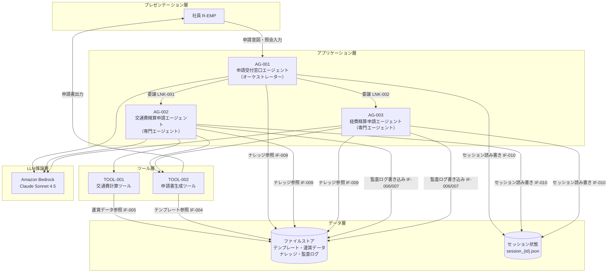

# システム基本情報

> **参照元（システム要件定義資料）:**
> - エージェント一覧.md（エージェント一覧・役割の特定）
> - 機能ツール一覧.md（ツール一覧・目的の特定）
> - システム構成図.md、システム構成図の構成要素一覧.md（システム構成図・アーキテクチャ概要）
> - 機能要件一覧.md（主な機能の特定）
> - データ一覧.md、テーブル一覧.md（データストアの特定）
> - 外部システム機能一覧.md（外部サービスの特定）

> 文書ID：`SYS-INFO-001`
> 文書名：システム基本情報
> 版数：`v1.0`
> 作成日：2026-05-01


---

## 1. システム概要

### 1.1 システム名称

**システム名**: 経費精算申請AIエージェントシステム

**英語名**: Expense Application AI Agent System

**略称**: EAAS

### 1.2 システムの目的・役割

**目的**:
- 申請ルールを知らない社員でも正しい申請書（交通費精算申請・経費精算申請）を作成できるようにする
- 対話型AIエージェントによる申請情報の自動収集・申請書の自動生成を実現する
- 申請ルール照会・入力内容チェックにより申請エラーを削減する

**役割**:
- ユーザーの自然言語入力から申請種別を判断し、適切な専門エージェントに委譲する
- 対話を通じて申請に必要な情報を収集し、Excelテンプレートに基づく申請書（下書き）を生成する
- 業務ルールに基づく申請内容チェックおよび申請ルール照会に回答する
- 全操作の監査ログを記録し、ガバナンス要件を満たす


---

## 2. システム構成図

### 2.1 アーキテクチャ概要

本システムは、階層型マルチエージェント構成（Agent as Tools パターン）を採用しています。

**階層構造**:
1. プレゼンテーション層：CLI による社員との対話インタフェース（COMP-001）
2. アプリケーション層：AG-001（オーケストレーター）が申請種別を判断し、AG-002/AG-003（専門エージェント）に委譲する
3. ツール層：TOOL-001（交通費計算）・TOOL-002（申請書生成）が個別機能を実行する


### 2.2 システム構成図（Mermaid）



### 2.3 コンポーネント間の依存関係

| 連携ID | 送信元 | 送信先 | 方式 | 備考 |
|---|---|---|---|---|
| LNK-001 | AG-001 | AG-002 | Agent-as-Tool | 交通費精算申請委譲 |
| LNK-002 | AG-001 | AG-003 | Agent-as-Tool | 経費精算申請委譲 |
| IF-001 | AG-001/002/003 | Amazon Bedrock | HTTPS/REST | LLM推論 |
| IF-002 | AG-003 | Amazon Bedrock | HTTPS/REST | OCR処理 |
| IF-004 | TOOL-002 | ファイルストア | ファイル参照 | テンプレート取得 |
| IF-005 | TOOL-001 | ファイルストア | ファイル参照 | 運賃データ取得 |
| IF-006/007 | AG-002/003 | ファイルストア | ファイル書き込み | 監査ログ記録 |
| IF-009 | AG-001/002/003 | ファイルストア | ファイル参照 | ナレッジ全文ロード |
| IF-010 | AG-001/002/003 | セッション状態 | ファイル読み書き | セッション引き継ぎ |

---

## 3. 技術スタック

### 3.1 開発環境

| 項目 | 内容 |
|-----|------|
| OS | ローカルPC |
| シェル | CLI（コマンドラインインタフェース） |
| 言語 | Python 3.x |
| エントリーポイント | main.py |

### 3.2 LLM

| 項目 | 内容 |
|-----|------|
| LLMサービス | Amazon Bedrock |
| モデル | Claude Sonnet 4.5（jp.anthropic.claude-sonnet-4-5-20250929-v1:0） |
| 認証 | AWS IAM（AWS_ACCESS_KEY_ID / AWS_SECRET_ACCESS_KEY） |
| リージョン | ap-northeast-1（デフォルト） |


### 3.3 フレームワーク・ライブラリ

| 項目 | バージョン | 用途 |
|-----|------|------|
| strands-agents | v1.25.0 | マルチエージェント・オーケストレーションフレームワーク |
| strands-agents-tools | v1.25.0 | エージェント用ツール群（image_reader 等） |
| strands-agents-builder | v1.25.0 | エージェントビルダー |
| pydantic | v2+ | 入力・状態モデルのデータバリデーション |
| openpyxl | 要件上未定義 | 経費申請書の Excel ファイル生成 |
| boto3 / botocore | 要件上未定義 | Bedrock アクセス用 AWS SDK |
| Pillow | 要件上未定義 | 領収書読み取り用画像処理（strands_tools の image_reader が内部で使用） |
| python-dotenv | 要件上未定義 | 環境変数管理（.env ファイル読み込み） |
| python-dateutil | 要件上未定義 | 日付解析 |
| pytest | 要件上未定義 | テストランナー（マーカー: unit, integration, slow, llm） |
| hypothesis | 要件上未定義 | プロパティベーステスト |
| pytest-cov | 要件上未定義 | カバレッジレポート |

### 3.4 外部サービス

| サービス | 用途 |
|---------|------|
| Amazon Bedrock（Claude Sonnet 4.5） | LLM推論（自然言語処理・判断・生成・OCR） |
| ファイルストア（ローカルファイルシステム） | テンプレート・運賃データ・ナレッジ・セッション・監査ログの格納 |

---

## 4. ディレクトリ構造

```
eaas/
├── main.py                        # エントリーポイント
├── requirements.txt               # 依存ライブラリ一覧
├── .env.template                  # 環境変数テンプレート
├── .env                           # 環境変数（gitignore対象）
├── config/
│   └── model_config.py            # モデル設定（モデルID・ガードレール等の集約）
├── agents/
│   ├── orchestrator_agent.py      # AG-001: 申請受付窓口エージェント
│   ├── transport_agent.py         # AG-002: 交通費精算申請エージェント
│   └── expense_agent.py           # AG-003: 経費精算申請エージェント
├── tools/
│   ├── transport_tools.py         # TOOL-001: 交通費計算ツール
│   └── output_generator.py        # TOOL-002: 申請書生成ツール
├── handlers/
│   ├── error_handler.py           # ErrorHandler: 例外処理・ログ出力
│   ├── human_approval_hook.py     # HumanApprovalHook: 人間承認フック
│   └── loop_control_hook.py       # LoopControlHook: ループ制御フック
├── models/
│   ├── agent_state.py             # エージェント状態モデル（Pydantic）
│   ├── transport_models.py        # 交通費関連データモデル（Pydantic）
│   └── expense_models.py          # 経費関連データモデル（Pydantic）
├── session/
│   └── session_manager.py         # FileBasedSessionManager: セッション管理
├── data/
│   ├── sessions/                  # セッションファイル保存先（session_{id}.json）
│   ├── fare_routes.json            # 電車経路運賃テーブル（DATA-004）
│   ├── fare_fixed.json             # 固定運賃データ（DATA-005）
│   └── knowledge/                 # 社内申請ルール・必要情報一覧（DATA-001/012）
├── templates/
│   ├── expense_template.xlsx       # 経費精算申請書テンプレート（DATA-002）
│   └── transport_template.xlsx     # 交通費精算申請書テンプレート（DATA-003）
├── output/                        # 生成申請書の出力先（実行時自動作成）
├── logs/
│   ├── agent.log                  # アプリケーションログ
│   ├── audit_log_std.jsonl        # 標準監査ログ（DATA-010）
│   └── audit_log_hi.jsonl         # 強化監査ログ（DATA-011）
└── tests/
    ├── unit/                      # ユニットテスト（マーカー: unit）
    ├── integration/               # 統合テスト（マーカー: integration）
    └── conftest.py                # テスト共通設定
```


---

## 5. エージェント一覧

| エージェントID | エージェント名 | 役割 | 基本設計書 |
|--------------|--------------|------|-----------|
| AG-001 | 申請受付窓口エージェント | オーケストレーター。申請意図解釈・申請種別判断・専門エージェント委譲・申請ルール照会 | 04_basic-design/outputs/エージェント基本設計_AG-001.md |
| AG-002 | 交通費精算申請エージェント | スペシャリスト。交通費精算申請情報収集・申請書生成・申請内容チェック | 04_basic-design/outputs/エージェント基本設計_AG-002.md |
| AG-003 | 経費精算申請エージェント | スペシャリスト。経費精算申請情報収集・領収書OCR・申請書生成・申請内容チェック | 04_basic-design/outputs/エージェント基本設計_AG-003.md |

**詳細**: 各エージェントの詳細仕様は基本設計書を参照してください。

---

## 6. ツール一覧

| ツールID | ツール名 | 目的 | 基本設計書 |
|---------|---------|------|-----------|
| TOOL-001 | 交通費計算ツール | 運賃テーブル（fare_routes.json）・固定運賃データ（fare_fixed.json）を参照して交通費を自動計算する | 04_basic-design/outputs/ツール基本設計_TOOL-001.md |
| TOOL-002 | 申請書生成ツール | Excelテンプレートを読み込み、収集した申請情報を書き込んで申請書（下書き）ファイルを生成する。経費精算・交通費精算の両申請種別に対応 | 04_basic-design/outputs/ツール基本設計_TOOL-002.md |

**詳細**: 各ツールの詳細仕様は基本設計書を参照してください。

---

## 7. 共通コンポーネント一覧

| コンポーネントID | コンポーネント名 | 目的 | 基本設計書 |
|----------------|----------------|------|-----------|
| HD-001 | ErrorHandler | 全コンポーネント共通の例外処理・ログ出力委譲クラス。エラー種別ごとの handle_* メソッドとログメソッド群を提供する | 04_basic-design/outputs/共通コンポーネント基本設計.md |
| HD-002 | HumanApprovalHook | 申請書生成前の人間承認フック。APR-001（社員の確認・承認）を実現する | 04_basic-design/outputs/共通コンポーネント基本設計.md |
| HD-003 | LoopControlHook | ReActループ上限（最大10回）の制御フック。全エージェントに適用する | 04_basic-design/outputs/共通コンポーネント基本設計.md |
| SM-001 | FileBasedSessionManager | ファイルストアを用いたセッション状態の永続化管理クラス（data/sessions/session_{id}.json） | 04_basic-design/outputs/共通コンポーネント基本設計.md |
| DM-001 | model_config | モデルID・ガードレール設定・リトライ設定等の共通設定値を集約するモジュール（config/model_config.py） | 04_basic-design/outputs/共通コンポーネント基本設計.md |

**詳細**: 各コンポーネントの詳細仕様は基本設計書を参照してください。

---

## 8. データストア

### 8.1 データファイル

| ファイル名 | 内容 | 形式 | パス |
|----------|------|------|------|
| fare_routes.json | 電車経路運賃テーブル（出発地・目的地・運賃の対応） | JSON | data/fare_routes.json |
| fare_fixed.json | バス・タクシー・飛行機の固定運賃定義 | JSON | data/fare_fixed.json |
| 社内申請ルール | 申請種別・必要項目・申請先・高額閾値・経費区分等のルール定義 | テキスト（Markdown/JSON等） | data/knowledge/（ファイル名は要件上未定義） |
| 申請書作成必要情報一覧 | 申請種別ごとの必須項目定義 | テキスト（Markdown/JSON等） | data/knowledge/（ファイル名は要件上未定義） |
| expense_template.xlsx | 経費精算申請書テンプレート（セル位置定義：B3=申請者名, B4=申請日, A/H列=各経費行） | Excel (.xlsx) | templates/expense_template.xlsx |
| transport_template.xlsx | 交通費精算申請書テンプレート（セル位置定義：B3=申請者名, B4=申請日, A/H列=各移動行） | Excel (.xlsx) | templates/transport_template.xlsx |

### 8.2 出力ファイル

| ディレクトリ | 内容 | 形式 | パス |
|------------|------|------|------|
| output/ | 生成された申請書（下書き）ファイル | Excel (.xlsx) | output/（実行時自動作成） |

### 8.3 ストレージ

| ディレクトリ | 内容 | 形式 | パス |
|------------|------|------|------|
| data/sessions/ | エージェント間セッション状態（申請者名・申請日・会話コンテキスト等） | JSON | data/sessions/session_{id}.json |
| logs/ | アプリケーションログ | テキスト | logs/agent.log |
| logs/ | 標準監査ログ（全エージェント操作記録） | JSONL | logs/audit_log_std.jsonl |
| logs/ | 強化監査ログ（申請書生成・承認操作記録） | JSONL | logs/audit_log_hi.jsonl |

---

## 9. ターゲットユーザー

**主要ユーザー**: 一般社員（R-EMP）

**ユーザー特性**:
- 申請ルール・手続きに不慣れな一般社員が主対象
- CLI を通じて対話形式で申請書を作成する

---

## 10. 主な機能

### 10.1 申請受付・種別判断機能

1. 申請意図の自然言語理解と申請種別（交通費精算申請・経費精算申請）の判断（FR-001）
2. 申請種別確定後の専門エージェントへの委譲（LNK-001/LNK-002）
3. 申請ルール照会への回答（FR-011）

### 10.2 交通費精算申請機能

1. 申請に必要な情報（移動日・出発地・目的地・交通手段・業務目的等）の対話収集（FR-005）
2. 駅名の正規化（「渋谷駅」→「渋谷」等）（FR-006）
3. 運賃テーブル・固定運賃を用いた交通費の自動計算（FR-007、TOOL-001）
4. 申請書（下書き）の Excel ファイル生成（FR-009、TOOL-002）

### 10.3 経費精算申請機能

1. 申請に必要な情報（購入日・店舗名・品目・経費区分・金額・業務目的等）の対話収集（FR-002）
2. 領収書画像から情報の自動抽出（OCR）（FR-003）
3. 経費区分の自動判断（FR-004）
4. 申請書（下書き）の Excel ファイル生成（FR-008、TOOL-002）

### 10.4 共通機能

1. 申請内容の業務ルール適合チェックとフィードバック（FR-010）
2. 申請書生成前の人間承認（APR-001）
3. 入力文字数上限チェック（500文字以内、FR-012）
4. 標準監査ログ・強化監査ログの記録（CAP-GOV-001）

---

## 11. 技術的特徴

### 11.1 階層型マルチエージェント構成（Agent as Tools）

- AG-001（オーケストレーター）が AG-002/AG-003（専門エージェント）を `@tool(context=True)` デコレータでラップしたツール関数として呼び出す
- `invocation_state`（ToolContext 経由）を用いてセッション ID・申請者名・申請日をエージェント間で受け渡す（LLMプロンプトには含まれない）
- 最大委譲深度は 1 レベル（AG-001 → AG-002/003）、最大ループ回数は 10 回

### 11.2 システムプロンプト埋め込みによるナレッジ管理

- 申請ルールナレッジは RAG を使用せず、各エージェントのシステムプロンプトに全文埋め込む方式を採用
- ファイルストア上のナレッジファイルを起動時に全文ロードしてシステムプロンプトに組み込む

---

## 12. 制約事項

### 12.1 技術的制約

- Strands SDK v1.25.0 の API 仕様に依存（バージョン固定）
- Amazon Bedrock の APIレート制限（要件上未定義）への対応が必要
- セッション状態はファイルベース永続化（data/sessions/session_{id}.json）のみ対応（DB不使用）
- 会話インタフェースは CLI のみ（API 提供は要件上未定義）

### 12.2 業務的制約

- 申請種別は「交通費精算申請」「経費精算申請」の 2 種類のみ
- 申請書は下書きファイルとして出力し、社員が承認後に提出する
- 高額閾値：交通費精算 10,000 円以上・経費精算 5,000 円以上は事前上長承認が必要（通知のみ）
- 申請期限：経費発生日から 90 日以内
- 入力文字数上限：500 文字（FR-012）
- 最大会話ターン数：要件上未定義

### 12.3 運用的制約

- AWS 認証情報（AWS_ACCESS_KEY_ID / AWS_SECRET_ACCESS_KEY）の事前設定が必要
- ログは logs/agent.log と標準出力に出力（LOG_LEVEL 環境変数で制御）
- ガードレール ID/バージョンは GUARDRAIL_ID / GUARDRAIL_VERSION 環境変数で設定

---

## 13. 今後の拡張予定

### 13.1 機能拡張

- 申請書の自動提出（現在は下書き生成のみ）
- 新規申請種別への対応（AG-001 のルーティングロジック追加）
- 新規専門エージェントの追加（Agent-as-Tool パターンで拡張可能）

### 13.2 技術的拡張

- セッション状態の DB 対応（現在はファイルベース）
- RAG による大規模ナレッジ対応（現在はシステムプロンプト埋め込み）
- API インタフェースの追加（現在は CLI のみ）

---

## 14. 関連ドキュメント

| ドキュメント名 | パス |
|-------------|------|
| 基本設計書（エージェント AG-001） | artifacts/04_basic-design/outputs/エージェント基本設計_AG-001.md |
| 基本設計書（エージェント AG-002） | artifacts/04_basic-design/outputs/エージェント基本設計_AG-002.md |
| 基本設計書（エージェント AG-003） | artifacts/04_basic-design/outputs/エージェント基本設計_AG-003.md |
| 基本設計書（ツール TOOL-001） | artifacts/04_basic-design/outputs/ツール基本設計_TOOL-001.md |
| 基本設計書（ツール TOOL-002） | artifacts/04_basic-design/outputs/ツール基本設計_TOOL-002.md |
| 基本設計書（共通コンポーネント） | artifacts/04_basic-design/outputs/共通コンポーネント基本設計.md |
| マルチエージェント連携設計 | artifacts/03_system-design/outputs/マルチエージェント連携設計.md |
| セッション管理方針 | artifacts/03_system-design/outputs/セッション管理方針.md |
| 例外処理方針 | artifacts/03_system-design/outputs/例外処理方針.md |
| 実行制御方針 | artifacts/03_system-design/outputs/実行制御方針.md |
| 共通設定方針 | artifacts/03_system-design/outputs/共通設定方針.md |
| バリデーション方針 | artifacts/03_system-design/outputs/バリデーション方針.md |

---

## 15. 変更履歴

| 日付 | 版 | 変更内容 | 担当 |
|-----|---|---------|------|
| 2026-05-01 | v1.0 | 初版作成 | - |

---
