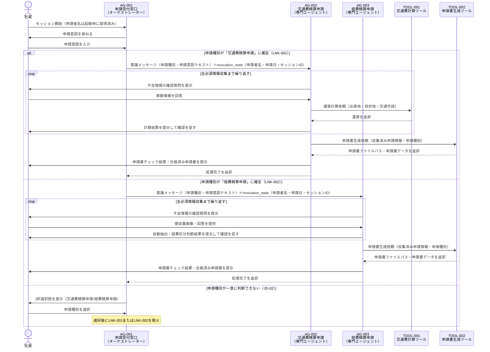

# マルチエージェント連携設計書

> **参照元（システム要件定義資料）:**
> - エージェント一覧.md（エージェント役割・責務・自律度の特定）
> - エージェント間連携定義.md（連携方式・連携ポリシー・連携フロー）
> - 会話フロー一覧.md（連携が発生する会話フロー・タイミング）
> - 機能要件一覧.md（連携が必要な機能の特定）
> - 自律度・権限定義.md（エージェントの権限境界・判断権限）
> - システム基本情報.md（アーキテクチャ概要・エージェント構成）

> 文書ID：`SYS-MA-001`
> 文書名：マルチエージェント連携設計書
> 版数：`v1.0`
> 作成日：2026-05-06


---

## 1. 目的・適用範囲

### 1.1 目的

本設計書では、以下を定義します:
- エージェント間の委譲方式
- ルーティング方式
- 通信契約（エージェント間メッセージ）
- 協調パターン

本設計書では、以下は定義しません（別紙参照）:
- 詳細な例外処理（例外処理方針参照）
- セッション保持（セッション管理方針参照）
- 権限設計（自律度・権限定義参照）

### 1.2 適用範囲

**対象システム**: 申請AIエージェントシステム

**対象エージェント**:
- AG-001: 申請受付窓口エージェント（オーケストレーター）
- AG-002: 交通費精算申請エージェント（専門エージェント）
- AG-003: 経費精算申請エージェント（専門エージェント）


---

## 2. 用語・前提

### 2.1 用語

| 用語 | 定義 |
|-----|------|
| オーケストレーション | AG-001が申請種別を判断し、適切な専門エージェント（AG-002またはAG-003）へ処理を割り振る制御方式 |
| ルーティング | 申請種別（交通費精算申請/経費精算申請）に基づいてどのエージェントへ委譲するかを決定する処理 |
| 委譲（Delegation） | AG-001が申請フロー（情報収集・申請書作成・チェック）の全体実行を専門エージェントに丸投げし、結果のみを受け取る方式 |
| Agent as Tools | 専門エージェントをオーケストレーターから `@tool(context=True)` デコレートした関数として呼び出すStrands Agentsの実装パターン |
| エージェント間メッセージ | AG-001から専門エージェントへ委譲時に渡す業務コンテキスト情報（申請種別・申請者名・申請意図テキスト等） |
| セッションID | 申請フロー全体を通じて一意に識別するID。セッション状態ファイルのキーとなる |
| invocation_state | `ToolContext` を通じてツール関数内でのみ参照できる辞書。プロンプトに含めない機密情報（セッションID・申請日等）をエージェント間で引き渡すために使用する |

### 2.2 前提・制約

**同期/非同期の前提**:
- 全エージェント間連携は同期（リクエスト/レスポンス）方式

**外部I/Fの制約**:
- LLMバックエンドはAmazon Bedrock（Claude Sonnet 4.5）のみ
- エージェント間通信はStrands AgentsのAgent as Toolsパターンで実装する

**運用・監査上の制約**:
- 循環呼び出し禁止
- 最大委譲深度：1（AG-001→AG-002/AG-003の1段のみ）
- AG-002とAG-003の同時起動は禁止（申請種別確定後に一方のみ委譲）

---

## 3. 連携アーキテクチャ（協調パターン）

### 3.1 採用する協調パターン

採用パターン：**階層（Manager-Worker）型 / Agent as Tools実装**

AG-001がオーケストレーターとして申請種別判断を担い、AG-002・AG-003を専門エージェントとして Strands Agents の `@tool(context=True)` 経由で呼び出す。専門エージェントはAG-001の判断結果を受けてフロー全体（情報収集・申請書作成・チェック）を自律実行する。


### 3.2 採用理由・非採用理由

**採用理由**:
- 申請種別（交通費/経費）が明確に分かれており、各フローの責務を専門エージェントに委ねる階層構造が自然に成立する
- Strands Agents の Agent as Tools パターンで実装でき、オーケストレーターのツールリストに専門エージェントのツール関数を登録するだけで連携が成立する
- 委譲深度1段の単純な構造のため、循環呼び出しや暴走のリスクが低い

**非採用理由**:
- ピア（Peer-to-Peer）型：エージェント間の相互呼び出しが発生する構造は、循環リスクが高く本システムの要件に不適合
- 並列協調（Collaboration）型：交通費精算申請と経費精算申請は同時に発生しないため並列協調は不要

### 3.3 連携の基本原則（設計ルール）

**単一責任**:
- AG-001は申請種別判断・案内のみを担い、申請情報収集・申請書作成・チェックは実施しない
- AG-002は交通費精算申請フローのみ担当する
- AG-003は経費精算申請フローのみ担当する

**委譲の粒度**:
- 委譲単位は「申請種別ごとの全フロー（情報収集→申請書作成→チェック→合格済み申請書提示）」を1単位として委譲する

**"判断"と"実行"の分離**:
- 申請種別の判断（ルーティング決定）はAG-001が担う
- 判断結果を受けた実行（情報収集・申請書作成・チェック）は専門エージェントが担う

**冪等性・再実行可能性**:
- セッション状態ファイルを参照することで、中断・再開時に同じ委譲メッセージを渡しても重複処理が発生しないよう設計する
- TOOL-002（申請書生成）は申請書IDを用いて同一セッションの重複生成を防止する

---

## 4. エージェント連携構成

### 4.1 エージェント一覧（連携観点）

| AG-ID | エージェント名 | 役割（連携観点） | 入力 | 出力 | 依存先 |
|-------|--------------|----------------|------|------|-------|
| AG-001 | 申請受付窓口エージェント | ルーティング決定・委譲トリガー | 申請者名（起動時取得）、申請意図テキスト（社員入力）、申請日（システム日付） | 委譲メッセージ（申請種別・申請意図テキスト）＋invocation_state（申請者名・申請日・セッションID） | なし（専門エージェントを呼び出す側） |
| AG-002 | 交通費精算申請エージェント | 交通費精算フロー全体の実行 | 委譲メッセージ（申請種別：交通費精算申請・申請意図テキスト）＋invocation_state（申請者名・申請日・セッションID） | チェック合格済み申請書（D-008） | TOOL-001, TOOL-002 |
| AG-003 | 経費精算申請エージェント | 経費精算フロー全体の実行 | 委譲メッセージ（申請種別：経費精算申請・申請意図テキスト）＋invocation_state（申請者名・申請日・セッションID） | チェック合格済み申請書（D-008） | TOOL-002 |


### 4.2 役割分類と責務

**司令塔（Orchestrator）**:
- **責務**: 申請者名（アプリケーション起動時取得・初期化パラメータ）を受け取り、申請意図の受付 → 申請種別の判断（ルーティング）→ 専門エージェントへの委譲を行う。申請日はシステム日付（YYYY-MM-DD）を自動取得して `invocation_state` に設定する
- **権限境界**: 申請書生成・ファイル出力は禁止（最大自律度Lv2）

**専門エージェント（AG-002 / AG-003）**:
- **責務**: 委譲された申請種別フローの全体実行（情報収集・運賃計算または領収書抽出・申請書作成・チェック・合格済み申請書提示）
- **依頼受付条件**: AG-001が申請種別を確定し、`_get_{agent_name}_agent(session_id)` ファクトリ関数経由で呼び出されたとき


---

## 5. ルーティング設計（どのエージェントへ回すか）

### 5.1 ルーティング方式

採用方式：**ルールベース（判断基準表）＋LLM分類器（intent分類）ハイブリッド**

AG-001がLLM推論で申請意図テキストを解釈し、社内申請ルールナレッジ（D-002）を根拠に申請種別を判断する。LLMが一意に判断できない場合はユーザーへ2択選択肢を提示するフォールバック処理を行う。


### 5.2 ルーティング判断基準表

| 条件（入力/状態） | ルーティング先 | 例 | 備考 |
|----------------|--------------|---|------|
| 申請意図が「交通費精算申請」と判断できる（JD-01） | AG-002 | 「タクシー代を精算したい」「電車の交通費を申請したい」 | LNK-001を発火 |
| 申請意図が「経費精算申請」と判断できる（JD-01） | AG-003 | 「会食費を精算したい」「事務用品を購入したので申請したい」 | LNK-002を発火 |
| 申請種別が一意に判断できない（JD-02） | ユーザー選択後に決定 | 「精算したい」（種別不明） | 2択選択肢を提示 → ユーザーが選択後にルーティング先が確定する |
| 申請ルール外のケース | CF-006（エスカレーション） | 「給与の精算をしたい」 | エスカレーション案内を提示 |


### 5.3 フォールバック方針

**判断不能時の扱い**:
- 申請種別が一意に判断できない場合は「交通費精算申請」「経費精算申請」の2択選択肢を提示し、ユーザーに選択させる（BRL-01）

**低信頼時の扱い**:
- LLMが申請ルール外と判断した場合はCF-006（例外対応・エスカレーション）へ遷移する

---

## 6. 委譲・協調設計（いつ・どう委譲するか）

### 6.1 タスク分割ルール

**分割単位**: 申請種別ごとのフロー全体（交通費精算申請フロー / 経費精算申請フロー）

**分割の上限**:
- 並列数: 1（AG-002とAG-003は同時に起動しない）
- 深さ: 1（AG-001→AG-002またはAG-001→AG-003の1段のみ）

**依頼テンプレ（エージェント間メッセージ）**:
```
AgentMessage(
  申請種別,        # 交通費精算申請 または 経費精算申請
  申請意図テキスト  # 社員が入力した申請意図の自然文
)
```
> ※ エージェント間メッセージで渡す業務コンテキストは上記項目のみとする
> ※ 申請者名・申請日・セッションIDは `invocation_state` 経由で渡す（委譲メッセージには含めない）
> ※ 上記以外の情報はエージェント間メッセージに含めない


### 6.2 委譲条件（Delegation Policy）

| 条件 | 委譲先候補 | 優先順位 | 禁止条件 |
|-----|----------|---------|---------|
| 申請種別が「交通費精算申請」に確定（JD-01またはユーザー選択） | AG-002 | 1 | AG-003との同時起動禁止 |
| 申請種別が「経費精算申請」に確定（JD-01またはユーザー選択） | AG-003 | 1 | AG-002との同時起動禁止 |
| 申請種別が未確定 | 委譲しない | — | ユーザー選択が完了するまで委譲禁止 |

### 6.3 並列・逐次の決定ルール

**並列可能条件**: 本システムでは並列委譲は発生しない（1セッションにつき1つの申請種別フローのみ）

**逐次必須条件**: CF-001（申請種別判断・案内）完了後に委譲する。CF-001完了前の委譲は禁止

**排他対象**:
- AG-002とAG-003の同時起動
- 申請種別確定前の委譲

---

## 7. エージェント間通信設計（契約）

### 7.1 メッセージ種別

| 種別 | 目的 | 必須フィールド |
|-----|------|--------------|
| 委譲メッセージ（Delegation） | AG-001から専門エージェントへの処理委譲 | 申請種別、申請意図テキスト |


### 7.2 エージェント間メッセージスキーマ

**オーケストレーター（AG-001）→ 専門エージェント（AG-002 / AG-003）の委譲メッセージ**:
```
{
  "申請種別": "交通費精算申請" または "経費精算申請",
  "申請意図テキスト": "<社員が入力した申請意図の自然文>"
}
```
> ※ 申請者名・申請日は委譲メッセージに含めず、`invocation_state` 経由で渡す

**専門エージェント → サブエージェント**: 本システムでは専門エージェントから更に別エージェントへの委譲は発生しない（委譲深度1段のみ）

> ※ 具体的な型・バリデーション制約はデータモデル基本設計書で定義する（本設計書はフィールド構成のみ確定する）


### 7.3 共有コンテキスト設計（連携観点）

**invocation_stateフィールド仕様**:

オーケストレーター（AG-001）から専門エージェント（AG-002/AG-003）へ `ToolContext` 経由で渡す `invocation_state`:

| フィールド | 内容 | 備考 |
|-----------|------|------|
| `applicant_name` | 申請者名 | アプリケーション起動時に取得 |
| `application_date` | 申請日（YYYY-MM-DD形式） | システム日付を自動取得 |
| `session_id` | セッションID | セッションマネージャーの初期化に使用 |

専門エージェント内部でエージェントへ渡す `invocation_state`:

| フィールド | 内容 | 備考 |
|-----------|------|------|
| `applicant_name` | 申請者名 | — |
| `application_date` | 申請日（YYYY-MM-DD形式） | — |

> `session_id` はオーケストレーターから専門エージェントへの受け渡しには含めるが、専門エージェント内部ではセッションマネージャーの初期化に直接使用し、エージェントへの `invocation_state` には含めない

**実装上の制約**:
- `invocation_state` は辞書リテラルで渡す。専用の Pydantic モデルは定義しない
- `session_id` はツール関数の引数に含めない

**共有する情報（委譲メッセージ）**:
- 申請種別：委譲メッセージとして渡す
- 申請意図テキスト：委譲メッセージとして渡す

**共有しない情報**:
- 専門エージェント内で収集した申請情報（D-005）：専門エージェントが自律的に管理し、オーケストレーターには返さない
- 申請書ファイルパス：専門エージェントが管理する

**参照方法**:
- セッションIDはファクトリ関数 `_get_{agent_name}_agent(session_id)` の引数として渡し、専門エージェント内部でSessionManagerの初期化に使用する
- 委譲メッセージはツール関数のパラメータとして渡す

**更新ルール**:
- セッション状態ファイルは各エージェントが独立して読み書きする
- AG-001はAG-002/AG-003のセッション状態を直接更新しない


---

## 8. 状態引き継ぎ（連携観点）

### 8.1 必須の状態情報（連携に必要）

| 状態キー | 用途 | 更新主体 | 保存期間 |
|---------|------|---------|---------|
| session_id | セッションを一意に識別する | AG-001（生成） | セッション終了まで |
| 申請種別 | どの専門エージェントを呼び出すかの判断に使用する | AG-001（設定） | セッション終了まで |
| 申請者名 | 専門エージェントが申請書に記載する | アプリ起動時取得・AG-002/AG-003（利用） | セッション終了まで |
| 申請日 | 申請書に記載する | システム日付から自動取得・AG-002/AG-003（利用） | セッション終了まで |
| 申請フロー進捗状態 | セッション再開時に継続点を特定する | AG-002またはAG-003（更新） | セッション終了まで |


### 8.2 再開（Resume）設計

**中断からの再開条件**:
- セッションIDが有効であり、data/sessions/ にセッション状態ファイルが存在する場合に再開可能

**再開時の優先順位**:
- セッション状態ファイルから申請種別・申請フロー進捗状態を復元し、中断したステップから処理を継続する

---

## 9. 連携フロー定義（ユースケース別）

### 9.1 ユースケース一覧

| UC-ID | 名称 | 主担当（起点） | 参加エージェント | 備考 |
|-------|-----|--------------|----------------|------|
| UC-MA-01 | 交通費精算申請フロー | AG-001 | AG-001, AG-002 | LNK-001を発火 |
| UC-MA-02 | 経費精算申請フロー | AG-001 | AG-001, AG-003 | LNK-002を発火 |
| UC-MA-03 | 申請種別判断不能・ユーザー選択フロー | AG-001 | AG-001 | 選択後にUC-MA-01またはUC-MA-02へ遷移 |
| UC-MA-04 | 例外対応・エスカレーション | AG-001/AG-002/AG-003 | AG-001, AG-002, AG-003 | CF-006 |

### 9.2 連携フロー（Mermaid）



### 9.3 連携フロー（例外系の分岐ポイント）

**失敗しうるステップ**:
1. AG-001が申請種別を判断する際のLLM推論失敗
2. AG-002/AG-003のツール呼び出し失敗（TOOL-001 / TOOL-002）
3. 申請書フォーマット取得失敗（TOOL-002内部エラー）
4. 申請期限超過の検出（90日超過）
5. 申請書チェックで解消不能な不備の検出

**失敗時の戻り先**:
- 再試行: TOOL-001/TOOL-002の一時エラー時は専門エージェントが再試行を促す
- 再ルーティング: 不要（委譲深度1段のため）
- エスカレーション: 申請ルール外のケース・修正不可不備・ナレッジ参照失敗はCF-006（エスカレーション案内）へ遷移する

---

## 10. 依存関係・循環防止ルール

### 10.1 依存関係（DAG）

| From | To | 目的 | 循環禁止ルール |
|------|---|------|--------------|
| AG-001 | AG-002 | 交通費精算申請フローの委譲（LNK-001） | AG-002からAG-001への呼び出し禁止 |
| AG-001 | AG-003 | 経費精算申請フローの委譲（LNK-002） | AG-003からAG-001への呼び出し禁止 |
| AG-002 | TOOL-001 | 運賃計算 | — |
| AG-002 | TOOL-002 | 申請書生成 | — |
| AG-003 | TOOL-002 | 申請書生成 | — |

### 10.2 循環防止・暴走防止

**最大委譲深さ**: 1（AG-001→AG-002またはAG-001→AG-003の1段のみ）

**最大ループ回数**: オーケストレーター10回、専門エージェント10回（ReActループ上限）

**タスク再発行のクールダウン**: 要件上未定義

**監視指標**:
- ループ回数がReActループ上限（10回）に到達した場合はLoopControlHookが検知してエスカレーションを案内する
- 委譲深度がルール（1段）を超えた場合はエラーとして処理する


---

## 11. インタフェース境界（他成果物との切り分け）

### 11.1 本設計書の責務

- AG-001から専門エージェントへの委譲方式・ルーティング設計
- エージェント間メッセージのフィールド構成（概念レベル）
- 委譲条件・並列/逐次の決定ルール
- 循環防止・暴走防止ルール

### 11.2 他成果物へ委譲する責務（参照）

- 実行制御（再試行、タイムアウト等）: 実行制御方針
- セッション管理: セッション管理方針
- 例外処理: 例外処理方針
- エスカレーション: エスカレーション設計（CF-006）
- 権限／承認: 自律度・権限定義
- ガードレール: ガードレール要件定義
- ログ: ログ出力要件定義

---

## 12. 設計上の決定事項（Decision Log）

| ID | 決定事項 | 理由 | 影響範囲 | 代替案 |
|----|---------|------|---------|-------|
| DEC-MA-01 | 専門エージェントをAgent as Toolsパターンで実装する | Strands Agentsの標準パターンであり、オーケストレーターのツールリストに登録するだけで連携が成立する | AG-001, AG-002, AG-003の実装 | マルチエージェントSDKの直接呼び出し（採用しない） |
| DEC-MA-02 | 委譲深度は1段に限定する | AG-001→AG-002/AG-003の2エージェント構成で要件を満たせるため、深い階層は不要 | 全エージェント | 多段委譲（採用しない） |
| DEC-MA-03 | セッションIDはinvocation_state経由で渡す | セッションIDはプロンプトに含めるべき情報ではなく、LLMのコンテキストウィンドウを無駄に消費しないため | AG-001, AG-002, AG-003の実装 | ツールパラメータで渡す（採用しない） |

---

## 13. 未決事項・リスク

| ID | 未決事項/リスク | 影響 | 対応案 | 期限 |
|----|---------------|------|-------|------|
| RISK-MA-01 | タイムアウト値が要件上未定義 | 長時間処理時のセッション管理に影響 | 実装フェーズで設定値を決定する | 基本設計フェーズ |
| RISK-MA-02 | エスカレーション先が要件上未定義 | CF-006の案内内容に影響 | 業務要件確定後に設定する | 要件確定時 |

---

## 14. 変更履歴

| 日付 | 版 | 変更内容 | 変更者 |
|-----|---|---------|-------|
| 2026-05-06 | v1.0 | 初版作成 | - |
| 2026-05-06 | v1.1 | invocation_stateフィールド仕様確定・申請者情報取得タイミング変更（起動時取得・システム日付自動取得）・委譲メッセージスキーマ更新 | - |

---
