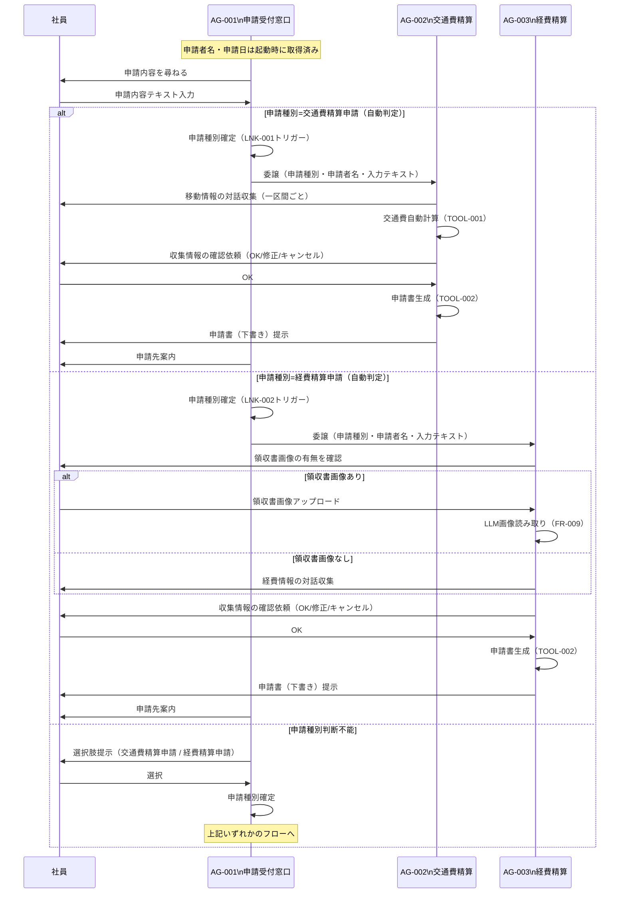

# マルチエージェント連携設計書

> **参照元（システム要件定義資料）:**
> - エージェント一覧.md（エージェント役割・責務・自律度の特定）
> - エージェント間連携定義.md（連携方式・連携ポリシー・連携フロー）
> - 会話フロー一覧.md（連携が発生する会話フロー・タイミング）
> - 機能要件一覧.md（連携が必要な機能の特定）
> - 自律度・権限定義.md（エージェントの権限境界・判断権限）
> - データ一覧.md（共有コンテキスト・状態情報の特定）

> 文書ID：`SYS-MA-001`
> 文書名：マルチエージェント連携設計書
> 版数：`v1.0`
> 作成日：2026-05-02


---

## 1. 目的・適用範囲

### 1.1 目的

本設計書では、以下を定義します:
- エージェント間の委譲方式
- ルーティング方式
- 通信契約（エージェント間メッセージ）
- 協調パターン

本設計書では、以下は定義しません（別紙参照）:
- 詳細な例外処理（例外処理方針参照）
- セッション保持（セッション管理方針参照）
- 権限設計（権限設計参照）

### 1.2 適用範囲

**対象システム**: 社内申請AIアシスタントシステム（IAAS）

**対象エージェント**:
- AG-001：申請受付窓口エージェント（オーケストレーター）
- AG-002：交通費精算申請エージェント（専門エージェント）
- AG-003：経費精算申請エージェント（専門エージェント）


---

## 2. 用語・前提

### 2.1 用語

| 用語 | 定義 |
|-----|------|
| オーケストレーション | AG-001が申請種別を判断し、適切な専門エージェント（AG-002またはAG-003）へ処理を委譲する制御パターン |
| ルーティング | AG-001が申請内容テキストと申請者名を受け取り、申請種別に応じてAG-002またはAG-003を選択すること |
| 委譲（Delegation） | AG-001がAG-002またはAG-003をツールとして呼び出し、申請書作成フローの実行を丸投げすること |
| エージェント間メッセージ | AG-001からAG-002/AG-003へ渡す業務コンテキスト（申請種別・申請者名・入力テキスト） |
| invocation_state | Strands Agentsの ToolContext を通じてアクセスできる辞書。LLMプロンプトに含まれず、ツール関数内でのみ参照可能 |
| セッションID | セッション単位で発行する一意識別子。形式：`{YYYYMMDD}_{HHMMSS}_{uuid4[:8]}` |
| Agent as Tools | 専門エージェントをオーケストレーターから `@tool(context=True)` でデコレートした関数として呼び出すパターン |

### 2.2 前提・制約

**同期/非同期の前提**:
- 全連携は同期（リクエスト/レスポンス）方式とする
- 非同期イベントバスは使用しない

**外部I/Fの制約**:
- LLMバックエンドは Amazon Bedrock（Claude Sonnet 4.5）のみ
- 申請書提出はAIが行わず、社員が手動で実施する（ACT-EXEC-01）

**運用・監査上の制約**:
- 最大委譲深さは1（AG-001→AG-002/AG-003まで。AG-002/AG-003からのさらなる委譲は禁止）
- AG-002とAG-003の並列起動は禁止（1セッションで1申請種別のみ）
- タイムアウト：要件上未定義

---

## 3. 連携アーキテクチャ（協調パターン）

### 3.1 採用する協調パターン

採用パターン：**司令塔（Supervisor/Orchestrator）型 + Agent as Tools パターン**

AG-001がオーケストレーターとして申請種別を判断し、AG-002またはAG-003を `@tool(context=True)` でデコレートしたツール関数として呼び出す。ファクトリ関数 `_get_{agent_name}_agent(session_id)` でエージェントインスタンスを生成する。


### 3.2 採用理由・非採用理由

**採用理由**:
- Strands Agents フレームワークの推奨パターンであり、Agent as Tools によりオーケストレーターから専門エージェントをツールとして呼び出せる
- 申請種別（交通費・経費）ごとに専門エージェントを分離することで、ドメインロジックの独立性が高まる
- invocation_state を使用することで、セッションIDをLLMプロンプトに含めずに伝播できる

**非採用理由**:
- ピア（Peer-to-Peer）型：エージェント間の直接通信は状態管理が複雑になるため非採用
- 協調（Collaboration）型：本システムでは並列処理が不要であり、直列委譲のみで要件を満たせるため非採用

### 3.3 連携の基本原則（設計ルール）

**単一責任**:
- AG-001は申請種別判断・委譲のみを担う（申請書生成・交通費計算は担当しない）
- AG-002は交通費精算申請フローのみを担当する
- AG-003は経費精算申請フローのみを担当する

**委譲の粒度**:
- 委譲単位はフロー全体（申請書作成フロー一式）とする
- 途中での再委譲や部分委譲は行わない

**"判断"と"実行"の分離**:
- AG-001（Lv2）は判断・提案のみ行い、申請書生成・計算は実行しない
- AG-002/AG-003（Lv3）が申請書生成・計算を実行する

**冪等性・再実行可能性**:
- 申請書生成（TOOL-002）はエラー時に1回のリトライを許容する（非冪等のため1回のみ）
- 交通費計算（TOOL-001）はリトライ可能（参照のみ）

---

## 4. エージェント連携構成

### 4.1 エージェント一覧（連携観点）

| AG-ID | エージェント名 | 役割（連携観点） | 入力 | 出力 | 依存先 |
|-------|--------------|----------------|------|------|-------|
| AG-001 | 申請受付窓口エージェント | 申請種別判断・AG-002またはAG-003へ委譲（オーケストレーター）。申請者名はアプリケーション起動時に取得済み | 申請者名（起動時取得済み）、申請内容テキスト（D-001） | 委譲メッセージ（申請種別・申請者名・入力テキスト） | AG-002（as tool）、AG-003（as tool）、ナレッジファイル |
| AG-002 | 交通費精算申請エージェント | 移動情報収集・交通費計算・申請書生成（LNK-001受信側） | 委譲メッセージ（申請種別・申請者名・入力テキスト） | 申請書（下書き）（D-011） | TOOL-001、TOOL-002 |
| AG-003 | 経費精算申請エージェント | 経費情報収集・領収書OCR・申請書生成（LNK-002受信側） | 委譲メッセージ（申請種別・申請者名・入力テキスト） | 申請書（下書き）（D-011） | TOOL-002 |


### 4.2 役割分類と責務

**司令塔（Orchestrator）**:
- **責務**: 申請種別の判断（Lv2）、AG-002またはAG-003へのルーティング・委譲。申請者名・申請日はアプリケーション起動時に取得済み
- **権限境界**: 申請書生成（P-EXEC-002）および申請書提出（P-EXEC-003）は実行不可

**専門エージェント**:
- **責務**: 委譲を受けた申請フローの全工程（情報収集・計算・バリデーション・申請書生成）を実行する
- **依頼受付条件**: AG-001から申請種別と申請者名が確定した状態で委譲を受けた場合のみ起動する


---

## 5. ルーティング設計（どのエージェントへ回すか）

### 5.1 ルーティング方式

採用方式：**ルールベース（判断基準表）**


### 5.2 ルーティング判断基準表

| 条件（入力/状態） | ルーティング先 | 例 | 備考 |
|----------------|--------------|---|------|
| 申請種別 = 交通費精算申請（自動判定 or 社員選択） | AG-002 | 「先週の出張の交通費を精算したい」 | LNK-001発火 |
| 申請種別 = 経費精算申請（自動判定 or 社員選択） | AG-003 | 「先日の接待費の領収書がある」 | LNK-002発火 |
| 申請種別の自動判定不能 | ユーザーへ選択肢提示（FR-002） | 内容が曖昧で判断できない | 判定後に上記いずれかへルーティング |


### 5.3 フォールバック方針

**判断不能時の扱い**:
- AG-001が申請種別を自動判定できない場合は、交通費精算申請・経費精算申請の選択肢を社員に提示する（FR-002 / JD-02）
- 社員の選択後に該当エージェントへルーティングする

**低信頼時の扱い**:
- 判断の根拠（参照ルールID）を提示することで社員が確認できるようにする（根拠提示方針参照）

---

## 6. 委譲・協調設計（いつ・どう委譲するか）

### 6.1 タスク分割ルール

**分割単位**: 申請フロー全体（情報収集・計算・申請書生成を1単位として委譲）

**分割の上限**:
- 並列数: 1（AG-002とAG-003の同時起動は禁止 / DEC-003）
- 深さ: 1（AG-001→AG-002/AG-003まで）

**依頼テンプレ（エージェント間メッセージ）**:
```
AgentMessage(
  申請種別,
  申請者名,
  申請内容テキスト（ユーザーの入力テキスト）
)
```
> ※ エージェント間メッセージで渡す業務コンテキストは上記3項目のみとする
> ※ セッションID・申請者名（applicant_name）・申請日（application_date）は invocation_state 経由でファクトリ関数が受け取り、LLMプロンプトには含めない
> ※ 申請日は YYYY-MM-DD 形式のシステム日付（実行時の日付）を自動取得する
> ※ 上記以外の情報はエージェント間メッセージに含めない


### 6.2 委譲条件（Delegation Policy）

| 条件 | 委譲先候補 | 優先順位 | 禁止条件 |
|-----|----------|---------|---------|
| 申請種別 = 交通費精算申請かつ申請者名が設定済み（起動時に取得済み） | AG-002 | 1（唯一） | 申請者名未取得時の委譲禁止 |
| 申請種別 = 経費精算申請かつ申請者名が設定済み（起動時に取得済み） | AG-003 | 1（唯一） | 申請者名未取得時の委譲禁止 |

### 6.3 並列・逐次の決定ルール

**並列可能条件**: なし（本システムでは並列委譲なし）

**逐次必須条件**: 申請種別確定 → 委譲（AG-002またはAG-003を逐次起動）

**排他対象**:
- AG-002とAG-003の同一セッション内での同時起動は禁止
- 1セッションで対応できる申請種別は1種類のみ

---

## 7. エージェント間通信設計（契約）

### 7.1 メッセージ種別

| 種別 | 目的 | 必須フィールド |
|-----|------|--------------|
| エージェント間メッセージ（LNK-001） | AG-001からAG-002へ交通費精算申請フローを委譲する | 申請種別、申請者名、申請内容テキスト |
| エージェント間メッセージ（LNK-002） | AG-001からAG-003へ経費精算申請フローを委譲する | 申請種別、申請者名、申請内容テキスト |


### 7.2 エージェント間メッセージスキーマ

**オーケストレーター（AG-001） → 専門エージェント（AG-002/AG-003）**:
```
{
  application_type: 申請種別（交通費精算申請 / 経費精算申請）,
  applicant_name: 申請者名,
  user_input_text: 申請内容テキスト（ユーザーの入力テキスト）
}
```

**専門エージェント → サブエージェント**:
```
（本システムでは専門エージェントからのさらなる委譲は行わない）
```
> ※ 具体的な型・バリデーション制約はデータモデル基本設計書で定義する（本設計書はフィールド構成のみ確定する）


### 7.3 共有コンテキスト設計（連携観点）

**共有する情報**:
- 申請種別（LLMのツールパラメータ経由）
- 申請者名（LLMのツールパラメータ経由）
- 申請内容テキスト（LLMのツールパラメータ経由）
- セッションID（invocation_state 経由 / LLMプロンプトには含めない）
- 申請者名（`applicant_name`）（invocation_state 経由）
- 申請日（`application_date`）（invocation_state 経由 / システム日付・YYYY-MM-DD形式）

**共有しない情報**:
- 収集済み申請情報（D-010）：各専門エージェントが自身のセッション状態ファイルに保持
- 会話履歴（SlidingWindowConversationManager が各エージェントで独立管理）

**参照方法**:
- LLMが推論・判断して渡すデータ（申請種別・申請者名・入力テキスト）：ツールパラメータ経由
- システム内部情報（セッションID）：invocation_state 経由

**更新ルール**:
- 申請種別・申請者名は AG-001 が確定後に一度だけ設定し、専門エージェントは変更しない
- セッション状態（D-010）の更新は各専門エージェントが自律的に行う


---

## 8. 状態引き継ぎ（連携観点）

### 8.1 必須の状態情報（連携に必要）

| 状態キー | 用途 | 更新主体 | 保存期間 |
|---------|------|---------|---------|
| session_id | セッション識別・セッション状態ファイルの参照 | SM-001（SessionManager） | セッション終了まで |
| application_type | ルーティング判断・専門エージェントへの引き継ぎ | AG-001（確定後固定） | セッション終了まで |
| applicant_name | 申請書への記入・専門エージェントへの引き継ぎ | アプリケーション起動時に設定済み（固定） | セッション終了まで |
| application_date | 申請日（YYYY-MM-DD形式、システム日付から自動取得） | アプリケーション起動時に設定済み（固定） | セッション終了まで |


### 8.2 再開（Resume）設計

**中断からの再開条件**:
- セッション状態ファイル（data/sessions/{session_id}.json）が存在する場合、収集済み情報から再開可能

**再開時の優先順位**:
- セッション状態ファイルの内容を優先する
- 専門エージェントは自身のセッション状態ファイルから収集済み情報を読み込んで継続する

---

## 9. 連携フロー定義（ユースケース別）

### 9.1 ユースケース一覧

| UC-ID | 名称 | 主担当（起点） | 参加エージェント | 備考 |
|-------|-----|--------------|----------------|------|
| UC-001 | 交通費精算申請フロー | AG-001 | AG-001, AG-002 | LNK-001 |
| UC-002 | 経費精算申請フロー | AG-001 | AG-001, AG-003 | LNK-002 |
| UC-003 | 申請種別判断不能時のフォールバック | AG-001 | AG-001のみ | FR-002、選択後UC-001またはUC-002へ |

### 9.2 連携フロー（Mermaid）



### 9.3 連携フロー（例外系の分岐ポイント）

**失敗しうるステップ**:
1. AG-001: 申請種別の自動判定失敗（→フォールバック：選択肢提示）
2. AG-002/AG-003: ツール関数でのEventLoopException/LoopLimitError（→LoopControlHookが検知しエラーハンドラへ委譲）
3. AG-002: TOOL-001 交通費計算失敗（経路不明等）（→手動入力を促す）
4. AG-002/AG-003: TOOL-002 申請書生成失敗（テンプレート取得失敗等）（→担当部門への問い合わせ案内）
5. AG-003: 領収書画像読み取り失敗（→手動入力へ切替）

**失敗時の戻り先**:
- 再試行: TOOL-001は最大6回リトライ（指数バックオフ）、TOOL-002は1回のみリトライ
- 再ルーティング: なし（申請種別確定後の再ルーティングは行わない）
- エスカレーション: CF-006（エラー・エスカレーション案内フロー）に移行して社員に案内

---

## 10. 依存関係・循環防止ルール

### 10.1 依存関係（DAG）

| From | To | 目的 | 循環禁止ルール |
|------|---|------|--------------|
| AG-001 | AG-002（as tool） | 交通費精算申請の委譲（LNK-001） | AG-002→AG-001の逆方向呼び出し禁止 |
| AG-001 | AG-003（as tool） | 経費精算申請の委譲（LNK-002） | AG-003→AG-001の逆方向呼び出し禁止 |
| AG-002 | TOOL-001 | 交通費計算 | TOOL-001からのエージェント呼び出し禁止 |
| AG-002 | TOOL-002 | 申請書生成 | TOOL-002からのエージェント呼び出し禁止 |
| AG-003 | TOOL-002 | 申請書生成 | TOOL-002からのエージェント呼び出し禁止 |

### 10.2 循環防止・暴走防止

**最大委譲深さ**: 1（AG-001→AG-002/AG-003まで）

**最大ループ回数**: 10回（LoopControlHook / max_iterations=10）

**タスク再発行のクールダウン**: 要件上未定義

**監視指標**:
- ReActループ回数（LoopControlHook が監視）
- 対話ターン数（セッションあたり最大30ターン）
- エラーログ（ErrorHandler が logs/error.log に記録）


---

## 11. インタフェース境界（他成果物との切り分け）

### 11.1 本設計書の責務

- エージェント間の委譲方式（Agent as Tools パターン）の定義
- ルーティング判断基準の定義
- エージェント間メッセージの概念レベルスキーマ（フィールド構成のみ）
- 並列/逐次制御の方針定義
- 循環防止ルールの定義

### 11.2 他成果物へ委譲する責務（参照）

- 実行制御（再試行、タイムアウト等）: 実行制御方針
- セッション管理: セッション管理方針
- 例外処理: 例外処理方針
- エスカレーション: エスカレーション設計
- 権限／承認: 権限設計／人間承認設計
- ガードレール: ガードレール設計
- ログ: ログ出力一覧

---

## 12. 設計上の決定事項（Decision Log）

| ID | 決定事項 | 理由 | 影響範囲 | 代替案 |
|----|---------|------|---------|-------|
| DEC-001 | Agent as Tools パターンを採用 | Strands Agents フレームワークの推奨パターン。専門エージェントをツールとして呼び出すことでオーケストレーターのシステムプロンプトをシンプルに保てる | AG-001の実装 | Manager-Worker型（フレームワーク非推奨のため非採用） |
| DEC-002 | 委譲メッセージは3フィールドのみ（申請種別・申請者名・入力テキスト）に限定 | LLMのコンテキストウィンドウ節約。セッションIDはinvocation_state経由で渡す | LLMのプロンプト設計 | 全情報をメッセージに含める（プロンプト肥大化のため非採用） |
| DEC-003 | AG-002とAG-003の並列起動禁止 | 1セッションで申請種別は1つのみ。並列で起動してもデータ競合のメリットがない | セッション設計 | 並列起動（業務上不要のため非採用） |

---

## 13. 未決事項・リスク

| ID | 未決事項/リスク | 影響 | 対応案 | 期限 |
|----|---------------|------|-------|------|
| RISK-001 | タイムアウト値が要件上未定義 | Bedrock API タイムアウト時の動作が不定 | 実行制御方針で定義する | 基本設計フェーズ |
| RISK-002 | 申請種別判断の正確性（LLMの判断誤り） | 誤ったエージェントへ委譲 | フォールバック（選択肢提示）で対応済み | — |

---

## 14. 変更履歴

| 日付 | 版 | 変更内容 | 変更者 |
|-----|---|---------|-------|
| 2026-05-02 | v1.0 | 初版作成 | - |
| 2026-05-02 | v1.1 | AG-001の申請者名収集役割を削除（起動時取得済みに変更）。invocation_stateにapplicant_name・application_dateを追加。シーケンス図の申請者名入力ステップを起動時取得済みの注記に変更。状態引き継ぎ表にapplication_date追加 | - |

---
