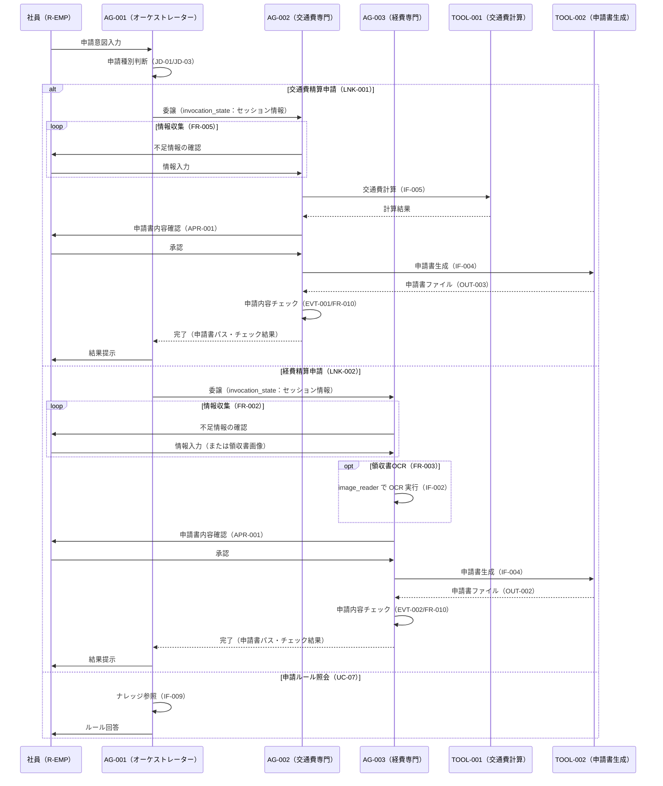

# マルチエージェント連携設計書

> **参照元（システム要件定義資料）:**
> - エージェント一覧.md（エージェント役割・責務・自律度の特定）
> - エージェント間連携定義.md（連携方式・連携ポリシー・連携フロー）
> - 会話フロー一覧.md（連携が発生する会話フロー・タイミング）
> - 機能要件一覧.md（連携が必要な機能の特定）
> - 自律度・権限定義.md（エージェントの権限境界・判断権限）
> - データ一覧.md（共有コンテキスト・状態情報の特定）

> 文書ID：`SYS-MA-001`
> 文書名：マルチエージェント連携設計書
> 版数：`v1.0`
> 作成日：2026-05-01


---

## 1. 目的・適用範囲

### 1.1 目的

本設計書では、以下を定義します:
- エージェント間の委譲方式（Agent as Tools パターン）
- ルーティング方式（LLM による意図分類と判断基準）
- 通信契約（エージェント間メッセージと invocation_state）
- 協調パターン（Supervisor/Orchestrator 型）

本設計書では、以下は定義しません（別紙参照）:
- 詳細な例外処理（例外処理方針参照）
- セッション保持（セッション管理方針参照）
- 権限設計（自律度・権限定義参照）

### 1.2 適用範囲

**対象システム**: 経費精算申請AIエージェントシステム（EAAS）

**対象エージェント**:
- AG-001: 申請受付窓口エージェント（オーケストレーター）
- AG-002: 交通費精算申請エージェント（専門エージェント）
- AG-003: 経費精算申請エージェント（専門エージェント）


---

## 2. 用語・前提

### 2.1 用語

| 用語 | 定義 |
|-----|------|
| Agent as Tools | 専門エージェントを `@tool(context=True)` でデコレートしたツール関数としてオーケストレーターに登録し呼び出すパターン |
| オーケストレーション | AG-001 が申請種別を判断し、適切な専門エージェントに処理を委譲する制御 |
| ルーティング | ユーザーの入力意図をもとに委譲先エージェント（AG-002/AG-003）を決定すること |
| 委譲（Delegation） | AG-001 が AG-002 または AG-003 へタスク全体（申請書作成フロー）を丸投げし、結果を受け取ること |
| invocation_state | `ToolContext` を通じてアクセスできる辞書。LLMプロンプトに含まれず、ツール関数の内部でのみ参照できるリクエスト単位のコンテキスト情報 |
| ファクトリ関数 | `_get_{エージェント名}_agent(session_id)` の命名規則でエージェントインスタンスを生成する関数 |
| セッション ID | セッションを一意に識別する識別子。invocation_state 経由でエージェント間に引き継ぐ |
| HumanApprovalHook | 申請書生成前に社員の承認（APR-001）を取得するフック |
| LoopControlHook | ReActループを最大10回に制限するフック |
| LNK-001/LNK-002 | AG-001から AG-002/AG-003 への委譲連携の識別子 |
| EVT-001/EVT-002 | AG-002/AG-003 の申請書生成後に発火する自動チェックイベントの識別子 |

### 2.2 前提・制約

**同期/非同期の前提**:
- 全エージェント間連携は同期処理（リクエスト/レスポンス）
- 同一セッション内での並列実行は禁止

**外部I/Fの制約**:
- Amazon Bedrock への呼び出しは Strands SDK v1.25.0 経由
- ファイルストアへのアクセスはローカルファイルI/O

**運用・監査上の制約**:
- 申請書生成（TOOL-002 実行）前に APR-001（社員承認）が必須
- 申請書生成・承認操作は強化監査ログ（LOG-HI）に記録する

---

## 3. 連携アーキテクチャ（協調パターン）

### 3.1 採用する協調パターン

採用パターン：**司令塔（Supervisor/Orchestrator）型**


### 3.2 採用理由・非採用理由

**採用理由**:
- AG-001 が申請種別判断とルーティングを一元管理することで、申請種別ごとの専門エージェントの責務境界を明確にできる
- Strands SDK の Agent as Tools パターンと適合性が高く、オーケストレーターが専門エージェントをツールとして呼び出す設計が自然に実装できる
- 申請種別が 2 種類（交通費・経費）で固定されており、動的なルーティング変更が不要なため Supervisor 型が十分

**非採用理由**:
- ピア（Peer-to-Peer）型：申請種別ごとに明確な担当エージェントが存在するため、ピア連携は不要
- 協調（Collaboration）型：申請種別ごとに単一スペシャリストに委譲するため、複数エージェントの並行協調は不要

### 3.3 連携の基本原則（設計ルール）

**単一責任**:
- AG-001 は申請種別判断・委譲・申請ルール照会のみを担当し、申請書生成は行わない
- AG-002 は交通費精算申請のみ、AG-003 は経費精算申請のみを担当する

**委譲の粒度**:
- 委譲単位は「申請書作成フロー全体（UC-02/UC-04）」であり、部分的な処理の委譲は行わない
- 最大委譲深度は 1 段（AG-001 → AG-002/AG-003）

**"判断"と"実行"の分離**:
- AG-001 が申請種別判断（JD-01）を行い、実行（申請書生成）は AG-002/AG-003 が担当する
- 申請書生成前の社員承認（APR-001）は HumanApprovalHook で AG-002/AG-003 内で実施する

**冪等性・再実行可能性**:
- 情報収集フロー（FR-002/FR-005）は冪等（同一情報を再入力しても結果が同じ）
- 申請書生成（TOOL-002）は APR-001 通過後のみ実行し、意図せぬ再実行を防ぐ

---

## 4. エージェント連携構成

### 4.1 エージェント一覧（連携観点）

| AG-ID | エージェント名 | 役割（連携観点） | 入力 | 出力 | 依存先 |
|-------|--------------|----------------|------|------|-------|
| AG-001 | 申請受付窓口エージェント | オーケストレーター。申請種別判断・委譲・申請ルール照会 | ユーザーの自然言語入力 | 申請種別判断結果・委譲実行・申請ルール回答 | AG-002（LNK-001）、AG-003（LNK-002）、ナレッジ（IF-009） |
| AG-002 | 交通費精算申請エージェント | スペシャリスト。交通費精算申請書作成フロー全体を担当 | 申請種別判断結果・invocation_state（セッション情報） | 交通費精算申請書（下書き）・チェック結果 | TOOL-001（交通費計算）、TOOL-002（申請書生成）、ナレッジ（IF-009）、運賃データ（IF-005）、テンプレート（IF-004） |
| AG-003 | 経費精算申請エージェント | スペシャリスト。経費精算申請書作成フロー全体を担当 | 申請種別判断結果・invocation_state（セッション情報） | 経費精算申請書（下書き）・チェック結果 | TOOL-002（申請書生成）、ナレッジ（IF-009）、テンプレート（IF-004）、Bedrock OCR（IF-002） |


### 4.2 役割分類と責務

**司令塔（Orchestrator）**:
- **責務**: ユーザー入力から申請種別（交通費精算申請/経費精算申請/申請ルール照会/不明）を判断し、適切な専門エージェントへ委譲する。申請ルール照会は AG-001 自身が回答する
- **権限境界**: 申請書生成ツール（TOOL-002）の実行権限を持たない（R-AG-001 に P-EXEC-002 は付与されない）

**専門エージェント**:
- **責務**: AG-001 から委譲されたタスク（申請書作成フロー全体）を実行する。社員との対話による情報収集・申請書生成・申請内容チェックをすべて担う
- **依頼受付条件**: AG-001 からの委譲（invocation_state 経由のコンテキスト引き継ぎ）がある場合のみ処理を開始する


---

## 5. ルーティング設計（どのエージェントへ回すか）

### 5.1 ルーティング方式

採用方式：**LLM による意図分類（intent 分類）**

AG-001 が Amazon Bedrock（Claude Sonnet 4.5）を用いてユーザーの自然言語入力を解釈し、申請種別判断基準（JD-01〜JD-03）に従って委譲先を決定する。


### 5.2 ルーティング判断基準表

| 条件（入力/状態） | ルーティング先 | 例 | 備考 |
|----------------|--------------|---|------|
| 「電車で行った」「交通費を申請したい」など移動・交通費に関する意図（JD-01） | AG-002（LNK-001） | 「先週の出張交通費を申請したい」 | BRL-04：候補が複数ある場合は確認の上確定 |
| 「領収書がある」「備品を買った」など購入・経費に関する意図（JD-01） | AG-003（LNK-002） | 「文房具の領収書がある」 | BRL-04：候補が複数ある場合は確認の上確定 |
| 「申請ルールを教えて」「期限はいつ？」など照会に関する意図（JD-02） | AG-001 自身が回答 | 「交通費の上限を教えて」 | UC-07。委譲は発生しない |
| 意図が不明または複数の申請種別に該当する可能性がある場合（JD-03） | ユーザーに確認後に決定 | 「申請したい」 | BRL-04：再確認を行い確定後に委譲 |


### 5.3 フォールバック方針

**判断不能時の扱い**:
- ユーザーに申請種別を確認する（JD-03/BRL-04）
- 確認後も判断できない場合は管理部門への問い合わせを案内する（CF-009）

**低信頼時の扱い**:
- 申請種別に複数の候補がある場合は LLM による推定結果を提示し、ユーザーに選択を促す（BRL-04）

---

## 6. 委譲・協調設計（いつ・どう委譲するか）

### 6.1 タスク分割ルール

**分割単位**: 申請種別（交通費精算申請フロー全体、または経費精算申請フロー全体）を 1 タスクとして委譲する

**分割の上限**:
- 並列数: 1（同一セッション内の並列実行禁止）
- 深さ: 1 段（AG-001 → AG-002 または AG-003）

**依頼テンプレ（エージェント間メッセージ）**:
```
AgentMessage(
  申請者名
  申請日
  セッション ID（invocation_state 経由で引き継ぐ）
)
```
> ※ エージェント間メッセージで渡す業務コンテキストは上記項目のみとする
> ※ 申請種別は委譲先エージェントの選択により決定されるため invocation_state には含めない
> ※ 具体的なフィールド名・型・バリデーション制約はデータモデル基本設計書で定義する
> ※ セッション ID はファクトリ関数内で消費するため invocation_state から除外して子エージェントには渡さない


### 6.2 委譲条件（Delegation Policy）

| 条件 | 委譲先候補 | 優先順位 | 禁止条件 |
|-----|----------|---------|---------|
| 申請種別=交通費精算申請が確定（JD-01/BRL-04）かつ申請者名が収集済み（申請日はシステム日付を自動取得） | AG-002（LNK-001） | 1 | 申請種別が未確定の場合の委譲 |
| 申請種別=経費精算申請が確定（JD-01/BRL-04）かつ申請者名が収集済み（申請日はシステム日付を自動取得） | AG-003（LNK-002） | 1 | 申請種別が未確定の場合の委譲 |

### 6.3 並列・逐次の決定ルール

**並列可能条件**: 本システムでは並列実行は行わない（申請種別は 1 種類を逐次処理）

**逐次必須条件**: 申請種別確定 → 委譲 → 専門エージェントによる情報収集 → APR-001 → 申請書生成 → 申請内容チェック

**排他対象**:
- 同一セッション内で AG-002 と AG-003 を同時に呼び出すことは禁止する
- AG-002/AG-003 が AG-001 を呼び出すことは禁止する（循環呼び出し禁止）

---

## 7. エージェント間通信設計（契約）

### 7.1 メッセージ種別

| 種別 | 目的 | 必須フィールド |
|-----|------|--------------|
| 委譲リクエスト（LNK-001/LNK-002） | AG-001 から AG-002/AG-003 へのタスク委譲 | 申請者名、申請日、セッション ID |
| 委譲レスポンス | AG-002/AG-003 から AG-001 への処理結果返却 | ステータス（completed/error）、申請書ファイルパス、チェック結果 |


### 7.2 エージェント間メッセージスキーマ

**オーケストレーター → 専門エージェント（ToolContext経由）**:
```
{
  session_id: セッションID（ファクトリ関数で消費）,
  applicant_name: 申請者名,
  application_date: 申請日
}
```
> ※ application_type（申請種別）は invocation_state に含めない。委譲先エージェントの選択（AG-002 または AG-003）により申請種別が決定される

**専門エージェント内部でエージェントに渡す invocation_state**:
```
{
  applicant_name: 申請者名,
  application_date: 申請日
}
```

**専門エージェント → サブエージェント**:
```
（本システムでは AG-002/AG-003 からの下位委譲は行わない）
```
> ※ 具体的な型・バリデーション制約はデータモデル基本設計書で定義する（本設計書はフィールド構成のみ確定する）


### 7.3 共有コンテキスト設計（連携観点）

**共有する情報**:
- セッション ID（ファイルストア上の session_{id}.json を介した状態引き継ぎ）
- 申請者名（invocation_state 経由でオーケストレーターから専門エージェントへ引き継ぐ）
- 申請日（invocation_state 経由でオーケストレーターから専門エージェントへ引き継ぐ）
- 申請種別（session_{id}.json に保存。invocation_state 経由では渡さない）

**共有しない情報**:
- 申請書生成の詳細入力（各移動行・各経費行のデータ）：専門エージェント内で収集・保持する
- 監査ログの内容：各エージェントが個別に記録し、他エージェントには共有しない

**参照方法**:
- invocation_state：`@tool(context=True)` デコレータが付いたツール関数内で `tool_context.invocation_state` から参照する
- セッション状態：`FileBasedSessionManager` 経由で `data/sessions/session_{id}.json` を読み書きする

**更新ルール**:
- invocation_state はリクエスト単位で有効（セッションをまたがない）
- セッション状態（data/sessions/）は会話ターンごとに更新し、セッション終了後に削除する


---

## 8. 状態引き継ぎ（連携観点）

### 8.1 必須の状態情報（連携に必要）

| 状態キー | 用途 | 更新主体 | 保存期間 |
|---------|------|---------|---------|
| session_id | セッション識別・ファイル名生成（session_{id}.json）・監査ログ追跡 | AG-001（起動時生成） | セッション終了まで |
| applicant_name | 申請書への申請者名反映・監査ログ記録 | AG-001（ユーザー入力から収集） | セッション終了まで |
| application_date | 申請書への申請日反映・申請期限チェック | AG-001（システム日付を自動取得） | セッション終了まで |
| application_type | 委譲先の確定・申請書種別の判定 | AG-001（JD-01/BRL-04 判断後確定）。session_{id}.json に保存、invocation_state 経由では渡さない | セッション終了まで |


### 8.2 再開（Resume）設計

**中断からの再開条件**:
- セッションファイル（session_{id}.json）が存在し、セッション状態が ACTIVE または WAITING の場合に再開可能

**再開時の優先順位**:
- 既存セッションファイルの状態を読み込み、中断箇所から処理を継続する
- 再開条件の詳細はセッション管理方針を参照する

---

## 9. 連携フロー定義（ユースケース別）

### 9.1 ユースケース一覧

| UC-ID | 名称 | 主担当（起点） | 参加エージェント | 備考 |
|-------|-----|--------------|----------------|------|
| UC-01 | 申請種別の提示 | AG-001 | AG-001 | LNK-001/LNK-002への委譲前処理 |
| UC-04 | 交通費精算申請書の作成 | AG-001 → AG-002 | AG-001, AG-002 | LNK-001委譲 |
| UC-02 | 経費精算申請書の作成 | AG-001 → AG-003 | AG-001, AG-003 | LNK-002委譲 |
| UC-07 | 申請ルールの照会 | AG-001 | AG-001 | 委譲なし |

### 9.2 連携フロー（Mermaid）



### 9.3 連携フロー（例外系の分岐ポイント）

**失敗しうるステップ**:
1. JD-01 での申請種別判断不能（意図不明）→ ユーザーへ再確認（JD-03/BRL-04）
2. AG-002/AG-003 の情報収集中にユーザーが処理中断
3. TOOL-001 の運賃データ参照失敗（ファイル不存在/形式エラー）
4. APR-001 でユーザーが承認拒否
5. TOOL-002 の申請書生成失敗（テンプレート不存在/書き込みエラー）
6. EVT-001/EVT-002 の申請内容チェック実行失敗

**失敗時の戻り先**:
- 再試行: TOOL-001/TOOL-002 の呼び出し失敗はリトライ（実行制御方針参照）
- 再ルーティング: 申請種別判断不能は AG-001 内で再確認後に委譲
- エスカレーション: AG-002/AG-003 からのエラー返却時は AG-001 が管理部門への問い合わせを案内（CF-009）

---

## 10. 依存関係・循環防止ルール

### 10.1 依存関係（DAG）

| From | To | 目的 | 循環禁止ルール |
|------|---|------|--------------|
| AG-001 | AG-002 | 交通費精算申請委譲（LNK-001） | AG-002 から AG-001 への呼び出し禁止 |
| AG-001 | AG-003 | 経費精算申請委譲（LNK-002） | AG-003 から AG-001 への呼び出し禁止 |
| AG-002 | TOOL-001 | 交通費計算 | — |
| AG-002 | TOOL-002 | 交通費精算申請書生成 | — |
| AG-003 | TOOL-002 | 経費精算申請書生成 | — |

### 10.2 循環防止・暴走防止

**最大委譲深さ**: 1 段（AG-001 → AG-002/AG-003）

**最大ループ回数**: 各エージェント 10 回（LoopControlHook で制御）

**タスク再発行のクールダウン**: 要件上未定義

**監視指標**:
- ReActループ回数（LoopControlHook が記録）
- エージェント間委譲回数（監査ログ LOG-STD に記録）


---

## 11. インタフェース境界（他成果物との切り分け）

### 11.1 本設計書の責務

- エージェント間の委譲方式・ルーティング方式・通信契約（invocation_state スキーマ）の定義
- Agent as Tools パターンの採用判断と設計ルールの定義
- 連携フロー（ユースケース別シーケンス図）の定義
- 循環防止ルール・最大委譲深度の定義

### 11.2 他成果物へ委譲する責務（参照）

- 実行制御（再試行、タイムアウト等）: 実行制御方針
- セッション管理: セッション管理方針
- 例外処理: 例外処理方針
- エスカレーション: 例外処理方針（CF-009）
- 権限／承認: 自律度・権限定義（APR-001、ABAC-001）
- ガードレール: ガードレール要件定義
- ログ: ログ出力要件定義

---

## 12. 設計上の決定事項（Decision Log）

| ID | 決定事項 | 理由 | 影響範囲 | 代替案 |
|----|---------|------|---------|-------|
| D-001 | Agent as Tools パターンを採用する | Strands SDK v1.25.0 が提供する標準パターン。AG-002/AG-003 をツール関数としてラップすることで AG-001 の ReActループ内で自然に呼び出せる | AG-001/002/003 の実装全般 | 直接エージェント呼び出し（Strands SDK 固有機能との乖離が生じるため不採用） |
| D-002 | セッション情報（申請者名・申請日・申請種別）は invocation_state で引き継ぐ | LLMプロンプトに含めずにエージェント間でコンテキストを受け渡せるため、コンテキストウィンドウを節約できる | セッション管理・データモデル設計 | ツールパラメータで渡す（LLMがプロンプトを読むため不適切）|
| D-003 | 最大委譲深度を 1 段に制限する | 申請種別が 2 種類に固定されており多段委譲は不要。無限再帰・ループを防止する | ループ制御・循環防止 | 多段委譲（不要な複雑性増加のため不採用） |
| D-004 | 申請書生成前の承認（APR-001）は HumanApprovalHook で AG-002/AG-003 内で実施する | AG-002/AG-003 が申請情報収集後に内部でフックを発火させる設計が Strands SDK のフック機構と整合する | HumanApprovalHook の実装 | AG-001 側で承認を管理（責務が分散するため不採用） |

---

## 13. 未決事項・リスク

| ID | 未決事項/リスク | 影響 | 対応案 | 期限 |
|----|---------------|------|-------|------|
| U-001 | AG-002/AG-003 へのリトライ制御詳細（タイムアウト値・最大リトライ数） | エラー時の再試行動作 | 実行制御方針で定義する | 04_basic-design |
| U-002 | セッション中断・再開時の invocation_state 再構築方法 | セッション再開後の継続可否 | セッション管理方針で定義する | 04_basic-design |

---

## 14. 変更履歴

| 日付 | 版 | 変更内容 | 変更者 |
|-----|---|---------|-------|
| 2026-05-01 | v1.0 | 初版作成 | - |

---
