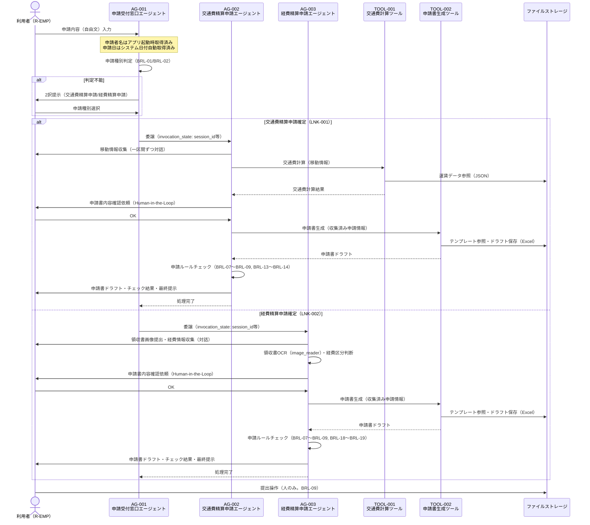

# マルチエージェント連携設計書

> **参照元（システム要件定義資料）:**
> - エージェント一覧.md（エージェント役割・責務・自律度の特定）
> - エージェント間連携定義.md（連携方式・連携ポリシー・連携フロー）
> - 会話フロー一覧.md（連携が発生する会話フロー・タイミング）
> - 機能要件一覧.md（連携が必要な機能の特定）
> - 自律度・権限定義.md（エージェントの権限境界・判断権限）
> - データ一覧.md（共有コンテキスト・状態情報の特定）

> 文書ID：`SYS-MA-001`
> 文書名：マルチエージェント連携設計書
> 版数：`v1.0`
> 作成日：2026-04-28


---

## 1. 目的・適用範囲

### 1.1 目的

本設計書では、以下を定義します:
- エージェント間の委譲方式（Agent as Tools パターン）
- ルーティング方式（申請種別によるルールベース振り分け）
- 通信契約（エージェント間メッセージ・invocation_state の内容）
- 協調パターン（階層型マルチエージェント）

本設計書では、以下は定義しません（別紙参照）:
- 詳細な例外処理（例外処理方針参照）
- セッション保持（セッション管理方針参照）
- 権限設計（自律度・権限定義参照）

### 1.2 適用範囲

**対象システム**: 社内申請AIエージェントシステム

**対象エージェント**:
- AG-001：申請受付窓口エージェント（オーケストレーター）
- AG-002：交通費精算申請エージェント（スペシャリスト）
- AG-003：経費精算申請エージェント（スペシャリスト）


---

## 2. 用語・前提

### 2.1 用語

| 用語 | 定義 |
|-----|------|
| オーケストレーション | AG-001がユーザー入力を解釈し、申請種別に応じた専門エージェントへ処理を振り分け全体を統括すること |
| ルーティング | AG-001が申請種別（交通費精算申請 / 経費精算申請）を判定し、対応する専門エージェントを選択すること |
| 委譲（Delegation） | AG-001が専門エージェントをツールとして呼び出し、申請フロー全体を任せること（Agent as Tools） |
| エージェント間メッセージ | AG-001から専門エージェントへ渡す業務コンテキスト。ツール関数のパラメータと `invocation_state` の2つで構成される |
| セッションID | 1回の申請フロー（AG-001〜AG-002またはAG-003の一連処理）を識別する一意のID |
| invocation_state | Strands Agents SDK の `ToolContext` を通じてアクセスできる辞書。LLMのプロンプトには含まれず、ツール関数内でのみ参照可能なコンテキスト情報を保持する |

### 2.2 前提・制約

**同期/非同期の前提**:
- 全連携は同期（リクエスト/レスポンス）方式
- AG-001は専門エージェントの処理完了を待機してから次のアクションを行う

**外部I/Fの制約**:
- 外部システム連携は要件上未定義

**運用・監査上の制約**:
- 申請書の自動提出禁止（BRL-09）：提出操作は利用者のみ実施可能
- AG-002とAG-003の直接連携禁止（循環呼び出し禁止）
- 最大委譲深度：1（AG-001 → AG-002 または AG-001 → AG-003 のみ）

---

## 3. 連携アーキテクチャ（協調パターン）

### 3.1 採用する協調パターン

採用パターン：**階層型マルチエージェント（Agent as Tools）**

AG-001（オーケストレーター）が AG-002/AG-003（スペシャリスト）をツール関数として実装し、`@tool(context=True)` デコレーターで呼び出す。専門エージェントはファクトリ関数 `_get_{agent_name}_agent(session_id)` で生成する。


### 3.2 採用理由・非採用理由

**採用理由**:
- Strands Agents SDK の Agent as Tools パターンに準拠しており、フレームワークの標準機能で実装できる
- 申請種別（2種）が明確に分かれており、専門エージェントへの委譲粒度がタスク単位で適切
- `invocation_state` を使うことでセッション情報（セッションID等）をLLMプロンプトに露出させずに渡せる

**非採用理由（ピア型・並列型）**:
- AG-002とAG-003は互いに依存しないため、ピア連携は不要
- 申請種別は同時に2種類発生しないため、並列実行は不要

### 3.3 連携の基本原則（設計ルール）

**単一責任**:
- AG-001：申請種別判定・専門エージェント委任・セッション全体管理のみ担当。申請フロー詳細（情報収集・申請書生成・ルールチェック）は担当しない
- AG-002：交通費精算申請フロー全体を担当。経費精算申請処理は担当しない
- AG-003：経費精算申請フロー全体を担当。交通費精算申請処理は担当しない

**委譲の粒度**:
- 申請フロー全体（情報収集〜最終提示）を1タスクとして委譲する
- 部分的なサブタスク単位での委譲は行わない

**"判断"と"実行"の分離**:
- AG-001は申請種別の判断と委譲先の決定のみを行う
- 申請書の生成・チェック・提示は専門エージェントが実行する
- 申請書の提出は利用者（Human-in-the-Loop）が実行する

**冪等性・再実行可能性**:
- セッション情報（DATA-004）はファイルストレージに永続化するため、エージェント再起動後も同一セッションIDで再開可能
- TOOL-001（交通費計算）は同一入力で同一結果を返す（副作用なし）

---

## 4. エージェント連携構成

### 4.1 エージェント一覧（連携観点）

| AG-ID | エージェント名 | 役割（連携観点） | 入力 | 出力 | 依存先 |
|-------|--------------|----------------|------|------|-------|
| AG-001 | 申請受付窓口エージェント | オーケストレーター：ルーティング・委譲 | ユーザー入力（申請内容自由文）, 申請者名 | 申請種別提示, AG-002/AG-003への委譲 | AG-002（ツール）, AG-003（ツール） |
| AG-002 | 交通費精算申請エージェント | スペシャリスト：交通費精算申請フロー全体 | 申請種別確定情報, invocation_state（session_id等） | 申請書ドラフト, 申請チェック結果 | TOOL-001, TOOL-002 |
| AG-003 | 経費精算申請エージェント | スペシャリスト：経費精算申請フロー全体 | 申請種別確定情報, invocation_state（session_id等） | 申請書ドラフト, 申請チェック結果 | TOOL-002 |


### 4.2 役割分類と責務

**司令塔（Orchestrator）：AG-001**:
- **責務**: ユーザー入力の受け付け、申請種別の判定と提示、専門エージェントへの委任、セッション全体の管理。申請者名はアプリ起動時に取得済みのものをエージェントの初期化パラメータとして受け取る。申請日はシステム日付を自動取得する
- **権限境界**: 申請種別判定（ACT-DEC-01）・専門エージェント委任（ACT-EXEC-02）のみ。情報収集・申請書生成・ルールチェックは権限外

**専門エージェント：AG-002, AG-003**:
- **責務**: 各申請種別の申請フロー全体（情報収集・計算・申請書生成・チェック・最終提示）の実行
- **依頼受付条件**: AG-001からの委任のみ（LNK-001またはLNK-002のトリガー後）


---

## 5. ルーティング設計（どのエージェントへ回すか）

### 5.1 ルーティング方式

採用方式：**ルールベース（社内申請ルールBRL-01/BRL-02に基づく判断基準表）**


### 5.2 ルーティング判断基準表

| 条件（入力/状態） | ルーティング先 | 例 | 備考 |
|----------------|--------------|---|------|
| 申請内容が交通費精算申請に該当する（BRL-01） | AG-002 | 「電車代を精算したい」 | LNK-001を発火 |
| 申請内容が経費精算申請に該当する（BRL-02） | AG-003 | 「会議費を精算したい」 | LNK-002を発火 |
| 申請種別が判定不能（どちらとも判断できない） | 判定不能処理 | 「申請したい」のみ | 2択提示→ユーザー選択で確定 |
| ユーザーが「交通費精算申請」を選択 | AG-002 | 2択選択肢選択時 | LNK-001を発火 |
| ユーザーが「経費精算申請」を選択 | AG-003 | 2択選択肢選択時 | LNK-002を発火 |


### 5.3 フォールバック方針

**判断不能時の扱い**:
- 「交通費精算申請」「経費精算申請」の2択をユーザーに提示する
- ユーザーの選択結果を申請種別として確定し、対応する専門エージェントへ委任する

**低信頼時の扱い**:
- LLMの判定信頼度が低い場合も同様に2択提示→ユーザー選択で確定する
- エラーメッセージを返し、ユーザーへエスカレーション案内を提示する（エスカレーション先は要件上未定義）

---

## 6. 委譲・協調設計（いつ・どう委譲するか）

### 6.1 タスク分割ルール

**分割単位**: 申請種別ごとに1タスク（申請フロー全体を1委譲単位とする）

**分割の上限**:
- 並列数: 1（AG-002とAG-003を同時に呼び出さない。申請種別は1回の申請で1種類）
- 深さ: 1（AG-001 → AG-002 または AG-001 → AG-003 の1階層のみ）

**依頼テンプレ（エージェント間メッセージ）**:
```
ToolContext invocation_state（オーケストレーター → 専門エージェント）:
- セッションID（session_id）
- 申請者名（applicant_name）
- 申請日（application_date）

専門エージェント内部でエージェントに渡す invocation_state:
- 申請者名（applicant_name）
- 申請日（application_date）
```
> ※ `session_id` はオーケストレーターから専門エージェントへの受け渡しには含めるが、専門エージェント内部ではセッションマネージャーの初期化に直接使用し、エージェントへの invocation_state には含めない
> ※ `application_type`（申請種別）は invocation_state には含めない。申請種別はAG-001がルーティング判断に使用するのみで、専門エージェントは自身の役割（交通費 or 経費）を固定で把握している
> ※ invocation_state は辞書リテラルで渡す。専用の Pydantic モデルは定義しない
> ※ `session_id` はツール関数の引数に含めない
> ※ 上記以外の情報はエージェント間メッセージに含めない

**申請者情報の取得タイミング**:
- 申請者名はアプリケーション起動時（対話ループ開始前）に取得し、エージェントの初期化パラメータとして渡す
- 申請日はユーザーとの対話で収集せず、システム日付（実行時の日付、YYYY-MM-DD形式）を自動取得する


### 6.2 委譲条件（Delegation Policy）

| 条件 | 委譲先候補 | 優先順位 | 禁止条件 |
|-----|----------|---------|---------|
| 申請種別 = 交通費精算申請 確定後 | AG-002 | 1 | AG-001からAG-002への同一フローへの二重委任禁止 |
| 申請種別 = 経費精算申請 確定後 | AG-003 | 1 | AG-001からAG-003への同一フローへの二重委任禁止 |
| AG-002からAG-003への直接委任 | — | — | 禁止（循環防止） |
| AG-003からAG-002への直接委任 | — | — | 禁止（循環防止） |

### 6.3 並列・逐次の決定ルール

**並列可能条件**: なし（本システムでは並列委譲は発生しない）

**逐次必須条件**: 
- AG-001が申請種別を確定してから専門エージェントへ委任する
- 専門エージェント内では情報収集→申請書生成→ルールチェック→最終提示の順序で逐次実行する

**排他対象**:
- AG-002とAG-003は同一セッション内で同時に実行しない
- TOOL-002（申請書生成）はHuman-in-the-Loop承認（利用者のOK）取得後にのみ呼び出す

---

## 7. エージェント間通信設計（契約）

### 7.1 メッセージ種別

| 種別 | 目的 | 必須フィールド |
|-----|------|--------------|
| invocation_state（AG-001 → 専門エージェント） | LLMプロンプトに含めずにセッション情報を専門エージェントへ渡す | session_id, applicant_name, application_date |
| invocation_state（専門エージェント内部） | 専門エージェント内でエージェントにコンテキストを渡す | applicant_name, application_date |
| ツール関数の戻り値 | 専門エージェントの処理結果をAG-001へ返す | 処理結果（成功/エラー）、申請書ドラフト情報 |


### 7.2 エージェント間メッセージスキーマ

**オーケストレーター → 専門エージェント（invocation_state）**:
```
{
  session_id: セッション識別子,
  applicant_name: 申請者名,
  application_date: 申請日（YYYY-MM-DD形式。システム日付を自動取得）
}
```
> ※ `application_type`（申請種別）は含めない。専門エージェントは自身の役割を固定で把握しているため不要
> ※ invocation_state は辞書リテラルで渡す。専用の Pydantic モデルは定義しない

**専門エージェント内部でエージェントに渡す invocation_state**:
```
{
  applicant_name: 申請者名,
  application_date: 申請日
}
```
> ※ `session_id` は専門エージェントのファクトリ関数でセッションマネージャーの初期化に直接使用し、エージェントへの invocation_state には含めない
> ※ `session_id` はツール関数の引数に含めない
> ※ 具体的な型・バリデーション制約はデータモデル基本設計書で定義する（本設計書はフィールド構成のみ確定する）


### 7.3 共有コンテキスト設計（連携観点）

**共有する情報**:
- セッション情報（DATA-004）：会話履歴・収集済み申請情報・申請種別確定情報（ファイルストレージ経由で共有）
- `invocation_state`：session_id・applicant_name・application_type・application_date（ツール関数呼び出し時に渡す）

**共有しない情報**:
- LLMの中間思考プロセス（プロンプト非表示）
- エージェント内部の処理状態（各エージェントが独立して保持）

**参照方法**:
- セッション情報：Strands Agents SDK のファイルセッション（data/sessions/）経由でファイルI/O
- `invocation_state`：`@tool(context=True)` + `tool_context.invocation_state` でツール関数内から参照

**更新ルール**:
- セッション情報はStrands Agents SDKが会話ターンごとに自動更新する
- `invocation_state` はリクエスト単位で有効（セッションをまたがない）


---

## 8. 状態引き継ぎ（連携観点）

### 8.1 必須の状態情報（連携に必要）

| 状態キー | 用途 | 更新主体 | 保存期間 |
|---------|------|---------|---------|
| session_id | セッション識別・ファクトリ関数でのセッションマネージャー生成 | Strands Agents SDK | セッション終了まで |
| applicant_name | 申請書への申請者名入力 | アプリケーション起動時に取得（対話ループ開始前） | セッション終了まで |
| application_type | 申請書種別の特定（AG-001のルーティング判断に使用。invocation_stateには含めない） | AG-001 | セッション終了まで |
| application_date | 申請書への申請日入力・申請期限チェック（システム日付を自動取得。YYYY-MM-DD形式） | アプリケーション起動時に自動取得 | セッション終了まで |


### 8.2 再開（Resume）設計

**中断からの再開条件**:
- セッション情報（DATA-004）がファイルストレージに存在する場合、同一セッションIDで再開可能
- Strands Agents SDK の `FileSessionManager` でセッション情報を永続化する

**再開時の優先順位**:
- 既存セッションが存在する場合は復元して継続する
- 既存セッションが存在しない場合は新規セッションを開始する

---

## 9. 連携フロー定義（ユースケース別）

### 9.1 ユースケース一覧

| UC-ID | 名称 | 主担当（起点） | 参加エージェント | 備考 |
|-------|-----|--------------|----------------|------|
| UC-001 | 交通費精算申請フロー | AG-001 | AG-001, AG-002 | LNK-001による委譲 |
| UC-002 | 経費精算申請フロー | AG-001 | AG-001, AG-003 | LNK-002による委譲 |
| UC-003 | 申請種別判定不能フロー | AG-001 | AG-001 | 2択提示→ユーザー選択後にUC-001またはUC-002へ |

### 9.2 連携フロー（Mermaid）



### 9.3 連携フロー（例外系の分岐ポイント）

**失敗しうるステップ**:
1. AG-001での申請種別判定不能 → 2択提示→ユーザー選択で対処
2. AG-002内でのEventLoopException（LoopLimitError）→ エラーメッセージをAG-001に返す
3. AG-002内でのException（予期しないエラー）→ エラーメッセージをAG-001に返す
4. TOOL-001で経路データなし → エラーメッセージを返し手動入力を促す
5. TOOL-002でテンプレートなし → エラーメッセージを返しエスカレーション案内
6. 申請期限超過（BRL-13/BRL-18）→ 申請不可通知
7. Human-in-the-Loop承認（OK以外）→ 修正ループまたはキャンセル

**失敗時の戻り先**:
- 再試行: TOOL-001エラーは手動入力に切り替え
- 再ルーティング: なし（同一専門エージェントで処理継続）
- エスカレーション: エラーメッセージをユーザーに提示（エスカレーション先は要件上未定義）

---

## 10. 依存関係・循環防止ルール

### 10.1 依存関係（DAG）

| From | To | 目的 | 循環禁止ルール |
|------|---|------|--------------|
| AG-001 | AG-002 | 交通費精算申請フロー委譲（LNK-001） | AG-002からAG-001への逆方向呼び出し禁止 |
| AG-001 | AG-003 | 経費精算申請フロー委譲（LNK-002） | AG-003からAG-001への逆方向呼び出し禁止 |
| AG-002 | TOOL-001 | 交通費計算 | 循環なし（ツールは一方向） |
| AG-002 | TOOL-002 | 申請書生成 | 循環なし（ツールは一方向） |
| AG-003 | TOOL-002 | 申請書生成 | 循環なし（ツールは一方向） |

### 10.2 循環防止・暴走防止

**最大委譲深さ**: 1（AG-001 → AG-002 または AG-003 の1階層のみ）

**最大ループ回数**: 10回（LoopControlHook で制御。全エージェント共通）

**タスク再発行のクールダウン**: 要件上未定義

**監視指標**:
- ReActループ回数（最大10回でLoopControlHookが制御）
- 同一セッション内の対話ターン数（30回超でセッション終了。FR-017）


---

## 11. インタフェース境界（他成果物との切り分け）

### 11.1 本設計書の責務

- エージェント間の委譲方式・ルーティング判断基準・連携フロー・メッセージ構成の定義

### 11.2 他成果物へ委譲する責務（参照）

- 実行制御（再試行、タイムアウト等）: 実行制御方針
- セッション管理: セッション管理方針
- 例外処理: 例外処理方針
- エスカレーション: エスカレーション先は要件上未定義
- 権限／承認: 自律度・権限定義
- ガードレール: ガードレール要件定義
- ログ: ログ出力要件定義

---

## 12. 設計上の決定事項（Decision Log）

| ID | 決定事項 | 理由 | 影響範囲 | 代替案 |
|----|---------|------|---------|-------|
| DEC-001 | Agent as Tools パターンを採用 | Strands Agents SDKの標準機能で実装可能。申請種別2種の委譲粒度に適合 | AG-001, AG-002, AG-003 | Peer-to-Peer（申請種別が少ないため不採用） |
| DEC-002 | invocation_state でセッション情報を渡す | LLMプロンプトへの機密情報露出を避けるため | AG-001, AG-002, AG-003, TOOL-001, TOOL-002 | ツール関数パラメータのみで渡す（プロンプト汚染リスクあり） |
| DEC-003 | 並列委譲なし（逐次のみ） | 1回の申請では交通費・経費のいずれか1種のみ対象となるため | AG-001 | 並列委譲（申請種別が複数の場合は将来検討） |

---

## 13. 未決事項・リスク

| ID | 未決事項/リスク | 影響 | 対応案 | 期限 |
|----|---------------|------|-------|------|
| UND-001 | タイムアウト値（LNK-001, LNK-002） | 専門エージェントの処理時間超過時の扱いが不明 | 要件確定後に設定 | 要件上未定義 |
| UND-002 | エスカレーション先の定義 | エラー発生時のユーザーへの案内先が不明 | 要件確定後に定義 | 要件上未定義 |
| UND-003 | 差し戻しリスク閾値 | 差し戻しリスク評価の精度に影響 | 要件確定後に定義 | 要件上未定義 |

---

## 14. 変更履歴

| 日付 | 版 | 変更内容 | 変更者 |
|-----|---|---------|-------|
| 2026-04-28 | v1.0 | 初版作成 | - |
| 2026-04-28 | v1.1 | invocation_stateから application_type を除外。申請者名はアプリ起動時取得、申請日はシステム日付自動取得に変更。invocation_state の辞書リテラル渡し・Pydanticモデル非定義を明記 | - |
| 2026-04-28 | v1.2 | セッション保存先参照を data/sessions/ に変更 | - |

---
